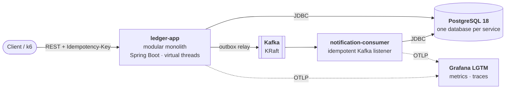
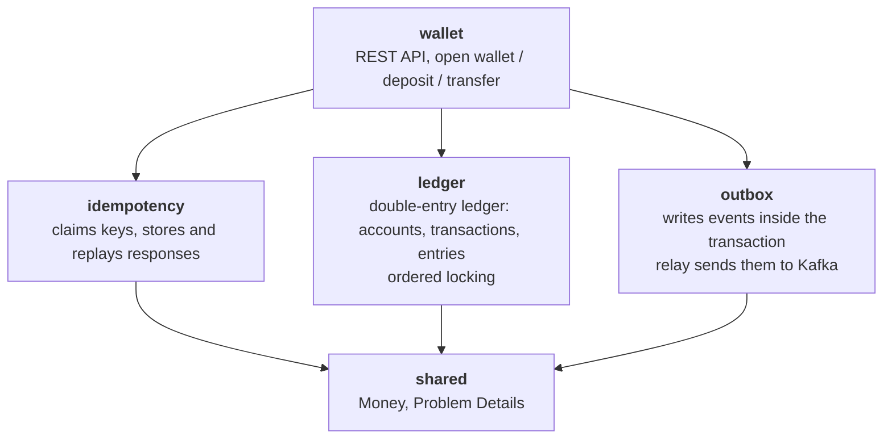
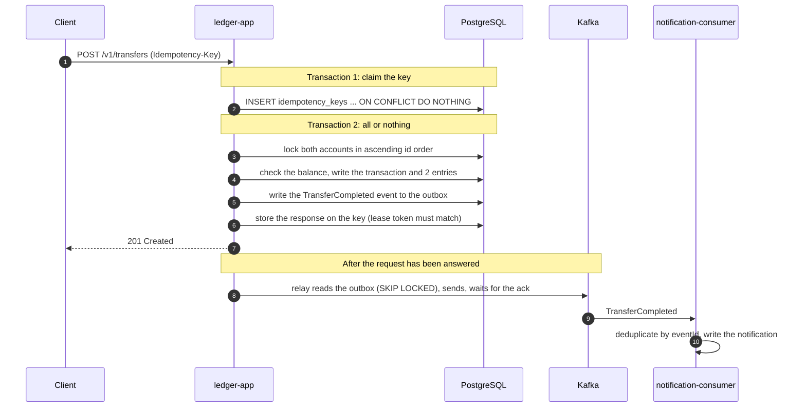

# Ledgerly

[](https://github.com/HoangThanhMan/ledgerly/actions/workflows/ci.yml)


E-wallet backend on a double-entry ledger, with money invariants backed by tests and measurements.

Ledgerly lets you open wallets, deposit money, transfer between wallets and read the entry history over a REST API. Every completed transfer publishes an event to Kafka, and a separate service consumes it to create a notification.

The business scope is small on purpose. The project is about the places where a money system usually goes wrong: two requests debiting the same wallet, a client that loses its connection and retries, a database write whose event never goes out, a message delivered twice. Money must not appear or disappear in any of those cases, and each guarantee comes with a test or a measurement.

## Table of contents

- [What problems it solves](#what-problems-it-solves)
- [Architecture](#architecture)
- [Install](#install)
- [Usage](#usage)
- [Configuration](#configuration)
- [API](#api)
- [Testing](#testing)
- [Performance](#performance)
- [Design decisions](#design-decisions)
- [Tech stack](#tech-stack)
- [Repository layout](#repository-layout)
- [Current limitations](#current-limitations)
- [Contributing](#contributing)
- [Author](#author)
- [License](#license)

## What problems it solves

| Problem | Approach | Evidence |
|---|---|---|
| **Double spending** when several requests debit one wallet | Lock the account rows with `SELECT ... FOR NO KEY UPDATE` before checking the balance. A `CHECK` constraint in the database also rejects a negative balance | `HotWalletDrainIT`: 500 threads each transfer 1 from a wallet holding 100, and exactly 100 succeed |
| **Deadlocks** when A→B and B→A run at the same time | Every transaction locks its accounts in ascending `id` order | `DeadlockFreedomIT`: 1,000 pairs of opposite transfers, 0 deadlocks. With the lock kept but the `ORDER BY` removed, the same test deadlocks more than 70 times |
| **A wrong ledger** under concurrent load | Entries are append-only, and the entries of a transaction must sum to zero, checked by a trigger at commit | `ConcurrentTransferIT`: 10,000 transfers from 200 virtual threads, after which the four ledger invariants still hold. `LedgerModelProperties`: 1,000 random operation sequences compared with an in-memory model |
| **Client retries** when it cannot tell whether the money moved | An `Idempotency-Key` header, a two-phase design with a lease and a fencing token, stored in PostgreSQL | `IdempotencyConcurrencyIT`: 50 concurrent requests with one key produce 1 transaction and 50 identical responses. `IdempotencyCrashRecoveryIT`: a failure after the money moved rolls the whole transfer back |
| **The database is written but the event is not published** (dual write) | Transactional outbox: the event is written in the same transaction as the entries, and a relay reads the outbox table and sends to Kafka | `OutboxAtomicityIT`, `RelayCrashDuplicateIT`. Run by hand: `kill -9` on the application while it drained 3,000 events ended with 3,050 transactions and 3,050 notifications |
| **Messages delivered more than once** | The consumer deduplicates by `eventId` in the same transaction that writes the notification | `ConsumerDedupIT`. In the `kill -9` run above, 22 duplicates were dropped |
| **Module boundaries eroding** over time | Each module has a public API and an `internal` package. ArchUnit checks the dependency matrix on every build | `ArchitectureTest` |
| **Not knowing where the time goes** | OpenTelemetry: one transfer is one trace from HTTP through every SQL statement, the outbox and Kafka to the consumer | `TracePropagationIT`, `TraceContinuationIT`, a Grafana dashboard in the repository |

The reasoning behind the main choices, and the alternatives that were rejected, are under [Design decisions](#design-decisions).

## Architecture

### Components



`ledger-app` is a **modular monolith**: everything that touches money lives in one process and one database, so a transfer is a single local transaction and needs no distributed transaction. What should be separate is separated through Kafka: `notification-consumer` is its own process with its own database, and a slow or dead consumer does not affect transfers.

### Modules inside `ledger-app`



Each module is a package under `dev.ledgerly`. Types at the package root are its public API, and everything under `internal` (`web`, `application`, `domain`, `persistence`) is private to the module. ArchUnit checks three rules on every build: a module only calls the modules it is allowed to and there are no cycles, `internal.domain` is plain Java with no dependency on Spring or JDBC, and `@Transactional` appears only in the `application` layer.

### One transfer



The money, the event and the response are committed in **the same transaction**. So there is no state in which the money moved but the event was lost, or the money moved and a retry moves it again. The relay delivers each event at least once and the consumer handles each `eventId` at most once, so the effect happens exactly once.

### The database is the last line of defence

The money rules do not live only in Java. If the code has a bug, PostgreSQL still refuses:

- `CHECK` constraints reject a negative balance on a user wallet and an entry with a zero amount.
- Triggers reject `UPDATE`, `DELETE` and `TRUNCATE` on the entries table. The ledger is append-only, and a mistake is fixed with a reversing entry.
- A `DEFERRABLE INITIALLY DEFERRED` constraint trigger checks at commit that the entries of every transaction sum to zero.
- Money is a `BIGINT` in the minor unit of the currency, never a floating-point number.

## Install

### Requirements

| What | Notes |
|---|---|
| Docker Engine and Docker Compose v2 | All that the container quick start needs. The integration tests need Docker too (Testcontainers) |
| JDK 17 or later | Only to run the applications or the tests from Gradle. Gradle downloads the JDK 25 used for compilation if the machine does not have it |
| `curl`, `jq`, `uuidgen` | Only for the example commands under [Usage](#usage) and for the smoke test |
| Free ports | 8080, 8082, 5433, 9092, plus 3000 and 4318 when Grafana is on |

### Quick start: everything in containers

```bash
git clone https://github.com/HoangThanhMan/ledgerly.git
cd ledgerly

# PostgreSQL, Kafka, ledger-app (:8080) and notification-consumer (:8082). Returns when all four are healthy
docker compose --profile full up -d --wait

# Optional: a deposit, a transfer, its retry, the notification and the ledger invariants, checked end to end
scripts/smoke-test.sh
```

The first run builds the two application images from source inside Docker. On the development machine that took about 3 minutes, most of it Gradle downloading dependencies. Once the images exist, the system is up in about 12 seconds.

Then open http://localhost:8080/swagger-ui.html to try the API in the browser, or continue with [Usage](#usage).

To stop: `docker compose --profile full down` (add `-v` to delete the data as well).

### For development: applications from Gradle

```bash
# 1. Infrastructure only: PostgreSQL on port 5433, Kafka on port 9092
docker compose up -d --wait

# 2. The two applications, one terminal each. Flyway creates the schema at startup
./gradlew :ledger-app:bootRun
./gradlew :notification-consumer:bootRun

# 3. Check: both must answer "status":"UP"
curl -s localhost:8080/actuator/health
curl -s localhost:8082/actuator/health
```

To try the API without compose, `./gradlew :ledger-app:bootTestRun` starts PostgreSQL and Kafka through Testcontainers.

To stop and clean up: `Ctrl+C` in both terminals, then `docker compose down` (add `-v` to delete the data as well).

### The container images

One [`Dockerfile`](Dockerfile) builds the image of any application (`--build-arg MODULE=ledger-app`):

- **Layered jar.** The dependencies (92 MB, rarely changed) and the application's own classes (under 200 kB, changed by every commit) are separate image layers, so a rebuild or a pull after a code change does not move the dependencies again.
- **Unprivileged user.** The process runs as uid 1001, not as root.
- **AOT cache (Java 25).** A training run during the image build records the classes the application loads and links at startup. Startup of `ledger-app` in its container: **2.07 s with the cache, 4.09 s without** (median of 5 starts each, alternating). `notification-consumer`: 1.48 s against 2.73 s (median of 3). The price is 114 MB more in the `ledger-app` image (622 MB in total), a layer that is rebuilt on every code change.

## Usage

### A first transfer

```bash
# Open two wallets
A=$(curl -s -X POST localhost:8080/v1/wallets -H 'Content-Type: application/json' -d '{"currency":"VND"}' | jq -r .id)
B=$(curl -s -X POST localhost:8080/v1/wallets -H 'Content-Type: application/json' -d '{"currency":"VND"}' | jq -r .id)

# Deposit 500,000 into wallet A
curl -s -X POST localhost:8080/v1/admin/deposits -H 'Content-Type: application/json' \
  -H "Idempotency-Key: $(uuidgen)" \
  -d "{\"walletId\":\"$A\",\"amount\":\"500000\",\"currency\":\"VND\"}"

# Transfer 150,000 from A to B. Run this curl command TWICE with the same key
KEY=$(uuidgen)
curl -si -X POST localhost:8080/v1/transfers -H 'Content-Type: application/json' \
  -H "Idempotency-Key: $KEY" \
  -d "{\"sourceWalletId\":\"$A\",\"targetWalletId\":\"$B\",\"amount\":\"150000\",\"currency\":\"VND\"}"

# Balance and entry history of wallet A
curl -s localhost:8080/v1/wallets/$A
curl -s "localhost:8080/v1/wallets/$A/entries?limit=5"
```

The second send returns the response of the first, adds the header `Idempotent-Replayed: true`, and does not move the money again:

```console
HTTP/1.1 201
Idempotent-Replayed: true
Location: /v1/transfers/01a11ad9-7f10-7459-a273-deb24dbb4296
Content-Type: application/json

{"id":"01a11ad9-7f10-7459-a273-deb24dbb4296","status":"COMPLETED","sourceWalletId":"01a11ad9-7eb8-...","targetWalletId":"01a11ad9-7ec9-...","amount":"150000","currency":"VND","createdAt":"2026-10-08T09:30:23.885956Z"}
```

```console
$ curl -s localhost:8080/v1/wallets/$A
{"id":"01a11ad9-7eb8-...","currency":"VND","balance":"350000","createdAt":"2026-10-08T09:30:23.800096Z"}
```

### See the event and check the ledger

```bash
# The TransferCompleted event on Kafka
docker compose exec kafka /opt/kafka/bin/kafka-console-consumer.sh \
  --bootstrap-server localhost:9092 --topic ledgerly.transfers.v1 --from-beginning --max-messages 1

# The notification that notification-consumer created
docker compose exec postgres psql -U ledgerly -d notification -c 'SELECT message, created_at FROM notifications'

# The four ledger invariants: each query lists violations, so a sound ledger returns 0 rows from all four
docker compose exec -T postgres psql -U ledgerly -d ledger < scripts/invariants.sql
```

```console
                                 message                                  |          created_at
--------------------------------------------------------------------------+-------------------------------
 You received 150000 VND from wallet 01a11ae0-91a3-73aa-abf2-99d7ab7901bc | 2026-10-08 09:38:21.016439+00
```

### Metrics and traces

By default the applications export no metrics and no traces. Add Grafana and restart both applications with the `observability` profile:

```bash
docker compose --profile observability up -d --wait
SPRING_PROFILES_ACTIVE=observability ./gradlew :ledger-app:bootRun
SPRING_PROFILES_ACTIVE=observability ./gradlew :notification-consumer:bootRun
```

With the applications in containers, one command does the same:

```bash
LEDGERLY_PROFILES=compose,observability docker compose --profile full --profile observability up -d --wait
```

Open http://localhost:3000 (user `admin`, password `admin`): the Ledgerly dashboard is the home page. In Explore, pick the Tempo data source to see traces. One transfer is one trace across both services: the HTTP request, 12 SQL statements, `outbox publish`, the send to Kafka, then the processing in the consumer.

## Configuration

The defaults live in each application's `application.yaml` and suit applications run from Gradle next to `compose.yaml`. In containers the `compose` profile replaces the host names (`application-compose.yaml`). Override them with environment variables following the Spring Boot convention, for example `SERVER_PORT=9080` or `LEDGERLY_OUTBOX_RELAY_ENABLED=false`.

| Property | Default | Meaning |
|---|---|---|
| `server.port` | `8080` (`ledger-app`), `8082` (`notification-consumer`) | HTTP port |
| `spring.datasource.url` | `jdbc:postgresql://localhost:5433/ledger` | Database of `ledger-app`. The consumer uses the `notification` database |
| `spring.kafka.bootstrap-servers` | `localhost:9092` | Kafka |
| `ledgerly.ledger.lock-timeout` | `2s` | Longest wait for the account locks. After that the answer is `503` with `Retry-After` |
| `ledgerly.idempotency.lease` | `30s` | How long a request may hold a key. After that a retry with the same key takes it over |
| `ledgerly.idempotency.ttl` | `24h` | Minimum time a key and its response are kept |
| `ledgerly.outbox.relay.enabled` | `true` | `false`: this instance serves the API only and publishes no events |
| `ledgerly.outbox.relay.poll-interval`, `batch-size` | `200ms`, `100` | Polling interval and batch size of the relay |
| `management.tracing.sampling.probability` | `0.1` | Share of requests that are traced. The `observability` profile sets `1.0` |

## API

| Method | Path | Description | `Idempotency-Key` |
|---|---|---|:-:|
| `POST` | `/v1/wallets` | Open a wallet | |
| `GET` | `/v1/wallets/{id}` | Balance and details of a wallet | |
| `GET` | `/v1/wallets/{id}/entries` | Entry history, keyset pagination (`?after=&limit=`) | |
| `POST` | `/v1/transfers` | Transfer between two wallets | Required |
| `GET` | `/v1/transfers/{id}` | Details of a transfer | |
| `POST` | `/v1/admin/deposits` | Deposit into a wallet from a system account, for development and tests | Required |

The full reference is the OpenAPI document: Swagger UI at http://localhost:8080/swagger-ui.html, the document itself at `/v3/api-docs`, and a copy in [`ledger-app/openapi.yaml`](ledger-app/openapi.yaml) that a test keeps equal to what the application serves. It describes every parameter and, for each operation, every problem it can answer with.

Amounts are integer strings in the minor unit (`"amount": "150000"`), so a JavaScript client cannot lose precision. Errors follow RFC 9457 Problem Details:

```json
{"type":"/problems/insufficient-funds","title":"Insufficient funds","status":422,
 "detail":"Wallet 01a11ad9-7eb8-... has 350000 VND, the transfer needs 9999999 VND","instance":"/v1/transfers"}
```

### How retries stay safe

A client that loses its connection midway cannot tell whether the money moved. So every `POST` that moves money requires an `Idempotency-Key` header: the client generates one value (a UUID is recommended) for **each operation** and keeps it across every resend.

| Situation | Response | What the client should do |
|---|---|---|
| Same key, same content, the first request has finished | The response of the first request, with `Idempotent-Replayed: true`. Reordered JSON fields or different whitespace still count as the same content | Use the result |
| Same key, the first request is still running | `409 idempotency-in-progress`, with `Retry-After: 1` | Wait, then resend with the **same** key |
| Same key, different body or different endpoint | `422 idempotency-key-reused` | A client bug: one key per operation |
| The first request was rejected by a business rule (for example `422 insufficient-funds`) | Later requests get that same error, even after the wallet has been topped up | To try again, use a **new** key |
| The first request failed technically (`503`, `500`) | Nothing was stored and no money moved | Resend with the same key |
| Missing header or invalid body | `400 validation-error`, and the key is not used up | Fix the request |

A key is kept for at least 24 hours.

## Testing

```bash
./gradlew build             # everything: formatting, Error Prone, NullAway, unit tests, integration tests, coverage
./gradlew test              # unit tests, ArchUnit
./gradlew integrationTest   # Testcontainers: real PostgreSQL 18 and Kafka
./gradlew spotlessApply     # fix formatting
```

- **No H2, no mocked database.** Persistence tests run on real PostgreSQL, the same version the application runs on.
- **Concurrency tests check invariants, not just the absence of errors.** After each run, `InvariantChecker` executes the very statements in [`scripts/invariants.sql`](scripts/invariants.sql). Randomised tests log their seed, and `-Pledgerly.test.seed=<n>` replays a failed run.
- **Failures are injected on purpose.** Tests simulate a process dying at the hardest points: after the money moved but before the key is marked complete, and after the relay sent to Kafka but before it committed.
- **The packaged system is tested too.** CI builds the container images, starts the whole system with `docker compose --profile full` and runs [`scripts/smoke-test.sh`](scripts/smoke-test.sh) against it.
- **Quality gates in CI:** a formatting difference, a null error (NullAway in JSpecify mode) or an Error Prone error fails the build. Line coverage of the `internal.domain` packages must be at least 80%.

| Invariant | Statement |
|---|---|
| I1 | The entries of every transaction sum to zero |
| I2 | No user wallet has a negative balance |
| I3 | Every account's balance equals the sum of its entries |
| I4 | The balances of all accounts, system accounts included, sum to zero |
| I5 | Each `Idempotency-Key` produces at most one transaction |
| I6 | Every committed transfer has exactly one outbox event |
| I7 | Each `eventId` has at most one effect in the consumer |

## Performance

Measured with k6 and the `constant-arrival-rate` executor (open loop, so the moments when the server is slow are still measured), 1 minute of warm-up and 5 minutes of measurement, three runs, median reported. `ledger-app` was pinned to 2 CPU cores. After each run the script rechecks the ledger invariants and compares the number of transactions, events and notifications.

| `POST /v1/transfers` | Result |
|---|---|
| Latency at 300 requests per second | p50 **2.17 ms**, p95 **4.21 ms**, p99 **17.14 ms**, no errors |
| Throughput ceiling on 2 cores | About **1,560 transfers per second**. The application's CPU runs out first, not PostgreSQL |
| Correctness under overload | At every load level the ledger stays correct and each transaction has exactly one event and one notification |

These numbers come from **one laptop running everything, over loopback, with a small data set** (Intel Core i7-11800H, 7 GB RAM, PostgreSQL and Kafka in Docker, k6 on the same machine). They are not the capacity of the system on a server.

Two things did not go well and are kept in the open. The first batch of runs is unusable: the benchmark script took a dashboard screenshot in the middle of a run and wrote its raw output to a RAM-backed directory. That batch is still in the repository, labelled as such. And in 4 of 11 runs at 300 requests per second the server stalled for 0.5 to 6 seconds. The cause has not been found ([#105](https://github.com/HoangThanhMan/ledgerly/issues/105)), so the honest summary is a p99 of about 17 ms with an unexplained risk of a stall of a few seconds.

The packaged system was checked with the same scenario: one run at 300 requests per second against the containers, `ledger-app` limited to 2 CPUs, gave p50 2.12 ms, p95 3.67 ms, p99 15.28 ms and no errors, with 102,598 transfers, events and notifications at the end. It is a single run on a different network path, so it confirms the baseline rather than replacing it.


*The `Ledgerly` dashboard during a ramp test in four steps: 600, 1,000, 1,500 and 2,000 requests per second.*

Every run is in [`perf/results`](perf/results): the k6 summary, one line per request (enough to recompute any percentile), server-side metrics, the post-run checks and a description of the environment (the notes are in Vietnamese). To rerun the baseline, with nothing else running on the machine:

```bash
docker compose --profile observability up -d --wait
./gradlew :ledger-app:bootJar :notification-consumer:bootJar
export SPRING_PROFILES_ACTIVE=observability
export MANAGEMENT_TRACING_SAMPLING_PROBABILITY=0.1   # the profile traces every request, the baseline traced 10%
taskset -c 0,1 java -Xmx512m -jar ledger-app/build/libs/ledger-app-1.0.0.jar &
java -Xmx256m -jar notification-consumer/build/libs/notification-consumer-1.0.0.jar &

# Three runs at 300 requests per second, results in perf/results/<name>/
perf/run-baseline.sh "$(date +%F)-baseline" 300 3
```

## Design decisions

| Question | Choice | Rejected, and why |
|---|---|---|
| How to structure the system | A modular monolith with boundaries checked by ArchUnit, plus one consumer process behind Kafka | Microservices: a transfer would be a saga from day one, at a high operating cost. A plain monolith: no boundaries to keep the money code apart |
| Which database | PostgreSQL | MySQL has no deferred constraints or constraint triggers, so "the entries of a transaction sum to zero" could not be enforced in the database |
| How to reach the database on the money path | Explicit SQL through `JdbcClient` | JPA alone hides which locks are taken and when the flush happens |
| How to represent money | `BIGINT` in minor units, with signed entries | Floating point cannot represent amounts exactly |
| How to stop double spending and deadlocks | Row locks taken in `id` order, at `READ COMMITTED` | Locking without `ORDER BY` still deadlocked about 72 times in 2,000 transfers, and locking each account in posting order 129 to 143 times (both measured). `SERIALIZABLE` and optimistic locking turn contention into retries, which grow with contention on a hot account (reasoned, not measured) |
| Where to keep idempotency keys | A table in the same PostgreSQL, so the stored response commits with the money | Redis: two stores, with a gap between the PostgreSQL commit and the Redis write in which a crash leaves them disagreeing |
| One transaction or two for an idempotent request | Two phases: claim the key, then do the work and complete the key | One transaction: a duplicate request blocks on the unique index and holds a connection until the first one commits |
| What if the request holding a key is slow, not dead | A lease with a fencing token that the completing `UPDATE` must match | A lease with an unconditional completing `UPDATE`: the slow request could still commit after a retry took the key over, giving two transfers for one key (measured) |
| How to publish events | A transactional outbox, drained by a polling relay with `FOR UPDATE SKIP LOCKED` | Writing to the database and then to Kafka loses the event if the process dies in between. Kafka transactions do not cover PostgreSQL. Debezium adds Kafka Connect and a replication slot to operate, and is much harder to run in tests |
| How to instrument | The Spring Boot OpenTelemetry starter, with Grafana LGTM in one container for development | The OpenTelemetry Java agent rewrites bytecode at runtime and lives outside the build, so it is hard to test in `./gradlew build`. Separate Prometheus, Jaeger and Grafana mean three services to wire together |
| What to do when a balance would overflow 64 bits | Reject the posting like any other business rule (`422`) | Letting the arithmetic exception surface: correct for the ledger, since nothing is written, but the client gets a `500` for a request it could have been told about (found by testing) |
| How to follow a request through the outbox | Store the request's `traceparent` on the outbox row and restore it when the relay sends | A separate trace for the relay with a span link back: correct, but harder to read |

## Tech stack

| Layer | Choice |
|---|---|
| Language | Java 25 (records, sealed interfaces, pattern matching, virtual threads), no preview features, no Lombok |
| Framework | Spring Boot 4.1, Spring Framework 7 |
| Data | PostgreSQL 18, Flyway, explicit SQL through `JdbcClient` on the money path |
| Messaging | Kafka 4 (KRaft), producer with `acks=all` and idempotence |
| Testing | JUnit 5, AssertJ, Testcontainers, ArchUnit, jqwik (property-based) |
| Quality | Spotless (Palantir Java Format), Error Prone, NullAway, JaCoCo |
| Observability | OpenTelemetry through the Spring Boot starter, Grafana LGTM |
| API reference | OpenAPI through springdoc, Swagger UI |
| Packaging | Docker multi-stage build, layered jar, Java 25 AOT cache, Docker Compose |
| Performance | k6 |
| Build, CI | Gradle 9 (Kotlin DSL, version catalog, convention plugins), GitHub Actions |

## Repository layout

| Directory | Contents |
|---|---|
| [`ledger-app`](ledger-app) | The main application: modules `wallet`, `ledger`, `idempotency`, `outbox`, `shared` |
| [`notification-consumer`](notification-consumer) | Idempotent Kafka consumer with its own database |
| [`ledger-contracts`](ledger-contracts) | Event definitions shared by producer and consumer |
| [`mock-bank`](mock-bank) | Skeleton of a simulated bank, no business logic yet |
| [`build-logic`](build-logic) | Gradle convention plugins: Java setup, quality gates, the `integrationTest` source set |
| [`Dockerfile`](Dockerfile), [`compose.yaml`](compose.yaml) | The container image of the applications, and the services to run them with |
| [`infra`](infra) | PostgreSQL init script, Grafana dashboard definition |
| [`perf`](perf) | k6 scenario, the script that runs the benchmark, raw results of every run |
| [`scripts`](scripts) | Queries that check the ledger invariants, the end-to-end smoke test |

Good places to start reading the code:

- [`V1__ledger_core.sql`](ledger-app/src/main/resources/db/migration/V1__ledger_core.sql): the ledger schema and the database-level constraints.
- [`LedgerService`](ledger-app/src/main/java/dev/ledgerly/ledger/internal/application/LedgerService.java) and [`PostingRules`](ledger-app/src/main/java/dev/ledgerly/ledger/internal/domain/PostingRules.java): posting a transaction, with locking and I/O kept apart from the pure business rules.
- [`IdempotencyService`](ledger-app/src/main/java/dev/ledgerly/idempotency/internal/application/IdempotencyService.java): the two phases, claiming a key and completing it.
- [`OutboxRelay`](ledger-app/src/main/java/dev/ledgerly/outbox/internal/application/OutboxRelay.java): reads the outbox and sends to Kafka.
- [`ConcurrentTransferIT`](ledger-app/src/integrationTest/java/dev/ledgerly/wallet/ConcurrentTransferIT.java) and [`ArchitectureTest`](ledger-app/src/test/java/dev/ledgerly/ArchitectureTest.java): the concurrency test and the module boundary test.

## Current limitations

- **Money stays inside the system.** Top-ups and withdrawals through a bank, and statement reconciliation, are planned but not implemented. `mock-bank` is only an application skeleton.
- **No authentication or authorisation.** Whoever can reach the API can act on every wallet. Do not run it outside a development environment.
- **One currency.** Wallets can only be opened in VND.
- **No overload protection.** Past the ceiling, requests queue up instead of being rejected early: at 2,000 requests per second some waited 7 seconds and still got a `201`.
- **A dead database is noticed slowly.** With PostgreSQL stopped, a request waits 30 seconds for a connection and is then answered with `500`, not with a quick `503`. The application recovers by itself about 5 seconds after the database is back.
- **A killed consumer delays notifications.** After `kill -9` on `notification-consumer`, the restarted consumer got its partitions back only when the broker's 45-second session timeout had passed: 43 seconds in the test, against under 3 seconds after a graceful stop. Nothing is lost or duplicated, it is only late.
- **Not deployed anywhere.** There are container images and a one-command compose setup, but no hosted demo and no images in a registry: they are built locally from source. Every measurement comes from one development machine.

## Contributing

This is a personal project, but questions, bug reports and suggestions are welcome through [Issues](https://github.com/HoangThanhMan/ledgerly/issues). For a pull request:

- `./gradlew build` must pass. Run `./gradlew spotlessApply` before committing to fix formatting.
- The PR title follows [Conventional Commits](https://www.conventionalcommits.org/), for example `fix(outbox): ...`.
- A change in behaviour needs a test.

Releases are described in the [changelog](CHANGELOG.md).

## Author

[@HoangThanhMan](https://github.com/HoangThanhMan)

## License

The repository has no license file yet, so by default all rights are reserved by the author.
