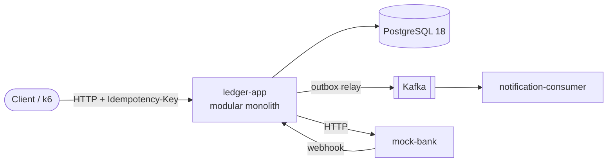

# Ledgerly

**Ví điện tử theo mô hình sổ cái kép (double-entry ledger), có bất biến được kiểm chứng bằng máy.**

[](https://github.com/HoangThanhMan/ledgerly/actions/workflows/ci.yml)


> 🚧 **Trạng thái:** tuần 5, chuyển tiền và nạp tiền đã **retry an toàn**: gửi lại cùng `Idempotency-Key` thì nhận lại response của lần đầu và tiền không chuyển lần hai ([ADR-0005](docs/adr/0005-idempotency-key-hai-pha-trong-postgresql.md)). 50 request đồng thời cùng key tạo đúng 1 giao dịch. Trước đó (tuần 4): khóa account theo thứ tự `id` ([ADR-0004](docs/adr/0004-khoa-bi-quan-co-thu-tu.md)), 10.000 lần chuyển trên 200 virtual threads không vi phạm bất biến. Chưa có sự kiện Kafka. Ví dụ `curl` cho mọi endpoint ở [nhật ký tuần 3](docs/journal/2026-W43.md#gọi-thử-bằng-curl). Xem [lộ trình 12 tuần](docs/03-lo-trinh.md).

Ledgerly là backend ví điện tử (mở ví, chuyển tiền, nạp/rút qua ngân hàng giả lập), xây dựng quanh bốn đảm bảo:

| Đảm bảo | Cách làm | Bằng chứng (sẽ có) |
|---|---|---|
| Không chi tiêu trùng khi có tải đồng thời | Khóa account theo thứ tự id, ràng buộc ở database | Test 200 virtual threads + kiểm tra bất biến |
| API chuyển tiền idempotent | `Idempotency-Key` hai pha theo mô hình Stripe | `IdempotencyConcurrencyIT`: 50 request đồng thời cùng key → 1 giao dịch, 50 câu trả lời giống nhau |
| DB và sự kiện nhất quán | Transactional outbox + consumer khử trùng | `kill -9` relay: 0 sự kiện mất |
| Đối soát với ngân hàng | Job so khớp sao kê, tự xử lý giao dịch mơ hồ | Test "ghost charge" |

## Kiến trúc



Chi tiết: [docs/01-kien-truc.md](docs/01-kien-truc.md).

## Cấu trúc repo

| Module | Mô tả |
|---|---|
| [`ledger-app`](ledger-app) | Ứng dụng chính, gồm các module `ledger`, `wallet`, `idempotency`, `outbox`, `bankgateway`, `topup`, `reconciliation` |
| [`mock-bank`](mock-bank) | Ngân hàng giả lập có thể cấu hình độ trễ và lỗi |
| [`notification-consumer`](notification-consumer) | Kafka consumer idempotent |
| [`ledger-contracts`](ledger-contracts) | Định nghĩa sự kiện dùng chung |
| [`build-logic`](build-logic) | Gradle convention plugins |
| [`docs`](docs) | Tài liệu: kiến trúc, lộ trình, ADR, kế hoạch từng tuần |

## Bắt đầu nhanh

**Yêu cầu:** Docker và JDK 17+ để chạy Gradle. JDK 25 sẽ được Gradle tự tải nếu máy chưa có.

```bash
# 1. Build và chạy toàn bộ test (Testcontainers tự bật PostgreSQL và Kafka)
./gradlew build

# Chỉ unit test (nhanh) hoặc chỉ integration test (Testcontainers)
./gradlew test
./gradlew integrationTest

# Sửa format trước khi commit (build sẽ đỏ nếu lệch format, lỗi null hoặc lỗi Error Prone)
./gradlew spotlessApply

# 2. Bật hạ tầng dev: PostgreSQL ở cổng 5433, Kafka ở cổng 9092
docker compose up -d

# 3. Chạy từng ứng dụng
./gradlew :ledger-app:bootRun              # http://localhost:8080/actuator/health
./gradlew :mock-bank:bootRun               # http://localhost:8081/actuator/health
./gradlew :notification-consumer:bootRun   # http://localhost:8082/actuator/health

# Hoặc chạy một app với Testcontainers, không cần compose
./gradlew :ledger-app:bootTestRun
```

## Retry an toàn như thế nào

Client mất kết nối giữa chừng thì không biết tiền đã chuyển hay chưa. Vì vậy mọi `POST` làm dịch chuyển tiền bắt buộc có header `Idempotency-Key`: client sinh một giá trị (nên là UUID) cho **mỗi thao tác** và giữ nguyên nó qua mọi lần gửi lại.

Output dưới đây là output thật của `./gradlew :ledger-app:bootTestRun` ngày 07/10/2026, chỉ rút gọn UUID thành `<A>`, `<B>`, `<T>`. Ví `<A>` có 500.000.

```console
$ curl -si -X POST localhost:8080/v1/transfers -H 'Content-Type: application/json' \
    -H 'Idempotency-Key: 6f1c2d3e-0002' \
    -d '{"sourceWalletId":"<A>","targetWalletId":"<B>","amount":"150000","currency":"VND"}'
HTTP/1.1 201
Location: /v1/transfers/<T>
Content-Type: application/json

{"id":"<T>","status":"COMPLETED","sourceWalletId":"<A>","targetWalletId":"<B>","amount":"150000","currency":"VND","createdAt":"2026-10-07T02:03:23.711026Z"}

$ # Gửi lại đúng lệnh trên: cùng response, thêm một header, tiền không chuyển lần hai
HTTP/1.1 201
Idempotent-Replayed: true
Location: /v1/transfers/<T>
Content-Type: application/json

{"id":"<T>","status":"COMPLETED","sourceWalletId":"<A>","targetWalletId":"<B>","amount":"150000","currency":"VND","createdAt":"2026-10-07T02:03:23.711026Z"}

$ curl -s localhost:8080/v1/wallets/<A>
{"id":"<A>","currency":"VND","balance":"350000","createdAt":"2026-10-07T02:03:23.608103Z"}
```

| Tình huống | Câu trả lời | Client nên làm gì |
|---|---|---|
| Cùng key, cùng nội dung, request đầu đã xong | Response của lần đầu, kèm `Idempotent-Replayed: true`. Đổi thứ tự trường JSON hay khoảng trắng vẫn tính là cùng nội dung | Dùng kết quả |
| Cùng key, request đầu còn đang chạy | `409 idempotency-in-progress`, kèm `Retry-After: 1` | Chờ rồi gửi lại với **cùng** key |
| Cùng key, khác body hoặc khác endpoint | `422 idempotency-key-reused` | Lỗi của client: mỗi thao tác một key |
| Lần đầu bị từ chối nghiệp vụ (ví dụ `422 insufficient-funds`) | Lần sau nhận lại đúng lỗi đó, kể cả khi ví đã được nạp thêm | Muốn thử lại thì dùng key **mới** |
| Lần đầu lỗi kỹ thuật (`503`, `500`) | Không có gì được lưu, tiền chưa chuyển | Gửi lại với cùng key |
| Thiếu header hoặc body không hợp lệ | `400 validation-error`, key không bị dùng mất | Sửa request |

Key được giữ ít nhất 24 giờ. Thiết kế hai pha, lý do không dùng Redis và các giới hạn nằm ở [ADR-0005](docs/adr/0005-idempotency-key-hai-pha-trong-postgresql.md).

## Tài liệu

- [Tổng quan dự án](docs/00-tong-quan-du-an.md): mục tiêu, phạm vi, mốc, rủi ro
- [Kiến trúc](docs/01-kien-truc.md): C4, mô hình dữ liệu, luồng nghiệp vụ, API
- [Cấu trúc thư mục](docs/02-cau-truc-thu-muc.md)
- [Lộ trình 12 tuần](docs/03-lo-trinh.md) và [kế hoạch từng tuần](docs/weeks/)
- [Chiến lược kiểm thử](docs/04-chien-luoc-kiem-thu.md)
- [Quy ước làm việc](docs/05-quy-uoc-lam-viec.md)
- [Architecture Decision Records](docs/adr/README.md)
