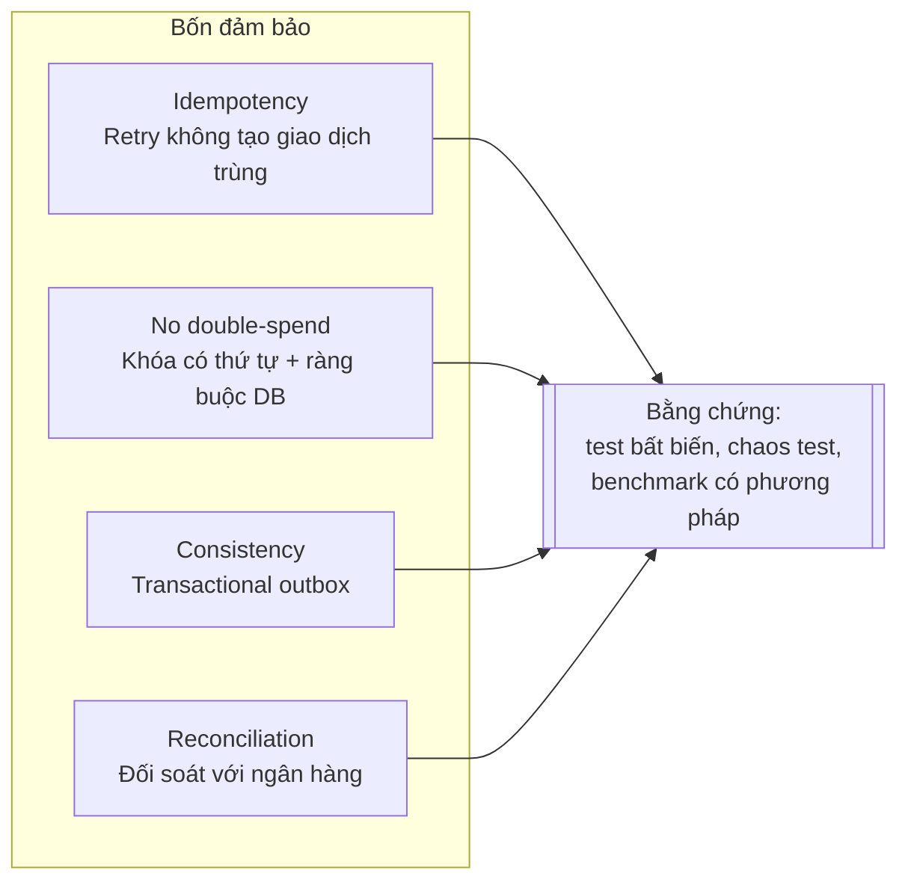

# 00. Tổng quan dự án (Project Charter)

| Thuộc tính | Giá trị |
|---|---|
| Tên dự án | **Ledgerly**: ví điện tử theo mô hình sổ cái kép, có bất biến được kiểm chứng |
| Repo | `ledgerly` (GitHub) |
| Trạng thái | Tuần 0: đã khởi tạo khung dự án (01/10/2026) |
| Thời gian | 15 tuần part-time, từ 05/10/2026 đến 17/01/2027 (12 tuần gốc và 3 tuần hướng AI, thêm ngày 07/10/2026) |
| Ngân sách | 12–15 giờ/tuần, tổng khoảng 205 giờ |
| Mốc MVP | Tuần 8 (29/11/2026), tag `v1.0.0` |
| Trợ lý AI | Tuần A3 (20/12/2026), tag `v1.1.0` |
| Phát hành cuối | Tuần 12 (17/01/2027), tag `v1.2.0` |
| Tài liệu gốc | [research/](research/): hai báo cáo phân tích để chọn đề tài, và [báo cáo về hướng AI Engineer](research/huong-ai-engineer.md) |

---

## 1. Tóm tắt

Ledgerly là backend ví điện tử viết bằng **Java 25 LTS và Spring Boot 4.1**. Nó dùng mô hình **sổ cái kép (double-entry ledger)**: mọi dịch chuyển tiền đều được ghi thành các bút toán bất biến có tổng bằng 0.

Từ tuần A1, dự án có thêm một **trợ lý ví** viết bằng Python: một agent gọi tool trên chính API của Ledgerly, để dự án dùng được cho cả vị trí backend lẫn AI Engineer. Hai phần được nối bằng một ý: agent bị ràng buộc bởi chính các bất biến của sổ cái, và sự ràng buộc đó do server ép chứ không do prompt.

Dự án không cạnh tranh bằng số lượng tính năng. Nó cạnh tranh bằng **bằng chứng đúng đắn**: mỗi đảm bảo kỹ thuật đi kèm một bài test, một bảng kết quả hoặc một ADR mà người khác có thể chạy lại để kiểm tra.

## 2. Bối cảnh và vấn đề

- Thị trường fresher Java 2025–2026 co hẹp. Nhà tuyển dụng ưu tiên ứng viên **giảm được rủi ro đào tạo lại**, không ưu tiên người liệt kê nhiều công nghệ.
- Tác giả đã có kinh nghiệm microservice bằng TypeScript và Python. Làm thêm một bộ CRUD microservice bằng Java chỉ lặp lại điều đã chứng minh.
- Nhóm tuyển Java lớn ở Việt Nam là thanh toán và ngân hàng (VNPAY, các ngân hàng số, fintech). Bài toán sổ cái khớp trực tiếp với nghiệp vụ của họ.
- Phân tích chi tiết và so sánh với phương án "Settlement Engine 4 microservice" nằm trong [research/](research/).
- Các ngân hàng mà dự án nhắm tới cho vị trí Java cũng đang tuyển AI Engineer, và tin tuyển AI hỏi nhiều nhất về Python, LLM, agent, RAG và eval. Phân tích và nguồn ở [research/huong-ai-engineer.md](research/huong-ai-engineer.md).

## 3. Mục tiêu (Goals)

| ID | Mục tiêu | Thước đo kiểm chứng |
|---|---|---|
| G1 | Không chi tiêu trùng (double-spend) khi có tải đồng thời | Test 200 virtual threads chuyển tiền chéo giữa 10 ví. Sau khi chạy, bất biến I1–I4 đều đúng |
| G2 | API chuyển tiền idempotent | 50 request đồng thời cùng `Idempotency-Key` tạo đúng 1 giao dịch và 49 response giống hệt |
| G3 | Ghi DB và phát sự kiện nhất quán | `kill -9` relay giữa batch: không mất sự kiện, bản trùng bị consumer loại bỏ |
| G4 | Chịu lỗi khi phụ thuộc ngoài gặp sự cố | Ma trận 5 kịch bản chaos (Toxiproxy) đều cho kết quả đúng kỳ vọng |
| G5 | Hiệu năng đo trung thực | Báo cáo p50/p95/p99 tại một mức RPS cố định, có công bố phương pháp, dùng k6 `constant-arrival-rate` |
| G6 | Repo dùng được như sản phẩm | `docker compose up` chạy toàn hệ thống, CI xanh, README và ADR đầy đủ |
| G7 | Agent không tự chuyển được tiền | Bất biến I8 đúng sau mọi lượt của bộ thử an toàn: giao dịch nào sinh từ agent cũng có một lệnh do người dùng xác nhận |
| G8 | Chất lượng của agent đo được | Bộ eval chấm trên trạng thái sổ cái, báo `pass^3`, chi phí mỗi task và độ trễ, có kết quả thô trong repo |
| G9 | Biết đổi model thì được gì, mất gì | Bảng so sánh ba model trên cùng bộ task, có công bố phương pháp |

## 4. Ngoài phạm vi (Non-goals)

Những thứ **chủ động không làm**, kèm lý do để trả lời khi phỏng vấn:

| Không làm | Lý do |
|---|---|
| Chia thành nhiều microservice | Đã chứng minh bằng TS/Python. Ở đây chọn modular monolith có ranh giới module được kiểm tra (xem [ADR-0001](adr/0001-modular-monolith.md)) |
| Frontend | Đây là dự án backend. Swagger UI và k6 đủ để demo. Trợ lý AI cũng chỉ có API |
| Xác thực đầy đủ (OAuth2/OIDC), đăng ký, mật khẩu | Không phải trọng tâm. Từ tuần A1 có token tự quản theo scope, vừa đủ để phân biệt người dùng với agent (ADR-0011) |
| Huấn luyện mô hình, ML cổ điển | Hướng AI của dự án là xây ứng dụng trên LLM (agent, RAG, eval). Năng lực huấn luyện mô hình cần bằng chứng khác |
| Agent tự chuyển tiền không cần xác nhận | Đi ngược mục tiêu G7 |
| Đa tiền tệ, quy đổi tỉ giá | Chỉ dùng VND. Mô hình `Money` vẫn có trường tiền tệ để mở rộng sau |
| Kubernetes, service mesh | Không cần ở quy mô này. Docker Compose là đường demo chính |
| Debezium CDC | Polling relay với `SKIP LOCKED` là đủ và dễ kiểm thử. Debezium được ghi là "đã cân nhắc" trong ADR-0006 |
| Tính năng preview của JDK (structured concurrency...) | Code chính chỉ dùng tính năng đã final |

## 5. Bốn đảm bảo cốt lõi

## 6. Phạm vi (MoSCoW)

### Must: MVP, hạn chót tuần 8

1. Mở ví và xem số dư, lịch sử bút toán.
2. Chuyển tiền nội bộ idempotent, chống chi tiêu trùng bằng khóa bi quan theo thứ tự cố định.
3. Lịch sử bút toán bất biến: không bao giờ `UPDATE` hay `DELETE` một entry.
4. Transactional outbox, relay lên Kafka, consumer idempotent.
5. Bộ test bất biến chạy sau mỗi lần load test.
6. `docker compose up` một lệnh, CI xanh, README và OpenAPI đầy đủ.

### Should (hướng AI): tuần A1–A3

7a. Token theo scope, quyền sở hữu ví, và lệnh chuyển tiền chờ xác nhận.
7b. Trợ lý ví: MCP server, agent gọi tool, RAG trên kho tri thức về chính sách.
7c. Bộ eval chấm trên trạng thái sổ cái, bộ thử an toàn, bảng so sánh model.

### Should: tuần 9–11

7. Saga nạp tiền qua `mock-bank` (`PENDING → SETTLED / FAILED`), có timeout, retry và bút toán bù trừ.
8. Ma trận chaos bằng Toxiproxy, `@ConcurrencyLimit` chống cạn connection pool.
9. Job đối soát sổ cái với sao kê của `mock-bank`.
10. Benchmark so sánh chiến lược khóa (bi quan và lạc quan), và virtual threads với platform threads.

### Could: làm nếu còn thời gian

11. Giữ tiền (hold, authorize/capture), áp dụng khái niệm semantic lock.
12. Circuit breaker cho HTTP client gọi `mock-bank`.
13. Rate limit theo ví.
14. Một ADR bị thay thế (trạng thái *superseded*).
15. Viết lại vòng lặp agent bằng LangGraph và so bằng cùng bộ eval.
16. Tinh chỉnh model embedding cho kho tri thức.
17. Dùng LLM phân loại và giải thích các dòng lệch khi đối soát.

### Won't, ở phiên bản này

Xem mục 4.

## 7. Mốc (Milestones)

| Mốc | Ngày | Tiêu chí hoàn thành |
|---|---|---|
| **M0**: Khung dự án | 01/10/2026 | Gradle multi-module build được, các app khởi động được, compose chạy được ✅ |
| **M1**: Thiết kế chốt | 11/10/2026 | Tài liệu kiến trúc đã review, ADR-0001/0002/0003 ở trạng thái Accepted, có backlog trên GitHub Projects |
| **M2**: Lõi sổ cái đúng | 01/11/2026 | Chuyển tiền đồng thời qua test bất biến, ADR-0004 |
| **M3**: Nhất quán | 15/11/2026 | Idempotency và outbox xong, test `kill -9` relay xanh |
| **M4**: MVP `v1.0.0` | 29/11/2026 | Tất cả mục *Must*, có demo, benchmark baseline |
| **M5**: Trợ lý AI `v1.1.0` | 20/12/2026 | Agent chạy được, I8 đúng trên bộ thử an toàn, bảng so sánh model, ADR-0011 đến 0013 |
| **M6**: Phát hành `v1.2.0` | 17/01/2027 | Các mục *Should* của tuần 9–11, blog, hai bản CV có số liệu thật |

## 8. Tiêu chí thành công

Dự án được coi là thành công khi đạt cả bốn điều sau:

- [ ] Người lạ clone repo, chạy `docker compose up` và `./gradlew build` thành công trong dưới 10 phút.
- [ ] Mọi con số trên CV đều có script và kết quả thô trong repo.
- [ ] Trả lời trôi chảy toàn bộ câu hỏi deep-dive trong [tuần 12](weeks/tuan-12.md).
- [ ] Không có tính năng *Must* nào dang dở.

## 9. Ràng buộc và giả định

- **Thời gian**: 12–15 giờ/tuần, song song với luyện thuật toán (khoảng 5 giờ/tuần, tính riêng).
- **Ngôn ngữ**: lõi là Java. Lớp AI là Python, trong một service riêng chỉ nói chuyện với lõi qua HTTP.
- **Phần cứng**: một máy cá nhân. Mọi benchmark phải ghi rõ cấu hình máy.
- **Chi phí**: 0 đồng cho hạ tầng. Deploy trên Oracle Always Free nếu có thẻ, nếu không thì Render free. **Ngoại lệ từ tuần A2:** tiền gọi model cho agent và eval, ước 60–100 USD cho cả ba tuần, chưa đo. Khoản này cần tác giả duyệt trước khi chạy.
- **Phiên bản**: Java 25 LTS, Spring Boot 4.1.x, PostgreSQL 18, Kafka 4.x (chế độ KRaft).

## 10. Đăng ký rủi ro (Risk register)

| ID | Rủi ro | Khả năng | Ảnh hưởng | Giảm thiểu |
|---|---|---|---|---|
| R1 | Trễ tiến độ, bỏ dở | Cao | Rất cao | MVP khóa ở tuần 8. Khi trễ thì cắt *Should/Could*, **không cắt test** |
| R2 | Phạm vi phình to (scope creep) | Trung bình | Cao | Mọi tính năng mới phải nằm trong danh sách MoSCoW. Nếu chưa có, ghi vào "Hướng phát triển" |
| R3 | Thư viện chưa tương thích Boot 4 (Jackson 3...) | Trung bình | Trung bình | Kiểm tra tương thích trước khi thêm thư viện, ưu tiên tính năng có sẵn trong Spring Framework 7 |
| R4 | Test Testcontainers chậm hoặc flaky | Trung bình | Trung bình | Dùng chung container cho cả suite, tách suite `integrationTest`. Dùng image JVM `apache/kafka`, **không** dùng `kafka-native`: bản native bị segfault 2/15 lần khởi động trên máy dev, bản JVM 15/15 (đo 2026-10-01) |
| R5 | Không giải thích được code do AI sinh | Trung bình | Rất cao | Ghi nhật ký dùng AI. Mọi đoạn code AI gợi ý phải có test và giải thích được từng dòng |
| R6 | Số liệu benchmark bị lật lại khi phỏng vấn | Trung bình | Cao | Công bố phương pháp đo, dùng `constant-arrival-rate`, commit kết quả thô |
| R7 | Dự án ăn hết thời gian luyện thuật toán | Cao | Cao | Khóa cứng 5 giờ/tuần cho LeetCode, không mượn sang |
| R8 | Hai hướng làm dự án mất trọng tâm | Trung bình | Cao | Chỉ **một** tính năng AI, và nó dùng lại idempotency, sự kiện, bất biến của lõi. README kể thành một ý. Hai bản CV, cùng một repo |
| R9 | Chi phí gọi model vượt dự tính | Trung bình | Trung bình | Đo chi phí một lượt chạy trước khi chạy đủ (A2-07). Phát triển bằng model rẻ. Eval thật không chạy tự động trên PR |
| R10 | Eval chập chờn làm CI đỏ ngẫu nhiên | Cao | Trung bình | CI chỉ chạy eval khô (phát lại transcript). Eval thật báo `pass^3` qua nhiều lượt |
| R11 | Agent bị dụ (prompt injection) | Cao | Rất cao | Quyền nằm ở server: token của agent không có scope thực thi. Bộ thử an toàn chấm bằng I8, I9 trên database |
| R12 | Hướng AI lấn mất saga, chaos, đối soát | Trung bình | Cao | MVP `v1.0.0` khóa trước khi bắt đầu A1. Nếu trễ thì cắt theo [quy tắc](03-lo-trinh.md#5-quy-tắc-cắt-giảm-khi-trễ), không cắt test |

## 11. Thuật ngữ

| Thuật ngữ | Nghĩa trong dự án |
|---|---|
| Account | Tài khoản kế toán. Ví của người dùng là một account. Ngoài ra có account hệ thống, ví dụ `bank-settlement` |
| Ledger transaction | Một nghiệp vụ tài chính, gồm từ 2 entry trở lên, tổng bằng 0 |
| Entry (bút toán) | Một dòng ghi nợ hoặc có trên một account. Bất biến, chỉ được thêm, không được sửa |
| Posting | Hành động ghi một ledger transaction vào sổ cái |
| Idempotency key | Khóa do client gửi lên để server nhận ra request bị lặp lại |
| Outbox | Bảng lưu sự kiện, được ghi trong cùng transaction với dữ liệu nghiệp vụ |
| Relay | Tiến trình đọc outbox và phát sự kiện lên Kafka |
| Saga | Chuỗi transaction cục bộ, khi lỗi thì chạy bước bù trừ |
| Reconciliation (đối soát) | So sánh sổ cái với nguồn bên ngoài (sao kê ngân hàng) để phát hiện chênh lệch |
| Hot account | Account bị nhiều giao dịch đồng thời tranh nhau khóa |
| Principal | Người gọi API đã xác thực. Sở hữu ví và token |
| Scope | Quyền gắn với một token, ví dụ `transfers:propose` |
| Transfer intent (lệnh chờ xác nhận) | Đề nghị chuyển tiền do agent tạo. Chỉ thành giao dịch khi người dùng xác nhận |
| Tool calling | Model trả về yêu cầu gọi một hàm có schema, ứng dụng thực thi rồi gửi kết quả lại |
| MCP | Model Context Protocol: giao thức chuẩn để một agent dùng tool của một hệ thống khác |
| RAG | Truy xuất các đoạn tài liệu liên quan rồi đưa vào ngữ cảnh để model trả lời có căn cứ |
| Eval | Bộ task cố định và grader để đo một hệ thống AI, chạy lại được như test |
| `pass^k` | Tỉ lệ task mà cả k lượt chạy đều đạt |
| Prompt injection | Nội dung không tin được chứa lệnh, nhằm khiến agent làm việc người dùng không yêu cầu |
| Coordinated omission | Lỗi đo khiến độ trễ trông tốt hơn thực tế, do bộ sinh tải chờ response rồi mới gửi tiếp |
