# 01. Kiến trúc hệ thống

> Tài liệu này mô tả **trạng thái đích** khi kết thúc tuần 12. Lớp AI (tuần A1–A3) nằm riêng ở [mục 14](#14-lớp-ai-kế-hoạch-tuần-a1a3), vì nó mới ở mức kế hoạch. Mỗi mục ghi rõ tuần triển khai để đối chiếu với [lộ trình](03-lo-trinh.md). Các sơ đồ dùng Mermaid, GitHub hiển thị trực tiếp.

## Mục lục

1. [Nguyên tắc kiến trúc](#1-nguyên-tắc-kiến-trúc)
2. [C4 mức 1: System Context](#2-c4-mức-1-system-context)
3. [C4 mức 2: Container](#3-c4-mức-2-container)
4. [C4 mức 3: Component trong ledger-app](#4-c4-mức-3-component-trong-ledger-app)
5. [Mô hình dữ liệu](#5-mô-hình-dữ-liệu)
6. [Luồng nghiệp vụ chính](#6-luồng-nghiệp-vụ-chính)
7. [Kiểm soát đồng thời](#7-kiểm-soát-đồng-thời)
8. [Thiết kế API](#8-thiết-kế-api)
9. [Sự kiện và Kafka](#9-sự-kiện-và-kafka)
10. [Quan sát hệ thống (Observability)](#10-quan-sát-hệ-thống-observability)
11. [Triển khai](#11-triển-khai)
12. [Tech stack](#12-tech-stack)
13. [Yêu cầu phi chức năng](#13-yêu-cầu-phi-chức-năng)
14. [Lớp AI (kế hoạch, tuần A1–A3)](#14-lớp-ai-kế-hoạch-tuần-a1a3)

---

## 1. Nguyên tắc kiến trúc

| # | Nguyên tắc | Hệ quả cụ thể |
|---|---|---|
| P1 | **Đúng trước, nhanh sau** | Mọi tối ưu hiệu năng phải giữ nguyên bất biến I1–I7 ([chiến lược kiểm thử](04-chien-luoc-kiem-thu.md)) |
| P2 | **Sổ cái chỉ được thêm (append-only)** | Không `UPDATE`/`DELETE` bảng `entries`. Muốn sửa sai thì ghi bút toán đảo |
| P3 | **Database là nguồn sự thật** | Ràng buộc nghiệp vụ quan trọng được khóa bằng constraint và trigger, không chỉ bằng code Java |
| P4 | **Mọi thao tác có thể bị lặp lại** | API ghi tiền bắt buộc có `Idempotency-Key`, consumer khử trùng theo `eventId`, mock-bank khử trùng theo `merchantRef` |
| P5 | **Ranh giới module được kiểm tra bằng máy** | ArchUnit chặn truy cập vào package `internal` của module khác và chặn phụ thuộc vòng |
| P6 | **Không có số liệu nào không kèm phương pháp đo** | Benchmark nào cũng có script, môi trường và kết quả thô trong repo |
| P7 | **Chỉ dùng tính năng final của JDK** | Không bật `--enable-preview` trong code chính |

## 2. C4 mức 1: System Context

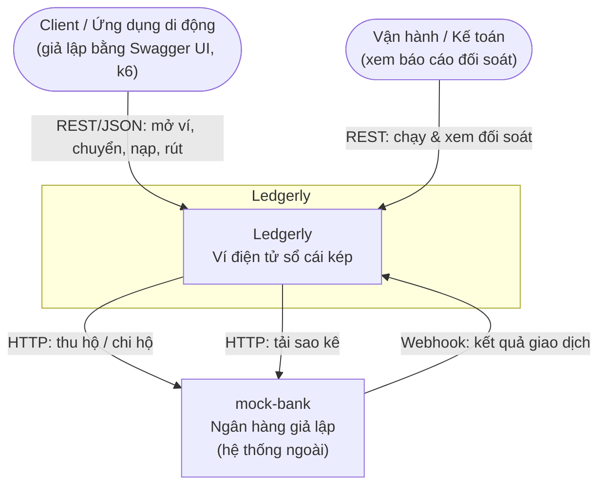

`mock-bank` nằm trong repo nhưng được đối xử như **hệ thống bên ngoài**. Nó có database riêng, giao tiếp qua mạng và có thể cấu hình độ trễ, tỉ lệ lỗi.

## 3. C4 mức 2: Container

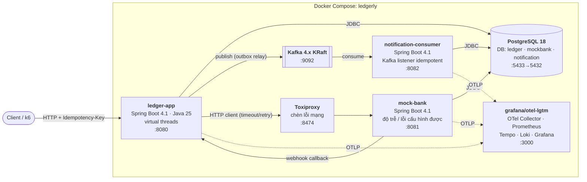

| Container | Trách nhiệm | Lưu trữ | Tuần |
|---|---|---|---|
| `ledger-app` | Toàn bộ nghiệp vụ ví và sổ cái, idempotency, outbox relay, saga, đối soát | DB `ledger` | 3–11 |
| `notification-consumer` | Nhận sự kiện, khử trùng theo `eventId`, ghi thông báo | DB `notification` | 6 |
| `mock-bank` | Giả lập ngân hàng: thu hộ, chi hộ, webhook, sao kê, chế độ lỗi | DB `mockbank` | 9 |
| `ledger-contracts` | Thư viện Java dùng chung: định nghĩa sự kiện (records) và phiên bản schema | Không | 6 |
| PostgreSQL | Một instance, mỗi service một database riêng | | 0 |
| Kafka | Message broker, 1 node KRaft | | 0 |
| Toxiproxy | Proxy chèn lỗi giữa `ledger-app` và `mock-bank`/PostgreSQL | | 10 |
| otel-lgtm | Metrics, traces và logs trong một container cho môi trường dev | | 7 |

## 4. C4 mức 3: Component trong ledger-app

`ledger-app` là một **modular monolith**. Mỗi module là một package cấp cao nhất dưới `dev.ledgerly`. Quy ước:

- Các kiểu ở **gốc package của module** là API công khai (facade, records, sự kiện).
- Mọi thứ trong `<module>.internal..` là riêng tư. Module khác không được import.

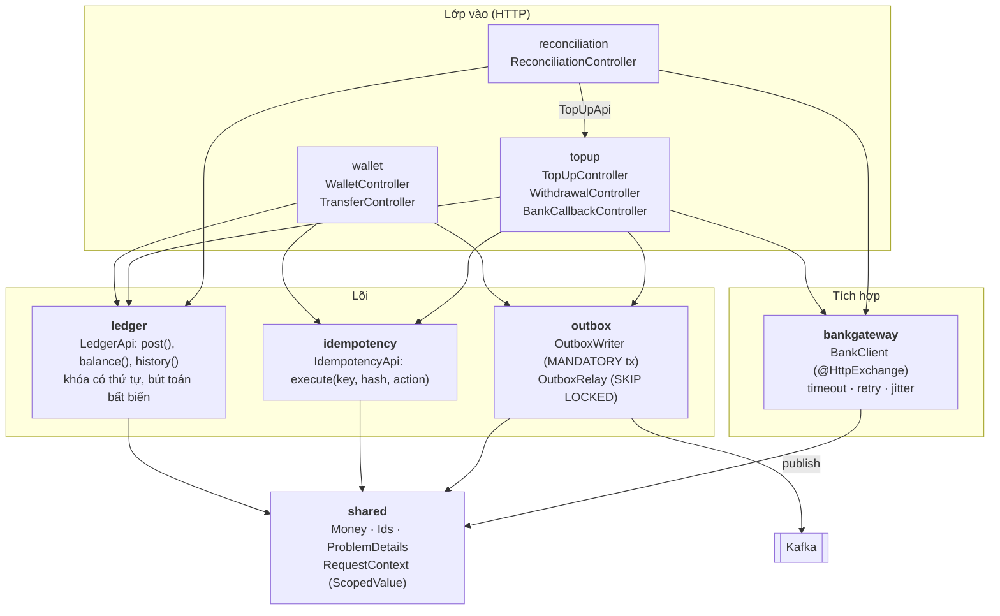

### Ma trận phụ thuộc cho phép (ArchUnit kiểm tra)

| Module ↓ được gọi → | shared | ledger | idempotency | outbox | bankgateway | topup |
|---|:-:|:-:|:-:|:-:|:-:|:-:|
| `wallet` | ✅ | ✅ | ✅ | ✅ | ❌ | ❌ |
| `topup` | ✅ | ✅ | ✅ | ✅ | ✅ | |
| `reconciliation` | ✅ | ✅ | ❌ | ❌ | ✅ | ✅ |
| `ledger` | ✅ | | ❌ | ❌ | ❌ | ❌ |
| `idempotency`, `outbox`, `bankgateway` | ✅ | ❌ | ❌ | ❌ | ❌ | ❌ |

Ngoài bảng trên, thư viện `ledger-contracts` (package `dev.ledgerly.contracts`) được dùng bởi `wallet`, nơi tạo payload của sự kiện, và `outbox`, nơi đóng gói envelope khi gửi. Các module khác chưa được dùng. `topup` sẽ được thêm khi nó có sự kiện (tuần 9).

`reconciliation` cần đọc các lệnh nạp/rút trong ngày và chuyển những lệnh `UNKNOWN` sang trạng thái cuối (luồng [6.5](#65-đối-soát-tuần-11)). Nó làm việc này qua `TopUpApi` chứ không đọc hay ghi thẳng bảng `topups`/`withdrawals`. Khi auto-heal, bút toán và sự kiện outbox vẫn do `topup` ghi trong transaction của nó, nên `reconciliation` không cần quyền gọi `outbox`.

Thêm ba quy tắc nữa:

1. Không có phụ thuộc vòng giữa các module (`slices().should().beFreeOfCycles()`).
2. `..internal.domain..` không phụ thuộc Spring hay JDBC (domain thuần Java).
3. `@Transactional` chỉ xuất hiện ở `..internal.application..`.

## 5. Mô hình dữ liệu

### 5.1 Quy ước

- **Tiền** lưu dạng `BIGINT` theo đơn vị nhỏ nhất của tiền tệ (VND có 0 chữ số thập phân), kèm `currency CHAR(3)`. **Không dùng `double`/`float`** (ADR-0003).
- **ID** dùng UUIDv7 (hàm `uuidv7()` có sẵn từ PostgreSQL 18). Có thứ tự theo thời gian nên thân thiện với B-tree index.
- `entries.amount` **có dấu**: âm là tiền ra khỏi account, dương là tiền vào account.
- Mọi bảng có `created_at TIMESTAMPTZ NOT NULL DEFAULT now()`.

### 5.2 Database `ledger`

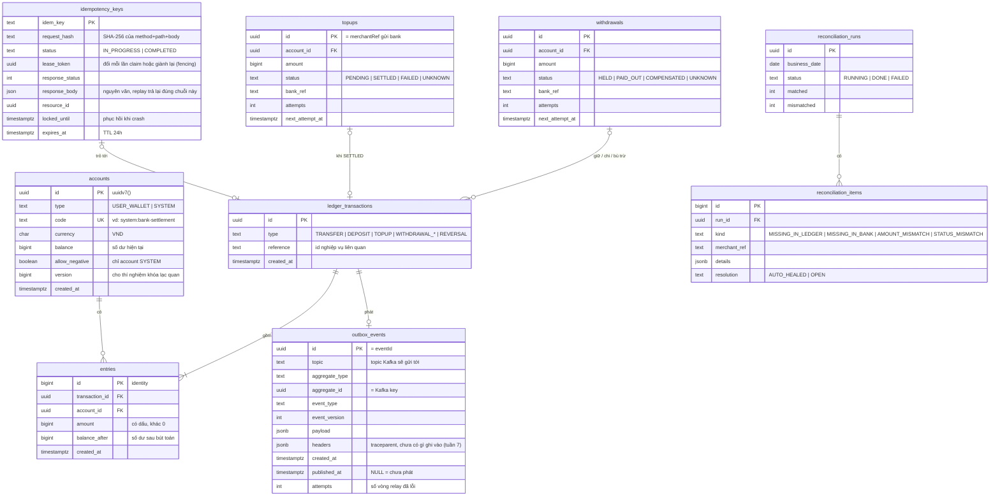

### 5.3 Ràng buộc ở tầng database (phòng thủ nhiều lớp)

| Ràng buộc | Cài đặt | Bảo vệ cho |
|---|---|---|
| Số dư không âm | `CHECK (allow_negative OR balance >= 0)` | I2, lớp chặn cuối nếu code có bug |
| Chỉ account hệ thống được âm | `CHECK (type = 'SYSTEM' OR NOT allow_negative)` | I2: một ví người dùng không thể bị bật `allow_negative` do nhầm |
| Bút toán khác 0 | `CHECK (amount <> 0)` | Dữ liệu rác |
| Entry bất biến | Trigger `BEFORE UPDATE OR DELETE ON entries`, gọi `RAISE EXCEPTION` | P2, I1 |
| Tổng entries của transaction bằng 0 | Constraint trigger `DEFERRABLE INITIALLY DEFERRED`, kiểm tra lúc commit | I1 |
| Không nạp/rút trùng | `UNIQUE` trên `topups.id`, `withdrawals.id` (chính là `merchantRef`) | P4 |
| Mỗi thay đổi một sự kiện | `UNIQUE (aggregate_id, event_type)` trên `outbox_events` | I6 |

### 5.4 Database `notification` và `mockbank`

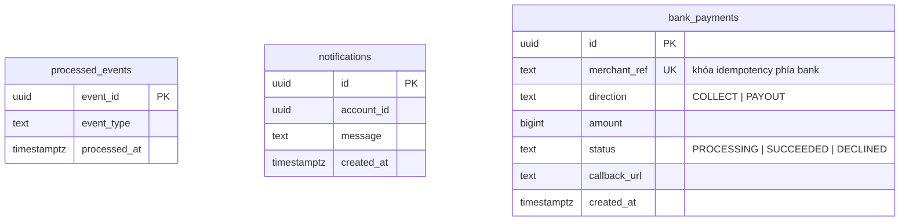

## 6. Luồng nghiệp vụ chính

### 6.1 Chuyển tiền idempotent (tuần 3–5)

Thiết kế hai pha: pha *claim* khóa idempotency, rồi pha *nghiệp vụ*. Lý do: cùng một cơ chế dùng được cho cả luồng có gọi HTTP ra ngoài (nạp/rút tiền), vì không được giữ DB transaction trong lúc chờ mạng.

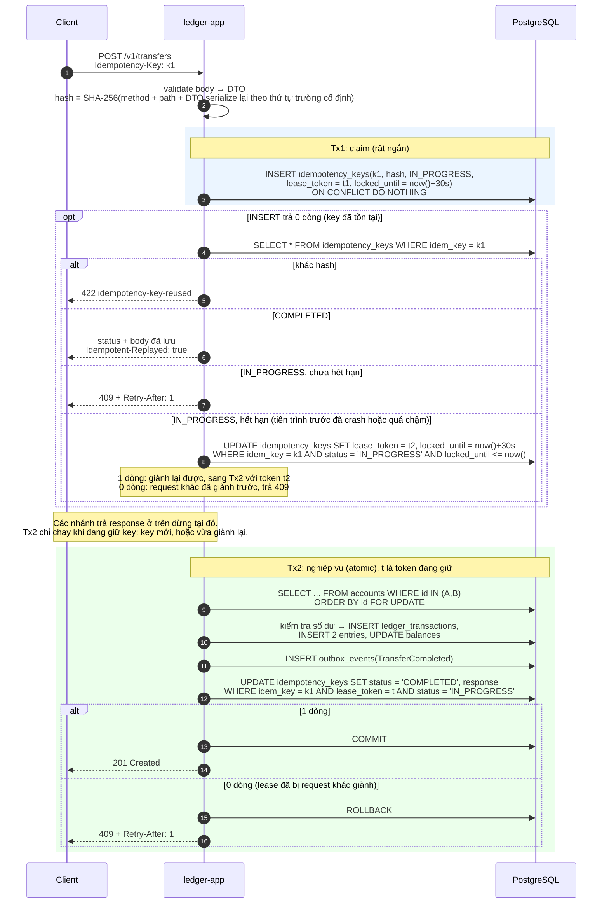

Mọi lời từ chối nghiệp vụ (thiếu số dư, ví không tồn tại, chuyển cho chính mình, sai tiền tệ) cũng được lưu thành `COMPLETED`. Retry với cùng key sẽ nhận lại đúng lỗi đó, kể cả khi ví đã được nạp thêm: muốn thử lại thì dùng key mới. Lỗi validate (400) xảy ra **trước** khi claim nên không được lưu.

Response được render thành JSON **bên trong Tx2** và lưu nguyên văn (cột `JSON`, không phải `JSONB`), nên replay trả lại đúng chuỗi của lần đầu, chỉ thêm header `Idempotent-Replayed: true`. Hash của request gồm cả method và path: cùng key ở endpoint khác là `422 idempotency-key-reused`. Lý do của các lựa chọn này nằm ở [ADR-0005](adr/0005-idempotency-key-hai-pha-trong-postgresql.md).

**Vì sao cần `lease_token` (fencing token).** `locked_until` chỉ là một lease có hạn. Nếu Tx2 của request A chạy lâu hơn 30 giây (chờ khóa hot account, GC pause, mạng tới DB chậm), request B sẽ giành lại key và hoàn tất Tx2 của nó. Nếu câu `UPDATE ... SET COMPLETED` của A không có điều kiện, A vẫn commit được, và một key sinh ra **hai** giao dịch (vi phạm I5). Khi `UPDATE` phải khớp đúng token đang giữ, A nhận về 0 dòng và rollback toàn bộ Tx2. Số đo ở tuần 5 ([ADR-0005, B4](adr/0005-idempotency-key-hai-pha-trong-postgresql.md#bằng-chứng)) cho thấy riêng điều kiện `status = 'IN_PROGRESS'` trong câu hoàn tất đã đủ để chỉ một bên commit. Token thêm hai thứ: bên thắng luôn là request đang giữ lease, và việc hoàn tất gắn với đúng một lần claim. Điều kiện `status = 'IN_PROGRESS'` trong câu giành lại cũng cần thiết: nếu A vừa commit `COMPLETED` giữa lúc B đọc và lúc B `UPDATE`, B không được giành một key đã xong.

**Tx2 lỗi kỹ thuật** (exception, mất kết nối, timeout khóa): Tx2 rollback nên chưa có hiệu ứng nào. Sau đó thả key theo kiểu best-effort, bằng `UPDATE idempotency_keys SET locked_until = now() WHERE idem_key = k1 AND lease_token = t`, để client retry ngay mà không phải nhận 409 tới khi lease hết hạn. Nếu bước thả key cũng lỗi thì lease tự hết hạn là lớp dự phòng.

**Dọn key.** `expires_at` là 24 giờ sau lần claim đầu. Một job chạy 10 phút một lần xóa key quá hạn theo lô 1000 (`FOR UPDATE SKIP LOCKED`), nên key sống *ít nhất* 24 giờ và vẫn replay cho tới khi bị xóa. Key `IN_PROGRESS` quá hạn (tiến trình chết và không ai retry) cũng bị xóa.

### 6.2 Outbox relay và consumer idempotent (tuần 6)

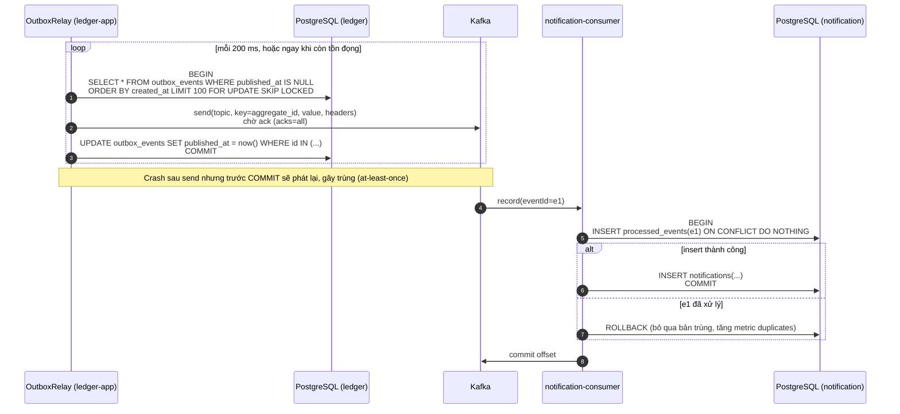

**Relay giữ DB transaction trong lúc chờ Kafka ack.** Điều này có vẻ trái với nguyên tắc "không giữ transaction khi chờ mạng" ở luồng 6.1, nhưng chấp nhận được vì ba lý do. Thứ nhất, chỉ một luồng nền giữ một connection, không phải mỗi request một connection. Thứ hai, khóa chỉ nằm trên các dòng outbox của lô, không đụng tới account. Thứ ba, mỗi lần gửi có timeout (5 giây, W06-04), nên khi Kafka sập transaction không bị treo. Có hai hệ quả cần biết. Producer có thể vẫn giao thành công một record **sau khi** relay đã hết timeout và rollback, và đó là một nguồn trùng nữa mà consumer phải chịu được. Ngoài ra, câu `SELECT` cần partial index `WHERE published_at IS NULL` (W06-02) để không phải quét các dòng đã phát.

**Các chi tiết của cài đặt** (lý do ở [ADR-0006](adr/0006-transactional-outbox-voi-polling-relay.md)):

- Lô được lấy theo `ORDER BY created_at, id` và gửi **lần lượt**: sự kiện nào lỗi thì chưa sự kiện nào sau nó được gửi. Vòng lỗi thì rollback, cột `attempts` tăng bằng một câu lệnh riêng, và relay nghỉ 200 ms, gấp đôi sau mỗi lần lỗi liên tiếp, tối đa 30 giây.
- `created_at` là lúc sự kiện được ghi (`clock_timestamp()`), không phải lúc transaction bắt đầu (`now()`) hay commit. Relay tìm việc bằng `published_at IS NULL`, không nhớ "đã đọc tới đâu", nên một transaction commit muộn vẫn được thấy.
- Producer đặt `linger.ms=0`. Relay chờ ack từng record, nên 5 ms gom lô mặc định chỉ cộng thêm độ trễ cho mỗi sự kiện.
- `ledgerly.outbox.relay.enabled=false` tắt relay của một instance. Nhiều relay chạy cùng lúc không phát trùng nhau nhờ `SKIP LOCKED`, nhưng hai sự kiện đang cùng tồn đọng của **một** aggregate có thể bị phát sai thứ tự.
- Chỉ **chuyển tiền** phát sự kiện. Nạp tiền nội bộ (`POST /v1/admin/deposits`) thì không.
- Consumer bỏ qua ngay message không đọc được (nó sẽ chặn cả partition), và thử lại không giới hạn với lỗi khác (database mất kết nối).

**Exactly-once về hiệu ứng** = at-least-once (relay retry) + at-most-once (consumer khử trùng). Kafka EOS không giải quyết được bài toán này, vì side effect nằm ở database ngoài Kafka.

### 6.3 Nạp tiền qua ngân hàng: saga có trạng thái (tuần 9)

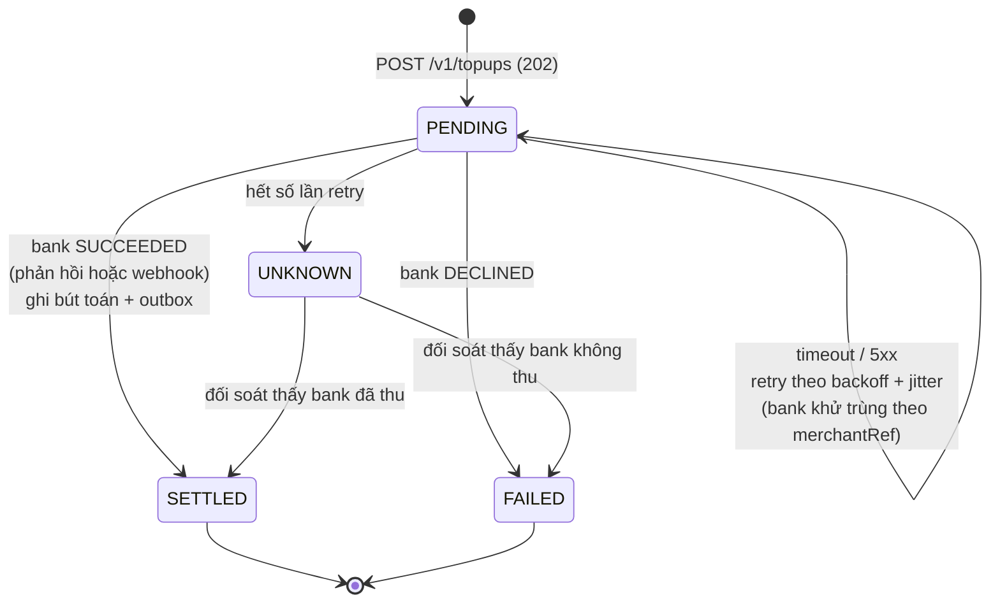

Mọi chuyển trạng thái đều là `UPDATE ... WHERE status = '<trạng thái cũ>'` (compare-and-set). Webhook và worker có chạy song song thì cũng chỉ một bên thắng.

### 6.4 Rút tiền: saga có bù trừ (tuần 9)

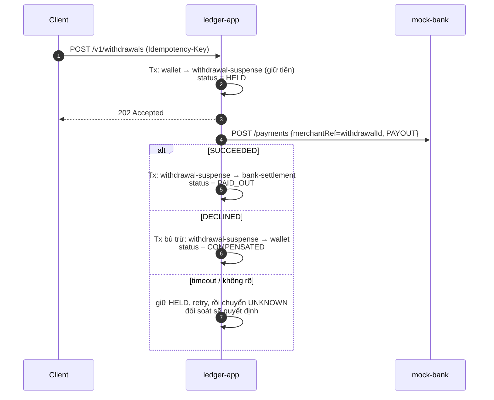

### 6.5 Đối soát (tuần 11)

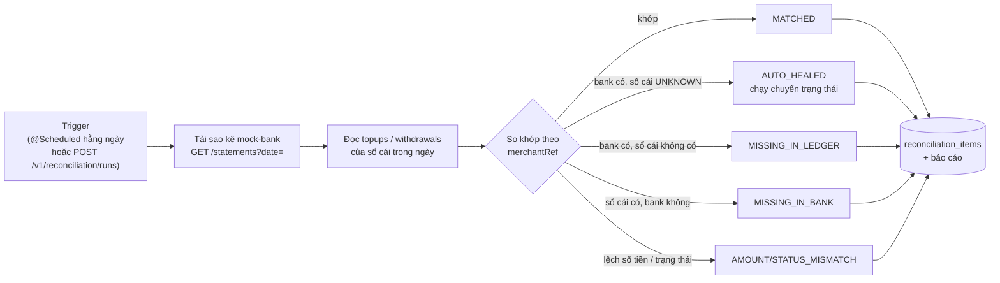

Đối soát nội bộ chạy kèm: kiểm tra bất biến I1–I4 bằng SQL (xem [chiến lược kiểm thử](04-chien-luoc-kiem-thu.md#2-bất-biến-hệ-thống)).

## 7. Kiểm soát đồng thời

| Vấn đề | Giải pháp | Ghi chú phỏng vấn |
|---|---|---|
| Hai giao dịch cùng trừ một ví | `SELECT ... FOR NO KEY UPDATE` trên dòng account, ở isolation READ COMMITTED, chờ khóa tối đa `lock_timeout` 2 giây ([ADR-0004](adr/0004-khoa-bi-quan-co-thu-tu.md)) | Khóa dòng tuần tự hóa các thao tác ghi trên cùng account. SERIALIZABLE gây nhiều lỗi retry hơn mà không thêm đảm bảo cần thiết |
| Deadlock khi A→B và B→A chạy cùng lúc | Luôn khóa theo **id tăng dần**, bằng một câu `ORDER BY id` | Thứ tự khóa toàn cục loại bỏ chờ vòng |
| Hot account (ví hệ thống nhận rất nhiều giao dịch) | Tuần 11 đo 3 chiến lược: khóa bi quan, khóa lạc quan + retry, ghi qua account trung gian rồi gộp (batching) | Kết quả ghi vào ADR-0010 |
| Virtual threads làm cạn connection pool | `@ConcurrencyLimit` ở tầng application. Pool HikariCP cỡ nhỏ, `connectionTimeout` ngắn, quá tải trả 503 | Từ JDK 24 (JEP 491), `synchronized` không còn gây pinning. Nút cổ chai thật là DB |
| Request context (correlation id) | `ScopedValue` (JEP 506, final ở Java 25) thay cho `ThreadLocal` | Không rò rỉ giữa các virtual thread, bất biến trong phạm vi |

## 8. Thiết kế API

### 8.1 Quy ước chung

- Phiên bản hóa bằng path `/v1/...`. Hiện tiền tố được viết thẳng trong `@RequestMapping`. API versioning có sẵn trong Spring Framework 7 sẽ dùng khi có phiên bản thứ hai.
- JSON dùng `camelCase`. Số tiền là **chuỗi số nguyên** theo đơn vị nhỏ nhất, ví dụ `"amount": "150000"`, để tránh mất chính xác ở client JavaScript.
- Lỗi theo **RFC 9457 Problem Details** (`application/problem+json`), có `type`, `title`, `status`, `detail`, `instance`. Lỗi validate có thêm `errors` (danh sách `field`, `message`). `traceId` được thêm khi có tracing (tuần 7).
- Phân trang lịch sử bằng keyset (`?after=<entryId>&limit=50`, `limit` từ 1 đến 100), không dùng offset. Response có `items` và `nextCursor`. `nextCursor` là giá trị `after` của trang kế, hoặc `null` ở trang cuối.
- Header `Idempotency-Key` (chuỗi 1–64 ký tự ASCII nhìn thấy được, khuyến nghị dùng UUID) **bắt buộc** với mọi `POST` làm dịch chuyển tiền. Gửi lại cùng key và cùng nội dung thì nhận lại response của lần đầu kèm `Idempotent-Replayed: true`. Gặp `409` thì chờ theo `Retry-After` rồi gửi lại với **cùng** key.

### 8.2 Danh sách endpoint

| Method | Path | Mô tả | Idempotency | Thành công | Tuần |
|---|---|---|:-:|---|:-:|
| `POST` | `/v1/wallets` | Mở ví | Không bắt buộc | 201 | 3 |
| `GET` | `/v1/wallets/{id}` | Số dư và thông tin ví | | 200 | 3 |
| `GET` | `/v1/wallets/{id}/entries` | Lịch sử bút toán (keyset) | | 200 | 3 |
| `POST` | `/v1/transfers` | Chuyển tiền nội bộ | **Bắt buộc** | 201 | 3–5 |
| `GET` | `/v1/transfers/{id}` | Chi tiết giao dịch | | 200 | 3 |
| `POST` | `/v1/admin/deposits` | Nạp tiền nội bộ (seed cho dev/test) | **Bắt buộc** | 201 | 3 |
| `POST` | `/v1/topups` | Nạp tiền qua ngân hàng | **Bắt buộc** | 202 | 9 |
| `GET` | `/v1/topups/{id}` | Trạng thái nạp | | 200 | 9 |
| `POST` | `/v1/withdrawals` | Rút tiền về ngân hàng | **Bắt buộc** | 202 | 9 |
| `POST` | `/internal/bank-callbacks` | Webhook từ mock-bank | Khử trùng theo `merchantRef` | 204 | 9 |
| `POST` | `/v1/reconciliation/runs` | Chạy đối soát | | 202 | 11 |
| `GET` | `/v1/reconciliation/runs/{id}` | Báo cáo đối soát | | 200 | 11 |

### 8.3 Bảng mã lỗi

| HTTP | `type` (Problem Details) | Khi nào |
|---|---|---|
| 400 | `/problems/validation-error` | Body, tham số hoặc header không hợp lệ, thiếu `Idempotency-Key` |
| 404 | `/problems/wallet-not-found` | Ví không tồn tại (account `SYSTEM` không phải là ví) |
| 404 | `/problems/transfer-not-found` | Giao dịch chuyển tiền không tồn tại |
| 409 | `/problems/idempotency-in-progress` | Key đang xử lý, kèm header `Retry-After` |
| 422 | `/problems/idempotency-key-reused` | Cùng key nhưng khác method, path hoặc body |
| 422 | `/problems/insufficient-funds` | Không đủ số dư |
| 422 | `/problems/same-account-transfer` | Chuyển cho chính mình |
| 422 | `/problems/currency-mismatch` | Tiền tệ của request khác tiền tệ của ví |
| 422 | `/problems/unsupported-currency` | Mở ví bằng tiền tệ chưa có account hệ thống (hiện chỉ có VND) |
| 500 | `/problems/internal-error` | Lỗi không lường trước. Không lộ nguyên nhân, chi tiết nằm trong log |
| 503 | `/problems/overloaded` | Không lấy được khóa account trong `lock_timeout` (2 giây), vượt `@ConcurrencyLimit` hoặc hết connection. Kèm `Retry-After` |

### 8.4 Ví dụ

```http
POST /v1/transfers HTTP/1.1
Content-Type: application/json
Idempotency-Key: 0199a7c2-5d1e-7b3a-9f00-6f1c2d3e4a5b

{ "sourceWalletId": "0199a7...", "targetWalletId": "0199a8...", "amount": "150000", "currency": "VND" }
```

```http
HTTP/1.1 201 Created
Location: /v1/transfers/0199a7d0-...

{ "id": "0199a7d0-...", "status": "COMPLETED", "sourceWalletId": "0199a7...", "targetWalletId": "0199a8...",
  "amount": "150000", "currency": "VND", "createdAt": "2026-10-20T09:15:02Z" }
```

## 9. Sự kiện và Kafka

| Topic | Key | Sự kiện | Producer → Consumer |
|---|---|---|---|
| `ledgerly.transfers.v1` | `transactionId` | `TransferCompleted` | ledger-app → notification-consumer |
| `ledgerly.topups.v1` | `topupId` | `TopUpSettled`, `TopUpFailed` | ledger-app → notification-consumer |
| `ledgerly.withdrawals.v1` | `withdrawalId` | `WithdrawalPaidOut`, `WithdrawalCompensated` | ledger-app → notification-consumer |

**Envelope** (định nghĩa trong `ledger-contracts`, gần với chuẩn CloudEvents):

```json
{
  "eventId": "0199a7d0-....",
  "eventType": "TransferCompleted",
  "eventVersion": 1,
  "occurredAt": "2026-10-20T09:15:02.123Z",
  "aggregateType": "LedgerTransaction",
  "aggregateId": "0199a7d0-....",
  "payload": { "sourceWalletId": "...", "targetWalletId": "...", "amount": "150000", "currency": "VND" }
}
```

Quy tắc tiến hóa schema:

- Chỉ được **thêm** trường tùy chọn.
- Đổi nghĩa hoặc xóa trường thì phải tăng `eventVersion` và tạo topic `.v2`.
- Consumer bỏ qua các trường không biết (tolerant reader).
- Producer dùng `acks=all` và `enable.idempotence=true`.

## 10. Quan sát hệ thống (Observability)

Ba ứng dụng dùng `spring-boot-starter-opentelemetry` (Micrometer → OTLP). Mặc định **không xuất gì**. Chạy với `SPRING_PROFILES_ACTIVE=observability` thì metric (10 giây một lần) và trace được gửi tới container `grafana/otel-lgtm` (`docker compose --profile observability up -d`, Grafana ở `:3000`, dashboard nạp từ `infra/grafana/dashboards/ledgerly.json`). Quyết định và bằng chứng ở [ADR-0007](adr/0007-opentelemetry-qua-boot-starter-va-grafana-lgtm.md).

| Loại | Tên | Ý nghĩa |
|---|---|---|
| Counter | `ledgerly.transfers{outcome}` | Số lần chuyển tiền theo kết quả: `completed`, `insufficient_funds`, `wallet_not_found`, `same_wallet`, `currency_mismatch`. Chỉ tăng **sau khi transaction commit**, nên một lần chuyển bị rollback không được đếm. Request lặp `Idempotency-Key` không được đếm lại |
| Counter | `ledgerly.idempotency.replays` | Số request được trả lại từ cache idempotency |
| Gauge | `ledgerly.outbox.pending` | Số sự kiện chưa phát |
| Gauge | `ledgerly.outbox.oldest.age` | Tuổi của sự kiện cũ nhất chưa phát (độ trễ relay) |
| Timer | `ledgerly.posting.lock.wait` | Thời gian chờ khóa account, có histogram |
| Timer | `jdbc.query` | Thời gian của từng câu SQL (thư viện `datasource-micrometer`), có histogram |
| Counter | `notification.duplicates` | Số bản trùng consumer đã loại bỏ |
| Có sẵn | `hikaricp.connections.pending`, `http.server.requests`, `kafka.consumer.*` | Từ Micrometer |

Trên Prometheus của LGTM, tên metric có dạng khác: dấu chấm thành gạch dưới, counter thêm `_total`, timer thêm đơn vị (`ledgerly_transfers_total`, `http_server_requests_milliseconds_bucket`). Nhãn phân biệt ứng dụng là `service_name`.

**Trace** của một lần chuyển tiền đi từ HTTP → từng câu SQL → relay → Kafka → consumer. Relay chạy sau khi request đã trả lời, trên luồng khác, nên không có gì tự nối hai việc đó: `OutboxService` lưu `traceparent` của request vào cột `headers` của dòng outbox, `KafkaEventPublisher` khôi phục nó và mở span `outbox publish` quanh lần gửi. Record trên Kafka mang header `traceparent`, consumer nối tiếp. Span của SQL chỉ có câu lệnh, **không** có giá trị tham số. Tỉ lệ lấy mẫu là 10%, profile `observability` nâng lên 100%.

**Log** là log dòng trên console, có `traceId` và `spanId`. Log chưa được gửi lên Loki (lý do ở ADR-0007).

## 11. Triển khai

| Thành phần | Image | Cổng host |
|---|---|---|
| ledger-app | build từ `ledger-app/Dockerfile` (layered + AOT cache) | 8080 |
| mock-bank | build từ `mock-bank/Dockerfile` | 8081 |
| notification-consumer | build từ `notification-consumer/Dockerfile` | 8082 |
| PostgreSQL | `postgres:18-alpine` | **5433** (tránh đụng Postgres cục bộ) |
| Kafka | `apache/kafka:4.3.1` | 9092 |
| Toxiproxy | `ghcr.io/shopify/toxiproxy` | 8474 |
| Grafana LGTM | `grafana/otel-lgtm` | 3000 (UI), 4317/4318 (OTLP) |

**Môi trường:**

- `local`: chỉ chạy hạ tầng bằng compose, chạy app bằng Gradle hoặc IDE.
- `compose`: chạy toàn bộ bằng `docker compose --profile full up`.
- `demo`: Oracle Always Free (ARM, 2 OCPU/12 GB) hoặc Render free (tuần 8).

Compose dùng **profiles** để không phải bật mọi thứ khi phát triển: mặc định chỉ có `postgres` và `kafka`, `observability` thêm LGTM, `chaos` thêm Toxiproxy, `full` thêm cả ba app.

## 12. Tech stack

| Lớp | Lựa chọn | Lý do |
|---|---|---|
| Ngôn ngữ | Java 25 LTS | Records, sealed interface, pattern matching, ScopedValue (final). Không dùng preview |
| Framework | Spring Boot 4.1, Spring Framework 7 | API versioning, `@ConcurrencyLimit`/`@Retryable` trong core, JSpecify, HTTP service client |
| Build | Gradle 9 (Kotlin DSL), version catalog, convention plugins trong `build-logic` | Cấu hình build ở một nơi, dễ thêm module |
| Dữ liệu | PostgreSQL 18, Flyway; JdbcClient cho đường nóng, Spring Data JPA cho phần đơn giản | Kiểm soát chính xác SQL, khóa và isolation (ADR-0002) |
| Messaging | Kafka 4 (KRaft) | Outbox relay, consumer idempotent |
| HTTP client | `@HttpExchange` + `RestClient`, timeout rõ ràng | Có sẵn trong Spring 7 |
| Kiểm thử | JUnit 5, AssertJ, Testcontainers 2, Toxiproxy, ArchUnit, jqwik | DB thật, lỗi mạng thật, kiểm tra kiến trúc, property-based |
| Chất lượng | Spotless (Palantir Java Format), Error Prone + NullAway, JaCoCo | Lỗi null và format bị bắt ngay lúc build |
| Hiệu năng | k6 (`constant-arrival-rate`), JMH | Tránh coordinated omission |
| Quan sát | OpenTelemetry (Boot starter), Grafana LGTM | Metrics, traces, logs trong một container |
| CI/CD | GitHub Actions | Build, test, báo cáo coverage |
| Đóng gói | Dockerfile multi-stage, layered jar, AOT cache của Java 25 | Khởi động nhanh hơn, image nhỏ hơn |

**Không dùng Lombok.** Records và IDE đã đủ. Code dễ đọc hơn khi phỏng vấn và không phụ thuộc annotation processor.

## 13. Yêu cầu phi chức năng

| ID | Yêu cầu | Mục tiêu ban đầu (điều chỉnh sau baseline tuần 7) |
|---|---|---|
| NFR-1 | Độ trễ `POST /v1/transfers` | p99 < 200 ms tại 300 RPS trên máy dev, ghi rõ cấu hình |
| NFR-2 | Tính đúng đắn | 0 vi phạm bất biến sau mọi load test và chaos test |
| NFR-3 | Sẵn sàng khi Kafka sập | API vẫn nhận giao dịch, outbox xả hết trong 60 giây sau khi Kafka lên lại |
| NFR-4 | Quá tải | Trả 503 trong dưới 1 giây, không treo request |
| NFR-5 | Khởi động | `docker compose --profile full up` sẵn sàng trong dưới 90 giây |
| NFR-6 | Build | `./gradlew build` dưới 5 phút trên CI |

## 14. Lớp AI (kế hoạch, tuần A1–A3)

> Mục này là **thiết kế dự kiến**, chưa có code. Mọi quyết định ở đây sẽ được ghi lại, kèm bằng chứng, trong ADR-0011 đến 0013 khi làm. Lý do chọn hướng này và các phương án đã loại: [research/huong-ai-engineer.md](research/huong-ai-engineer.md).

### 14.1 Nguyên tắc

1. **Lõi tiền không biết gì về LLM.** `ledger-app` không gọi model và không phụ thuộc thư viện AI nào. Lớp AI là một service khác, nói chuyện với lõi qua cùng API HTTP mà mọi client dùng.
2. **Quyền nằm ở server.** Agent giữ một token chỉ đọc được ví và *đề xuất* được lệnh chuyển. Việc thực thi cần token của người dùng. Model bị lừa hoàn toàn thì tiền vẫn không đi.
3. **Mọi thứ agent đọc được đều là dữ liệu, không phải lệnh.** Tài liệu của kho tri thức, kết quả tool, tên ví: không thứ nào được coi là chỉ dẫn.
4. **Chất lượng là số đo.** Bộ eval chấm trên trạng thái sổ cái, chạy lại được, có kết quả thô trong repo, giống benchmark của tuần 7.

### 14.2 Container

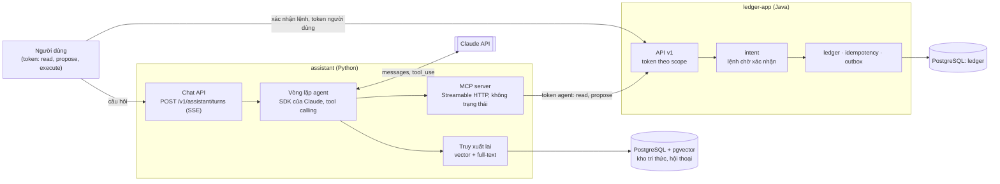

Đường xác nhận đi **thẳng** từ người dùng tới `ledger-app`, không qua `assistant`.

### 14.3 Thêm vào `ledger-app` (tuần A1)

| Module | Trách nhiệm |
|---|---|
| `identity` | Principal, token theo scope (lưu dạng băm), bộ lọc xác thực, người gọi trong `RequestContext` |
| `intent` | Lệnh chuyển tiền chờ xác nhận: tạo, xác nhận, từ chối, hết hạn, hạn mức. Khi xác nhận thì gọi `wallet` trong cùng transaction với idempotency key |
| `wallet` (sửa) | Mọi endpoint kiểm tra quyền sở hữu ví. Ví của người khác trả 404 |
| `idempotency` (sửa) | Key tính theo từng principal, không còn toàn cục |

Ma trận phụ thuộc của ArchUnit sẽ thêm: `intent` được gọi `wallet`, `idempotency`, `outbox`, `identity`, `shared`. `identity` chỉ được gọi `shared`. Các module khác đọc người gọi qua `shared.RequestContext`, không phụ thuộc `identity`.

### 14.4 Tool của agent

| Tool | Gọi tới | Loại | Scope cần |
|---|---|---|---|
| `get_wallet` | `GET /v1/wallets/{id}` | Chỉ đọc | `wallets:read` |
| `list_entries` | `GET /v1/wallets/{id}/entries` | Chỉ đọc | `wallets:read` |
| `get_transfer` | `GET /v1/transfers/{id}` | Chỉ đọc | `wallets:read` |
| `get_transfer_intent` | `GET /v1/transfer-intents/{id}` | Chỉ đọc | `wallets:read` |
| `propose_transfer` | `POST /v1/transfer-intents` | Có ghi, cần người xác nhận | `transfers:propose` |
| `search_knowledge` | Kho tri thức (tuần A3) | Chỉ đọc | Không gọi `ledger-app` |

Không có tool nào xác nhận lệnh, và không có tool nào gọi thẳng `POST /v1/transfers`.

`propose_transfer` gửi `Idempotency-Key` sinh từ `(conversation_id, tool_use_id)`. Model, SDK hay tầng mạng gọi lại bao nhiêu lần thì vẫn là một lệnh. Đây là chỗ lớp idempotency của tuần 5 được dùng lại nguyên vẹn.

### 14.5 Bất biến của lớp AI

| ID | Phát biểu | Kiểm bằng |
|---|---|---|
| **I8** | Mọi giao dịch sinh ra từ một lệnh đều có đúng một lệnh `CONFIRMED`, do một token có scope `transfers:execute` xác nhận | `scripts/invariants-agent.sql`, chạy sau mỗi lượt của bộ thử an toàn |
| **I9** | Không response 2xx nào trả dữ liệu của ví mà người gọi không sở hữu | `WalletOwnershipIT`, bộ thử an toàn |

### 14.6 Quan sát và chi phí

Mỗi lượt gọi model và mỗi lần gọi tool là một span, với thuộc tính theo quy ước `gen_ai.*` của OpenTelemetry. Quy ước này còn ở trạng thái Development, nên tên thuộc tính được gói trong một module để đổi một chỗ. `traceparent` đi tiếp sang `ledger-app`, nên một câu hỏi của người dùng là **một trace** xuyên cả hai service. Metric: token vào, token ra, chi phí và độ trễ của mỗi lượt.

### 14.7 Rủi ro theo OWASP Top 10 for Agentic Applications 2026

| Rủi ro | Biện pháp trong thiết kế |
|---|---|
| ASI01 Agent Goal Hijack | Nội dung truy xuất và kết quả tool được đánh dấu là dữ liệu. Bộ thử an toàn cài lệnh vào cả hai đường |
| ASI02 Tool Misuse | Tập tool nhỏ, schema chặt, không có tool thực thi tiền |
| ASI03 Identity & Privilege Abuse | Token của agent hẹp hơn token của người dùng, có hạn, thu hồi được. Service từ chối khởi động nếu được cấp scope thực thi |
| ASI09 Human-Agent Trust Exploitation | Người dùng xác nhận trên chính lệnh do server lưu (nguồn, đích, số tiền), không phải trên lời tóm tắt của agent |
| Còn lại | Không áp dụng ở quy mô này (không có nhiều agent, không chạy code do model sinh, không có bộ nhớ dài hạn). Ghi rõ trong ADR-0011 |

