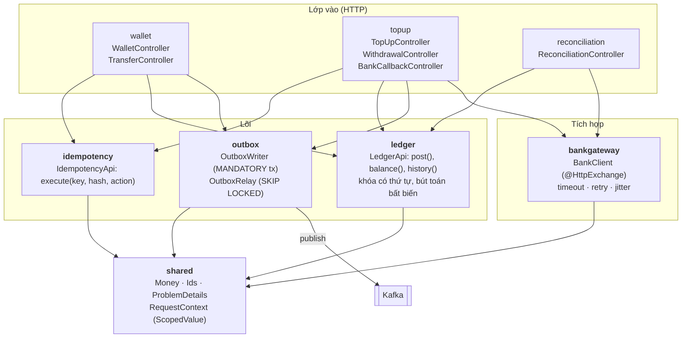
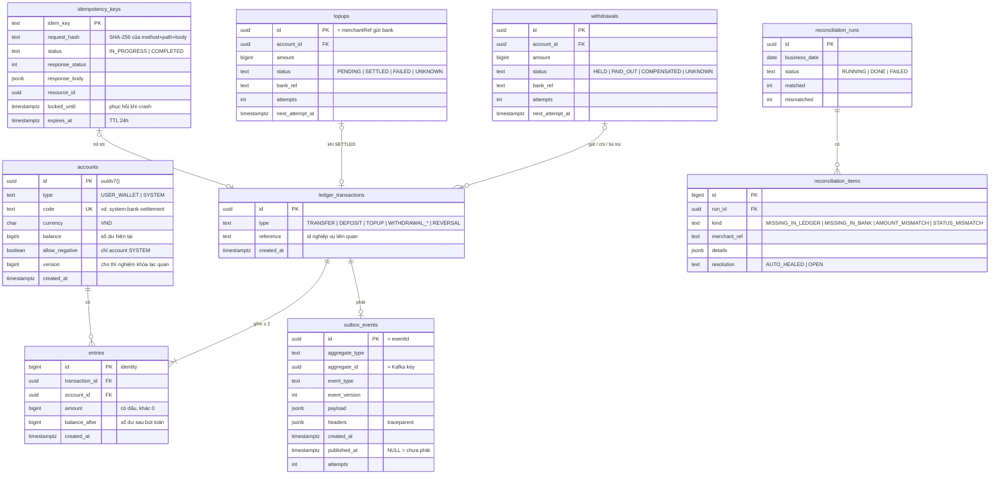
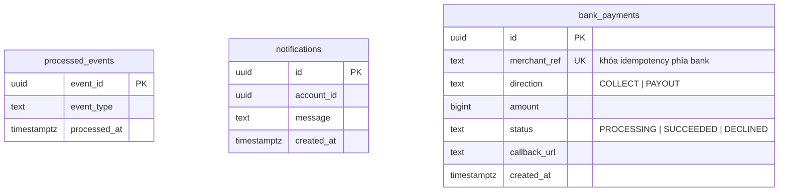
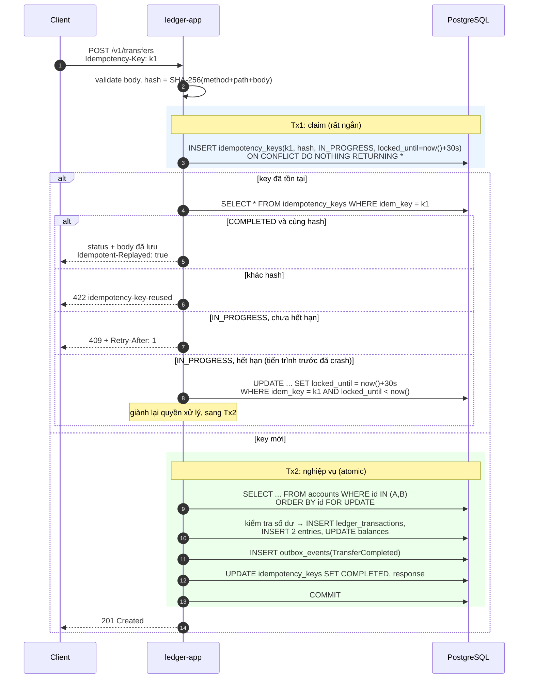
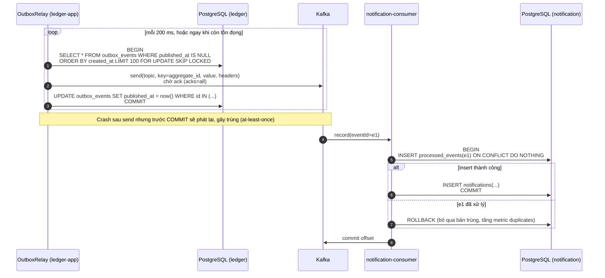
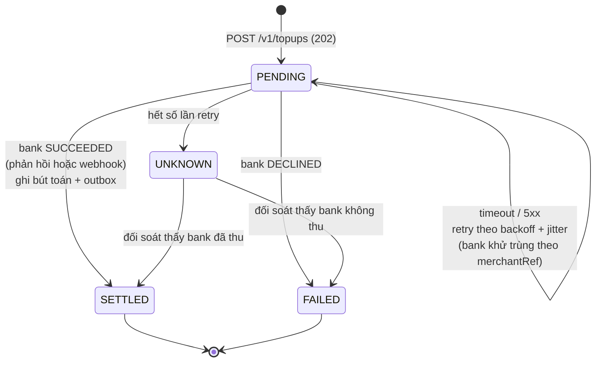
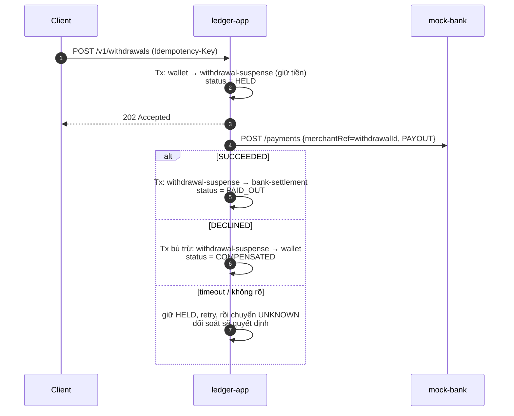
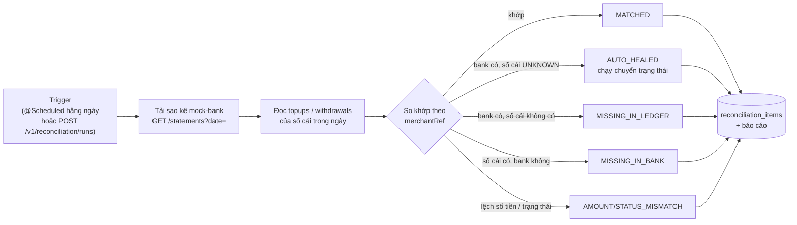

# 01. Kiến trúc hệ thống

> Tài liệu này mô tả **trạng thái đích** khi kết thúc tuần 12. Mỗi mục ghi rõ tuần triển khai để đối chiếu với [lộ trình](03-lo-trinh.md). Các sơ đồ dùng Mermaid, GitHub hiển thị trực tiếp.

## Mục lục

1. [Nguyên tắc kiến trúc](#1-nguyên-tắc-kiến-trúc)
2. [C4 mức 1: System Context](#2-c4-mức-1-system-context)
3. [C4 mức 2: Container](#3-c4-mức-2-container)
4. [C4 mức 3: Component trong ledger-app](#4-c4-mức-3-component-trong-ledger-app)
5. [Mô hình dữ liệu](#5-mô-hình-dữ-liệu)
6. [Luồng nghiệp vụ chính](#6-luồng-nghiệp-vụ-chính)
7. [Kiểm soát đồng thời](#7-kiểm-soát-đồng-thời)
8. [Thiết kế API](#8-thiết-kế-api)
9. [Sự kiện và Kafka](#9-sự-kiện-và-kafka)
10. [Quan sát hệ thống (Observability)](#10-quan-sát-hệ-thống-observability)
11. [Triển khai](#11-triển-khai)
12. [Tech stack](#12-tech-stack)
13. [Yêu cầu phi chức năng](#13-yêu-cầu-phi-chức-năng)

---

## 1. Nguyên tắc kiến trúc

| # | Nguyên tắc | Hệ quả cụ thể |
|---|---|---|
| P1 | **Đúng trước, nhanh sau** | Mọi tối ưu hiệu năng phải giữ nguyên bất biến I1–I7 ([chiến lược kiểm thử](04-chien-luoc-kiem-thu.md)) |
| P2 | **Sổ cái chỉ được thêm (append-only)** | Không `UPDATE`/`DELETE` bảng `entries`. Muốn sửa sai thì ghi bút toán đảo |
| P3 | **Database là nguồn sự thật** | Ràng buộc nghiệp vụ quan trọng được khóa bằng constraint và trigger, không chỉ bằng code Java |
| P4 | **Mọi thao tác có thể bị lặp lại** | API ghi tiền bắt buộc có `Idempotency-Key`, consumer khử trùng theo `eventId`, mock-bank khử trùng theo `merchantRef` |
| P5 | **Ranh giới module được kiểm tra bằng máy** | ArchUnit chặn truy cập vào package `internal` của module khác và chặn phụ thuộc vòng |
| P6 | **Không có số liệu nào không kèm phương pháp đo** | Benchmark nào cũng có script, môi trường và kết quả thô trong repo |
| P7 | **Chỉ dùng tính năng final của JDK** | Không bật `--enable-preview` trong code chính |

## 2. C4 mức 1: System Context


`mock-bank` nằm trong repo nhưng được đối xử như **hệ thống bên ngoài**. Nó có database riêng, giao tiếp qua mạng và có thể cấu hình độ trễ, tỉ lệ lỗi.

## 3. C4 mức 2: Container


| Container | Trách nhiệm | Lưu trữ | Tuần |
|---|---|---|---|
| `ledger-app` | Toàn bộ nghiệp vụ ví và sổ cái, idempotency, outbox relay, saga, đối soát | DB `ledger` | 3–11 |
| `notification-consumer` | Nhận sự kiện, khử trùng theo `eventId`, ghi thông báo | DB `notification` | 6 |
| `mock-bank` | Giả lập ngân hàng: thu hộ, chi hộ, webhook, sao kê, chế độ lỗi | DB `mockbank` | 9 |
| `ledger-contracts` | Thư viện Java dùng chung: định nghĩa sự kiện (records) và phiên bản schema | Không | 6 |
| PostgreSQL | Một instance, mỗi service một database riêng | | 0 |
| Kafka | Message broker, 1 node KRaft | | 0 |
| Toxiproxy | Proxy chèn lỗi giữa `ledger-app` và `mock-bank`/PostgreSQL | | 10 |
| otel-lgtm | Metrics, traces và logs trong một container cho môi trường dev | | 7 |

## 4. C4 mức 3: Component trong ledger-app

`ledger-app` là một **modular monolith**. Mỗi module là một package cấp cao nhất dưới `dev.ledgerly`. Quy ước:

- Các kiểu ở **gốc package của module** là API công khai (facade, records, sự kiện).
- Mọi thứ trong `<module>.internal..` là riêng tư. Module khác không được import.



### Ma trận phụ thuộc cho phép (ArchUnit kiểm tra)

| Module ↓ được gọi → | shared | ledger | idempotency | outbox | bankgateway |
|---|:-:|:-:|:-:|:-:|:-:|
| `wallet` | ✅ | ✅ | ✅ | ✅ | ❌ |
| `topup` | ✅ | ✅ | ✅ | ✅ | ✅ |
| `reconciliation` | ✅ | ✅ | ❌ | ❌ | ✅ |
| `ledger` | ✅ | | ❌ | ❌ | ❌ |
| `idempotency`, `outbox`, `bankgateway` | ✅ | ❌ | ❌ | ❌ | ❌ |

Thêm ba quy tắc nữa:

1. Không có phụ thuộc vòng giữa các module (`slices().should().beFreeOfCycles()`).
2. `..internal.domain..` không phụ thuộc Spring hay JDBC (domain thuần Java).
3. `@Transactional` chỉ xuất hiện ở `..internal.application..`.

## 5. Mô hình dữ liệu

### 5.1 Quy ước

- **Tiền** lưu dạng `BIGINT` theo đơn vị nhỏ nhất của tiền tệ (VND có 0 chữ số thập phân), kèm `currency CHAR(3)`. **Không dùng `double`/`float`** (ADR-0003).
- **ID** dùng UUIDv7 (hàm `uuidv7()` có sẵn từ PostgreSQL 18). Có thứ tự theo thời gian nên thân thiện với B-tree index.
- `entries.amount` **có dấu**: âm là tiền ra khỏi account, dương là tiền vào account.
- Mọi bảng có `created_at TIMESTAMPTZ NOT NULL DEFAULT now()`.

### 5.2 Database `ledger`



### 5.3 Ràng buộc ở tầng database (phòng thủ nhiều lớp)

| Ràng buộc | Cài đặt | Bảo vệ cho |
|---|---|---|
| Số dư không âm | `CHECK (allow_negative OR balance >= 0)` | I2, lớp chặn cuối nếu code có bug |
| Bút toán khác 0 | `CHECK (amount <> 0)` | Dữ liệu rác |
| Entry bất biến | Trigger `BEFORE UPDATE OR DELETE ON entries`, gọi `RAISE EXCEPTION` | P2, I1 |
| Tổng entries của transaction bằng 0 | Constraint trigger `DEFERRABLE INITIALLY DEFERRED`, kiểm tra lúc commit | I1 |
| Không nạp/rút trùng | `UNIQUE` trên `topups.id`, `withdrawals.id` (chính là `merchantRef`) | P4 |
| Mỗi transaction một sự kiện | `UNIQUE (aggregate_id, event_type)` trên `outbox_events` | I6 |

### 5.4 Database `notification` và `mockbank`



## 6. Luồng nghiệp vụ chính

### 6.1 Chuyển tiền idempotent (tuần 3–5)

Thiết kế hai pha: pha *claim* khóa idempotency, rồi pha *nghiệp vụ*. Lý do: cùng một cơ chế dùng được cho cả luồng có gọi HTTP ra ngoài (nạp/rút tiền), vì không được giữ DB transaction trong lúc chờ mạng.



Lỗi nghiệp vụ có tính xác định (ví dụ thiếu số dư, trả 422) cũng được lưu thành `COMPLETED`. Retry với cùng key sẽ nhận lại đúng lỗi đó. Lỗi validate (400) xảy ra **trước** khi claim nên không được lưu.

### 6.2 Outbox relay và consumer idempotent (tuần 6)



**Exactly-once về hiệu ứng** = at-least-once (relay retry) + at-most-once (consumer khử trùng). Kafka EOS không giải quyết được bài toán này, vì side effect nằm ở database ngoài Kafka.

### 6.3 Nạp tiền qua ngân hàng: saga có trạng thái (tuần 9)



Mọi chuyển trạng thái đều là `UPDATE ... WHERE status = '<trạng thái cũ>'` (compare-and-set). Webhook và worker có chạy song song thì cũng chỉ một bên thắng.

### 6.4 Rút tiền: saga có bù trừ (tuần 9)



### 6.5 Đối soát (tuần 11)



Đối soát nội bộ chạy kèm: kiểm tra bất biến I1–I4 bằng SQL (xem [chiến lược kiểm thử](04-chien-luoc-kiem-thu.md#2-bất-biến-hệ-thống)).

## 7. Kiểm soát đồng thời

| Vấn đề | Giải pháp | Ghi chú phỏng vấn |
|---|---|---|
| Hai giao dịch cùng trừ một ví | `SELECT ... FOR UPDATE` trên dòng account, ở isolation READ COMMITTED | Khóa dòng tuần tự hóa các thao tác ghi trên cùng account. SERIALIZABLE gây nhiều lỗi retry hơn mà không thêm đảm bảo cần thiết |
| Deadlock khi A→B và B→A chạy cùng lúc | Luôn khóa theo **id tăng dần** | Thứ tự khóa toàn cục loại bỏ chờ vòng |
| Hot account (ví hệ thống nhận rất nhiều giao dịch) | Tuần 11 đo 3 chiến lược: khóa bi quan, khóa lạc quan + retry, ghi qua account trung gian rồi gộp (batching) | Kết quả ghi vào ADR-0010 |
| Virtual threads làm cạn connection pool | `@ConcurrencyLimit` ở tầng application. Pool HikariCP cỡ nhỏ, `connectionTimeout` ngắn, quá tải trả 503 | Từ JDK 24 (JEP 491), `synchronized` không còn gây pinning. Nút cổ chai thật là DB |
| Request context (correlation id) | `ScopedValue` (JEP 506, final ở Java 25) thay cho `ThreadLocal` | Không rò rỉ giữa các virtual thread, bất biến trong phạm vi |

## 8. Thiết kế API

### 8.1 Quy ước chung

- Phiên bản hóa bằng path `/v1/...`, dùng API versioning có sẵn trong Spring Framework 7.
- JSON dùng `camelCase`. Số tiền là **chuỗi số nguyên** theo đơn vị nhỏ nhất, ví dụ `"amount": "150000"`, để tránh mất chính xác ở client JavaScript.
- Lỗi theo **RFC 9457 Problem Details** (`application/problem+json`), có `type`, `title`, `status`, `detail`, `instance` và `traceId`.
- Phân trang lịch sử bằng keyset (`?after=<entryId>&limit=50`), không dùng offset.
- Header `Idempotency-Key` (UUID, tối đa 64 ký tự) **bắt buộc** với mọi `POST` làm dịch chuyển tiền.

### 8.2 Danh sách endpoint

| Method | Path | Mô tả | Idempotency | Thành công | Tuần |
|---|---|---|:-:|---|:-:|
| `POST` | `/v1/wallets` | Mở ví | Không bắt buộc | 201 | 3 |
| `GET` | `/v1/wallets/{id}` | Số dư và thông tin ví | | 200 | 3 |
| `GET` | `/v1/wallets/{id}/entries` | Lịch sử bút toán (keyset) | | 200 | 3 |
| `POST` | `/v1/transfers` | Chuyển tiền nội bộ | **Bắt buộc** | 201 | 3–5 |
| `GET` | `/v1/transfers/{id}` | Chi tiết giao dịch | | 200 | 3 |
| `POST` | `/v1/admin/deposits` | Nạp tiền nội bộ (seed cho dev/test) | **Bắt buộc** | 201 | 3 |
| `POST` | `/v1/topups` | Nạp tiền qua ngân hàng | **Bắt buộc** | 202 | 9 |
| `GET` | `/v1/topups/{id}` | Trạng thái nạp | | 200 | 9 |
| `POST` | `/v1/withdrawals` | Rút tiền về ngân hàng | **Bắt buộc** | 202 | 9 |
| `POST` | `/internal/bank-callbacks` | Webhook từ mock-bank | Khử trùng theo `merchantRef` | 204 | 9 |
| `POST` | `/v1/reconciliation/runs` | Chạy đối soát | | 202 | 11 |
| `GET` | `/v1/reconciliation/runs/{id}` | Báo cáo đối soát | | 200 | 11 |

### 8.3 Bảng mã lỗi

| HTTP | `type` (Problem Details) | Khi nào |
|---|---|---|
| 400 | `/problems/validation-error` | Body không hợp lệ, thiếu `Idempotency-Key` |
| 404 | `/problems/wallet-not-found` | Ví không tồn tại |
| 409 | `/problems/idempotency-in-progress` | Key đang xử lý, kèm header `Retry-After` |
| 422 | `/problems/idempotency-key-reused` | Cùng key nhưng body khác |
| 422 | `/problems/insufficient-funds` | Không đủ số dư |
| 422 | `/problems/same-account-transfer` | Chuyển cho chính mình |
| 503 | `/problems/overloaded` | Vượt `@ConcurrencyLimit` hoặc hết connection, kèm `Retry-After` |

### 8.4 Ví dụ

```http
POST /v1/transfers HTTP/1.1
Content-Type: application/json
Idempotency-Key: 0199a7c2-5d1e-7b3a-9f00-6f1c2d3e4a5b

{ "sourceWalletId": "0199a7...", "targetWalletId": "0199a8...", "amount": "150000", "currency": "VND", "note": "Tiền cơm" }
```

```http
HTTP/1.1 201 Created
Location: /v1/transfers/0199a7d0-...

{ "id": "0199a7d0-...", "status": "COMPLETED", "amount": "150000", "currency": "VND", "createdAt": "2026-10-20T09:15:02Z" }
```

## 9. Sự kiện và Kafka

| Topic | Key | Sự kiện | Producer → Consumer |
|---|---|---|---|
| `ledgerly.transfers.v1` | `transactionId` | `TransferCompleted` | ledger-app → notification-consumer |
| `ledgerly.topups.v1` | `topupId` | `TopUpSettled`, `TopUpFailed` | ledger-app → notification-consumer |
| `ledgerly.withdrawals.v1` | `withdrawalId` | `WithdrawalPaidOut`, `WithdrawalCompensated` | ledger-app → notification-consumer |

**Envelope** (định nghĩa trong `ledger-contracts`, gần với chuẩn CloudEvents):

```json
{
  "eventId": "0199a7d0-....",
  "eventType": "TransferCompleted",
  "eventVersion": 1,
  "occurredAt": "2026-10-20T09:15:02.123Z",
  "aggregateType": "LedgerTransaction",
  "aggregateId": "0199a7d0-....",
  "payload": { "sourceWalletId": "...", "targetWalletId": "...", "amount": "150000", "currency": "VND" }
}
```

Quy tắc tiến hóa schema:

- Chỉ được **thêm** trường tùy chọn.
- Đổi nghĩa hoặc xóa trường thì phải tăng `eventVersion` và tạo topic `.v2`.
- Consumer bỏ qua các trường không biết (tolerant reader).
- Producer dùng `acks=all` và `enable.idempotence=true`.

## 10. Quan sát hệ thống (Observability)

Dùng `spring-boot-starter-opentelemetry` (Micrometer → OTLP) gửi tới container `grafana/otel-lgtm`. Chi tiết quyết định trong ADR-0007, tuần 7.

| Loại | Tên | Ý nghĩa |
|---|---|---|
| Counter | `ledgerly.transfers{outcome}` | Số giao dịch theo kết quả: `completed`, `insufficient_funds`, ... |
| Counter | `ledgerly.idempotency.replays` | Số request được trả lại từ cache idempotency |
| Gauge | `ledgerly.outbox.pending` | Số sự kiện chưa phát |
| Gauge | `ledgerly.outbox.oldest.age` | Tuổi của sự kiện cũ nhất chưa phát (độ trễ relay) |
| Timer | `ledgerly.posting.lock.wait` | Thời gian chờ khóa account |
| Counter | `notification.duplicates` | Số bản trùng consumer đã loại bỏ |
| Có sẵn | `hikaricp.connections.pending`, `http.server.requests`, `kafka.consumer.*` | Từ Micrometer |

Trace đi xuyên suốt từ HTTP → JDBC → outbox → Kafka header `traceparent` → consumer. Log JSON có `traceId`.

## 11. Triển khai

| Thành phần | Image | Cổng host |
|---|---|---|
| ledger-app | build từ `ledger-app/Dockerfile` (layered + AOT cache) | 8080 |
| mock-bank | build từ `mock-bank/Dockerfile` | 8081 |
| notification-consumer | build từ `notification-consumer/Dockerfile` | 8082 |
| PostgreSQL | `postgres:18-alpine` | **5433** (tránh đụng Postgres cục bộ) |
| Kafka | `apache/kafka:4.3.1` | 9092 |
| Toxiproxy | `ghcr.io/shopify/toxiproxy` | 8474 |
| Grafana LGTM | `grafana/otel-lgtm` | 3000 (UI), 4317/4318 (OTLP) |

**Môi trường:**

- `local`: chỉ chạy hạ tầng bằng compose, chạy app bằng Gradle hoặc IDE.
- `compose`: chạy toàn bộ bằng `docker compose --profile full up`.
- `demo`: Oracle Always Free (ARM, 2 OCPU/12 GB) hoặc Render free (tuần 8).

Compose dùng **profiles** để không phải bật mọi thứ khi phát triển: mặc định chỉ có `postgres` và `kafka`, `observability` thêm LGTM, `chaos` thêm Toxiproxy, `full` thêm cả ba app.

## 12. Tech stack

| Lớp | Lựa chọn | Lý do |
|---|---|---|
| Ngôn ngữ | Java 25 LTS | Records, sealed interface, pattern matching, ScopedValue (final). Không dùng preview |
| Framework | Spring Boot 4.1, Spring Framework 7 | API versioning, `@ConcurrencyLimit`/`@Retryable` trong core, JSpecify, HTTP service client |
| Build | Gradle 9 (Kotlin DSL), version catalog, convention plugins trong `build-logic` | Cấu hình build ở một nơi, dễ thêm module |
| Dữ liệu | PostgreSQL 18, Flyway; JdbcClient cho đường nóng, Spring Data JPA cho phần đơn giản | Kiểm soát chính xác SQL, khóa và isolation (ADR-0002) |
| Messaging | Kafka 4 (KRaft) | Outbox relay, consumer idempotent |
| HTTP client | `@HttpExchange` + `RestClient`, timeout rõ ràng | Có sẵn trong Spring 7 |
| Kiểm thử | JUnit 5, AssertJ, Testcontainers 2, Toxiproxy, ArchUnit, jqwik | DB thật, lỗi mạng thật, kiểm tra kiến trúc, property-based |
| Chất lượng | Spotless (Palantir Java Format), Error Prone + NullAway, JaCoCo | Lỗi null và format bị bắt ngay lúc build |
| Hiệu năng | k6 (`constant-arrival-rate`), JMH | Tránh coordinated omission |
| Quan sát | OpenTelemetry (Boot starter), Grafana LGTM | Metrics, traces, logs trong một container |
| CI/CD | GitHub Actions | Build, test, báo cáo coverage |
| Đóng gói | Dockerfile multi-stage, layered jar, AOT cache của Java 25 | Khởi động nhanh hơn, image nhỏ hơn |

**Không dùng Lombok.** Records và IDE đã đủ. Code dễ đọc hơn khi phỏng vấn và không phụ thuộc annotation processor.

## 13. Yêu cầu phi chức năng

| ID | Yêu cầu | Mục tiêu ban đầu (điều chỉnh sau baseline tuần 7) |
|---|---|---|
| NFR-1 | Độ trễ `POST /v1/transfers` | p99 < 200 ms tại 300 RPS trên máy dev, ghi rõ cấu hình |
| NFR-2 | Tính đúng đắn | 0 vi phạm bất biến sau mọi load test và chaos test |
| NFR-3 | Sẵn sàng khi Kafka sập | API vẫn nhận giao dịch, outbox xả hết trong 60 giây sau khi Kafka lên lại |
| NFR-4 | Quá tải | Trả 503 trong dưới 1 giây, không treo request |
| NFR-5 | Khởi động | `docker compose --profile full up` sẵn sàng trong dưới 90 giây |
| NFR-6 | Build | `./gradlew build` dưới 5 phút trên CI |
