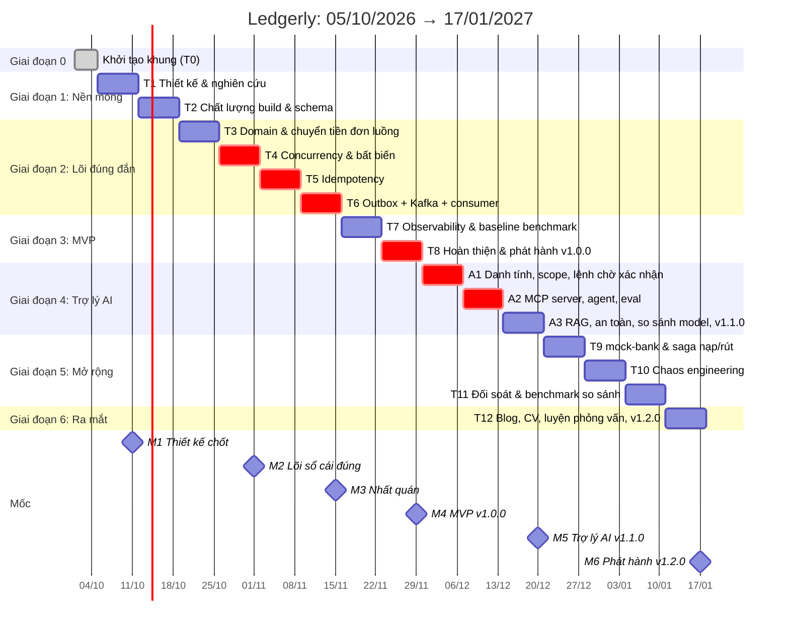

# 03. Lộ trình 12 tuần và 3 tuần hướng AI

> Ngày 07/10/2026 lộ trình có thêm ba tuần A1–A3 cho hướng AI Engineer, chen sau tuần 8. Các tuần 9–12 **giữ nguyên số** và lùi lịch ba tuần, để nhật ký và ADR đã viết không phải sửa. Lý do và nguồn: [research/huong-ai-engineer.md](research/huong-ai-engineer.md).
>
> Nguyên tắc: **mỗi tuần kết thúc bằng thứ chạy được và kiểm chứng được.** Tuần 8 phải có MVP hoàn chỉnh, deploy được. Nếu trễ, cắt phần mở rộng, **không cắt test**.

## 1. Biểu đồ Gantt



## 2. Tổng quan từng tuần

| Tuần | Thời gian | Chủ đề | Sản phẩm chính | ADR | Chi tiết |
|:-:|---|---|---|---|---|
| 0 | 01/10 – 04/10 | Khởi tạo khung | Gradle multi-module, 3 app khởi động, compose, CI | 0001, 0002 | [tuan-00](weeks/tuan-00.md) |
| 1 | 05/10 – 11/10 | Thiết kế & nghiên cứu | Tài liệu kiến trúc đã review, backlog, repo GitHub | 0003 | [tuan-01](weeks/tuan-01.md) |
| 2 | 12/10 – 18/10 | Chất lượng build & schema | Spotless, Error Prone, JaCoCo, suite `integrationTest`, `V1__ledger_core.sql` | | [tuan-02](weeks/tuan-02.md) |
| 3 | 19/10 – 25/10 | Domain & chuyển tiền đơn luồng | `Money`, `PostingRules`, API ví/chuyển tiền, ArchUnit | | [tuan-03](weeks/tuan-03.md) |
| 4 | 26/10 – 01/11 | Concurrency & bất biến | Khóa có thứ tự, test 200 virtual threads, jqwik | 0004 | [tuan-04](weeks/tuan-04.md) |
| 5 | 02/11 – 08/11 | Idempotency | Bảng key, 409/422, test 50 request trùng key | 0005 | [tuan-05](weeks/tuan-05.md) |
| 6 | 09/11 – 15/11 | Outbox + Kafka | Relay `SKIP LOCKED`, consumer khử trùng, test `kill -9` | 0006 | [tuan-06](weeks/tuan-06.md) |
| 7 | 16/11 – 22/11 | Observability & baseline | OTel + LGTM, dashboard, k6 baseline | 0007 | [tuan-07](weeks/tuan-07.md) |
| 8 | 23/11 – 29/11 | **MVP v1.0.0** | README, OpenAPI, Dockerfile, deploy demo | | [tuan-08](weeks/tuan-08.md) |
| A1 | 30/11 – 06/12 | Nền cho agent (Java) | Token theo scope, quyền sở hữu ví, lệnh chuyển tiền chờ xác nhận, khung service Python | 0011 | [tuan-a1](weeks/tuan-a1.md) |
| A2 | 07/12 – 13/12 | MCP server, agent, eval | Tool trên API thật, vòng lặp agent, bộ eval v1 chấm trên sổ cái | 0012 | [tuan-a2](weeks/tuan-a2.md) |
| A3 | 14/12 – 20/12 | **Trợ lý AI v1.1.0** | RAG trên pgvector, bộ thử an toàn, bảng so sánh ba model | 0013 | [tuan-a3](weeks/tuan-a3.md) |
| 9 | 21/12 – 27/12 | Saga nạp/rút | mock-bank, `@HttpExchange` client, bù trừ | 0008 | [tuan-09](weeks/tuan-09.md) |
| 10 | 28/12 – 03/01 | Chaos engineering | Ma trận 5 kịch bản Toxiproxy, `@ConcurrencyLimit` | 0009 | [tuan-10](weeks/tuan-10.md) |
| 11 | 04/01 – 10/01 | Đối soát & benchmark so sánh | Job đối soát, so sánh chiến lược khóa, VT với platform threads | 0010 | [tuan-11](weeks/tuan-11.md) |
| 12 | 11/01 – 17/01 | Ra mắt | Blog, GIF demo, hai bản CV, luyện phỏng vấn, `v1.2.0` | | [tuan-12](weeks/tuan-12.md) |

## 3. Mốc và điều kiện qua mốc

| Mốc | Hạn | Điều kiện qua mốc (tất cả phải đúng) |
|---|---|---|
| **M1** Thiết kế chốt | 11/10 | ☐ ADR-0001…0003 Accepted ☐ Có backlog issue cho T2–T8 trên GitHub Projects ☐ Đã tự trả lời được 5 câu hỏi deep-dive về sổ cái kép |
| **M2** Lõi sổ cái đúng | 01/11 | ☐ `ConcurrentTransferIT` xanh 10 lần liên tiếp ☐ Property test bất biến xanh ☐ ArchUnit xanh ☐ ADR-0004 |
| **M3** Nhất quán | 15/11 | ☐ Test 50 request trùng key xanh ☐ Test `kill -9` relay: 0 sự kiện mất ☐ Consumer đếm được số bản trùng |
| **M4** MVP | 29/11 | ☐ Mọi mục *Must* xong ☐ `docker compose --profile full up` chạy được ☐ Benchmark baseline có phương pháp ☐ Tag `v1.0.0` ☐ Link demo |
| **M5** Trợ lý AI | 20/12 | ☐ Bộ thử an toàn: không lượt nào vi phạm I8, I9 ☐ Bộ eval có `pass^3`, chi phí và độ trễ, kết quả thô trong repo ☐ Bảng so sánh ba model có phương pháp ☐ ADR-0011…0013 ☐ Tag `v1.1.0` |
| **M6** Phát hành | 17/01 | ☐ Các mục *Should* của tuần 9–11 xong hoặc đã ghi rõ lý do cắt ☐ Blog đã đăng ☐ Hai bản CV có số liệu thật ☐ Tag `v1.2.0` |

## 4. Phân bổ thời gian

| Hạng mục | Giờ/tuần | Ghi chú |
|---|:-:|---|
| Code + test | 8–10 | Tập trung vào mục tiêu tuần |
| Tài liệu (ADR, README, nhật ký) | 2–3 | Viết ngay trong tuần, không dồn cuối |
| Đọc tài liệu tham chiếu | 1–2 | Danh sách trong file từng tuần |
| **Luyện thuật toán** (riêng) | 5 | **Không mượn sang dự án** |

Tổng thời gian cho dự án khoảng 12–15 giờ/tuần, tức khoảng 205 giờ trong 15 tuần. Mỗi tuần để dư khoảng 15% làm vùng đệm.

## 5. Quy tắc cắt giảm khi trễ

Thứ tự **cắt trước** (từ trên xuống):

1. *Could*: hold/semantic lock, circuit breaker, rate limit theo ví, viết lại agent bằng LangGraph, tinh chỉnh embedding, LLM cho đối soát.
2. Benchmark virtual threads với platform threads (tuần 11).
3. Luồng rút tiền (giữ luồng nạp tiền làm ví dụ saga).
4. Webhook callback (chỉ dùng polling trạng thái).
5. Deploy trực tuyến (giữ `docker compose up` làm đường demo chính).
6. RAG (tuần A3): giữ agent, bộ eval và bộ thử an toàn.
7. So sánh ba model: chỉ báo cáo một model.

**Không bao giờ cắt:** test bất biến, test idempotency, test outbox, README, ADR của những quyết định đã làm. Với hướng AI: lệnh chờ xác nhận (A1), bất biến I8 và I9, và bộ thử an toàn. Một agent chạm được vào tiền mà không có ba thứ đó thì không nên tồn tại trong repo.

## 6. Nhịp làm việc mỗi tuần

| Thời điểm | Việc | Đầu ra |
|---|---|---|
| Thứ Hai | Đọc file tuần, tách thành issue trên GitHub Projects, ước lượng giờ | Cột *Todo* của tuần |
| Giữa tuần | Commit nhỏ theo Conventional Commits, mỗi tính năng là một PR | PR đã merge |
| Thứ Bảy | Chạy đủ test, tự review theo checklist PR | CI xanh |
| Chủ Nhật | Viết nhật ký tuần `docs/journal/YYYY-Www.md`, cập nhật trạng thái trong file tuần | Nhật ký + Definition of Done đã tick |

### Mẫu nhật ký tuần (`docs/journal/2026-W41.md`)

```markdown
# Tuần 1 (05/10 – 11/10/2026)
## Đã xong
## Chưa xong và lý do
## Quyết định đã đưa ra (link ADR)
## Điều học được
## Thời gian thực tế: __ giờ (kế hoạch: __ giờ)
## Rủi ro mới
```

## 7. Theo dõi tiến độ trên GitHub

- **GitHub Projects** (dạng board): [Ledgerly](https://github.com/users/HoangThanhMan/projects/3), cột `Backlog → Todo (tuần này) → In progress → Review → Done`.
- **Milestone GitHub** khớp với M1–M6. Mỗi issue gắn vào một milestone. Milestone `M5: v1.1.0` đang có trên GitHub cần đổi tên, và M6 cần tạo mới, khi kế hoạch hướng AI được tác giả duyệt.
- **Label**: `type:feat`, `type:test`, `type:docs`, `type:chore`, `area:ledger`, `area:idempotency`, `area:outbox`, `area:saga`, `area:recon`, `area:infra`, `priority:must`, `priority:should`, `priority:could`.
- Mỗi task trong file tuần có mã `Wxx-yy`, hoặc `Ax-yy` với ba tuần hướng AI. Dùng mã đó làm tiêu đề issue, ví dụ `W04-03 Test 200 virtual threads`.
