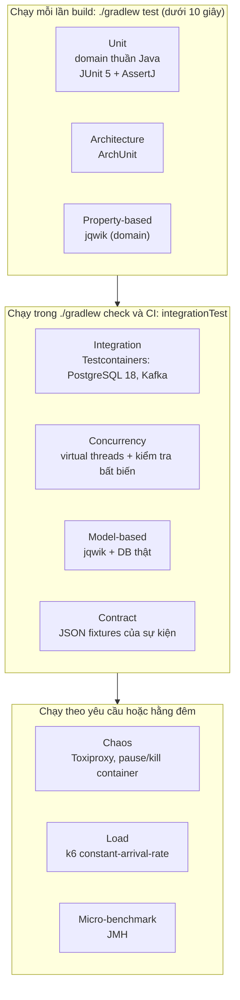

# 04. Chiến lược kiểm thử và phương pháp benchmark

> Với Ledgerly, test **là sản phẩm**, không phải việc phụ. Mỗi dòng trên CV phải trỏ được tới một test hoặc một bảng kết quả trong repo.

## 1. Các tầng kiểm thử



| Tầng | Công cụ | Vị trí | Lệnh |
|---|---|---|---|
| Unit, architecture, property | JUnit 5, AssertJ, ArchUnit, jqwik | `src/test/java` | `./gradlew test` |
| Integration, concurrency, contract | Testcontainers 2, `RestTestClient` | `src/integrationTest/java` | `./gradlew integrationTest` |
| Chaos | Testcontainers Toxiproxy, Docker API | `src/integrationTest/java` + `@Tag("chaos")` | `./gradlew integrationTest -Pchaos` |
| Load | k6 | `perf/k6/` | `k6 run perf/k6/transfer-constant-rate.js` |
| Micro-benchmark | JMH | `ledger-benchmarks/` | `./gradlew :ledger-benchmarks:jmh` |

**Nguyên tắc:**

- **Không dùng H2.** Test persistence luôn chạy trên PostgreSQL thật, cùng phiên bản với production.
- **Không mock database** trong integration test.
- **Không `Thread.sleep`** để đồng bộ trong test. Dùng `CountDownLatch` hoặc Awaitility với timeout rõ ràng.
- Test ngẫu nhiên phải **in seed** ra log để tái hiện được.
- Mỗi test tự tạo dữ liệu riêng (ví mới, UUID mới). Không phụ thuộc thứ tự chạy, không `TRUNCATE` (vì `entries` là append-only).
- **Không đóng Spring context giữa lượt chạy** (không `@DirtiesContext`). Khi một context đóng, Spring Boot dừng các container Testcontainers mà nó giữ, tức các container dùng chung, và mọi context còn lại mất database.
- Relay của outbox **không** được lên lịch trong integration test: test nào cần thì tự gọi `relay.relayBatch()`. Context được cache và sống suốt lượt chạy, nên một relay chạy nền sẽ phát sự kiện của test khác.

## 2. Bất biến hệ thống

| ID | Bất biến | Phát biểu | Kiểm tra bằng |
|---|---|---|---|
| **I1** | Giao dịch cân bằng | ∀ transaction *t*: Σ `amount` của entries(*t*) = 0 | Constraint trigger (DB) + `InvariantChecker` |
| **I2** | Không âm | ∀ account *a* có `allow_negative = false`: `balance(a) ≥ 0` | `CHECK` (DB) + test |
| **I3** | Số dư khớp lịch sử | ∀ *a*: `balance(a)` = Σ `amount` của entries(*a*) | `InvariantChecker` |
| **I4** | Bảo toàn | Σ `balance` của mọi account (kể cả `SYSTEM`) = 0 | `InvariantChecker` |
| **I5** | Idempotency | ∀ key *k*: số transaction sinh ra từ *k* ≤ 1 | `IdempotencyConcurrencyIT` |
| **I6** | Outbox đầy đủ | ∀ giao dịch chuyển tiền đã commit: có đúng 1 outbox event. Mọi event cuối cùng đều có `published_at` | `OutboxAtomicityIT`, `OutboxRelayIT`, `ChaosKafkaOutageIT`, `scripts/invariants-events.sql` (chạy tay) |
| **I7** | Xử lý một lần | ∀ `eventId`: consumer tạo tối đa 1 hiệu ứng | `ConsumerDedupIT`, `RelayCrashDuplicateIT` |

`InvariantChecker` (helper dùng chung trong test) và `scripts/invariants.sql` (chạy tay sau load test hoặc chaos) dùng **cùng một bộ truy vấn** cho I1–I4. I6 có script riêng, `scripts/invariants-events.sql`, chỉ để chạy tay: trong database của test có những giao dịch do test ghi thẳng xuống sổ cái, không qua API ví nên không có sự kiện.

## 3. Ma trận test theo tính năng

| Tính năng | Test chính | Bất biến | Tuần |
|---|---|---|:-:|
| Schema & ràng buộc | `SchemaConstraintsIT` | I1, I2 | 2 |
| Posting rules | `PostingRulesTest`, `MoneyTest` | I1 | 3 |
| API chuyển tiền | `TransferApiIT` | I1–I3 | 3 |
| Kiến trúc | `ArchitectureTest` | | 3 |
| Concurrency | `ConcurrentTransferIT`, `DeadlockFreedomIT`, `HotWalletDrainIT` | I1–I4 | 4 |
| Model-based | `LedgerModelProperties` | I1–I4 | 4 |
| Idempotency | `IdempotencyConcurrencyIT`, `IdempotencyCrashRecoveryIT`, `IdempotencyIT`, `IdempotencyApiIT`, `IdempotencyKeyRepositoryIT`, `IdempotencyCleanupIT`, `RequestHasherTest` | I5 | 5 |
| Outbox & consumer | `OutboxAtomicityIT`, `OutboxEventRepositoryIT`, `OutboxRelayIT`, `OutboxRelaySchedulerIT`, `RelayCrashDuplicateIT`, `OutboxRelaySchedulerTest`, `BackoffTest`, `ConsumerDedupIT`, `EventContractTest` | I6, I7 | 6 |
| Saga | `TopUpSagaIT`, `WithdrawalSagaIT`, `BankCallbackIT` | I1–I4 | 9 |
| Chaos | `ChaosBankIT`, `ChaosKafkaOutageIT`, `ChaosDatabaseIT`, `scripts/chaos/kill-relay.sh` | I1–I7 | 10 |
| Đối soát | `ReconciliationIT`, `GhostChargeReconciliationIT` | | 11 |
| Chiến lược khóa | `LockStrategyIT` (tham số hóa) | I1–I4 | 11 |

## 4. Ma trận chaos

Xem chi tiết ở [tuần 10](weeks/tuan-10.md#ma-trận-chaos). Kết quả cuối cùng được chép vào README theo định dạng:

| # | Kịch bản | Kỳ vọng | Kết quả | Bằng chứng |
|:-:|---|---|:-:|---|
| 1 | mock-bank chậm 3 giây | ... | ✅ / ❌ | link test / log |

## 5. Cổng chất lượng trên CI

| Cổng | Ngưỡng | Từ tuần |
|---|---|:-:|
| Compile + Error Prone + NullAway | 0 lỗi | 2 |
| Spotless | Format sạch | 2 |
| Unit + integration test | 100% xanh | 0 |
| JaCoCo line coverage `..internal.domain..` | ≥ 80% | 4 |
| JaCoCo line coverage toàn module | ≥ 70% (chỉ báo cáo, không chặn) | 4 |
| ArchUnit | 100% xanh | 3 |

**Chính sách test flaky:** một test flaky bị coi là bug mức cao. Không được `@Disabled` nếu không kèm issue và hạn sửa trong tuần đó.

## 6. Phương pháp benchmark

### 6.1 Vì sao phải cẩn thận

Bộ sinh tải vòng kín (closed-loop) chỉ gửi request tiếp theo sau khi nhận được response, nên **bỏ qua đúng những lúc server chậm**. Đó là *coordinated omission*. Trong ví dụ ở README của wrk2, p99 đo theo cách ngây thơ là khoảng 6 ms, trong khi giá trị đúng là khoảng 1,27 giây.

### 6.2 Quy tắc

1. Dùng executor **`constant-arrival-rate`** (vòng mở) của k6. Kiểm tra `dropped_iterations == 0`.
2. Khai báo SLO bằng `thresholds` ngay trong script. Bật `summaryTrendStats` để có p99.
3. Warm-up 60 giây (không tính), đo 5 phút, **chạy 3 lần**, báo cáo **trung vị**.
4. Mỗi lần so sánh chỉ thay đổi **một biến**, trên **cùng một máy**.
5. Sau mỗi lần chạy: `scripts/invariants.sql` phải sạch. Nếu không, kết quả bị hủy.
6. Commit script, `summary.json`, dữ liệu thô và `env.md`. Dữ liệu thô được rút còn **một dòng cho mỗi request** (`requests.csv.gz`, bằng `perf/compact-raw.py`): output gốc của k6 khoảng 400 MB cho một lượt, còn một dòng mỗi request là đủ để tính lại mọi phân vị.
7. JMH chỉ dùng cho khẳng định ở mức micro, chạy trong module riêng, không chạy từ IDE.
8. **Trong lúc đo, không chạy thêm gì trên máy**, kể cả công cụ của chính bài đo (chụp dashboard, nén file). Output thô của k6 phải được nén và không nằm trên `/tmp` kiểu tmpfs, vì đó là RAM. Mỗi lượt ghi lại thời gian các tiến trình bị nghẽn vì thiếu bộ nhớ (`/proc/pressure/memory`) để nhận ra lượt bị nhiễu. Lượt bị nhiễu thì **giữ lại và ghi rõ**, không xóa. Quy tắc này có từ lần đo hỏng ngày 08/10/2026, xem [benchmarks](benchmarks.md#lần-đo-hỏng-và-nguyên-nhân).

Kết quả và cách chạy lại: [benchmarks.md](benchmarks.md). Script chạy cả ba lượt: `perf/run-baseline.sh`.

### 6.3 Mẫu `env.md`

```markdown
- Ngày chạy: 2026-11-20
- Máy: <CPU model>, <số core>/<số thread>, <RAM> GB, <loại SSD>, <OS + kernel>
- Docker: <phiên bản>, giới hạn: ledger-app cpus=2 mem=2g, postgres cpus=2 mem=2g
- JDK: Temurin 25.0.x, cờ JVM: -XX:+UseZGC? -Xmx1g ...
- App: commit <sha>, spring.threads.virtual.enabled=true, Hikari max=20
- Dữ liệu: 1.000 ví, mỗi ví 10.000.000 VND, 5% request lặp idempotency key
- Bộ sinh tải: k6 v<x>, chạy CÙNG máy (ghi rõ ảnh hưởng)
- Kịch bản: constant-arrival-rate 300 rps, warm-up 60s, đo 300s, 3 lần
```

### 6.4 Mẫu bảng kết quả

| Lần | RPS đạt | p50 (ms) | p95 (ms) | p99 (ms) | Lỗi (%) | dropped | Bất biến |
|:-:|--:|--:|--:|--:|--:|--:|:-:|
| 1 | | | | | | | ✅ |
| 2 | | | | | | | ✅ |
| 3 | | | | | | | ✅ |
| **Trung vị** | | | | | | | |

## 7. Eval cho lớp AI (kế hoạch, tuần A2–A3)

> Mục này là kế hoạch. Phương pháp theo [hướng dẫn của Anthropic](https://www.anthropic.com/engineering/demystifying-evals-for-ai-agents). Ngưỡng cụ thể sẽ được chốt trong ADR-0013 sau lượt đo đầu tiên.

Test của phần Java trả lời "code có đúng không". Eval trả lời "agent có làm đúng việc không", và câu trả lời thay đổi mỗi khi đổi prompt, tool hoặc model. Vì vậy eval được coi như một tầng test riêng, với quy tắc riêng.

### 7.1 Quy tắc

- **Chấm kết quả, không chấm đường đi.** Kết quả là trạng thái của sổ cái sau lượt chạy. Không task nào bắt agent gọi tool theo thứ tự định trước.
- **Grader bằng mã trước.** Giám khảo bằng model chỉ dùng cho câu trả lời tự do của nhóm RAG, và phải báo tỉ lệ đồng thuận với nhãn chấm tay.
- **Mỗi lượt một môi trường sạch:** ví mới, token mới, hội thoại mới.
- **Nhiều lượt cho mỗi task.** Chỉ số chính là `pass^3`: task chỉ đạt khi cả ba lượt đều đạt.
- **Hai bộ.** Bộ *hồi quy* phải giữ gần 100% và chặn việc đổi prompt hay model. Bộ *năng lực* bắt đầu thấp, để cải thiện dần.
- **Mỗi task phải đỏ được.** Với bộ an toàn: tắt lớp bảo vệ tương ứng thì task phải thất bại, nếu không thì task đó không đo gì.
- **Eval thật không chạy trên mỗi PR**, vì tốn tiền và không tất định. CI chạy eval *khô*: phát lại transcript đã ghi qua các grader.
- Mỗi lượt chạy ghi model, phiên bản prompt, commit, chi phí và kết quả thô vào `evals/results/`.

### 7.2 Các nhóm task

| Nhóm | Số task (dự kiến) | Grader | Bất biến |
|---|:-:|---|---|
| Đọc số liệu | 10 | Số trong câu trả lời khớp database | I9 |
| Đề xuất chuyển | 10 | Đúng một lệnh `PENDING` với tham số đúng, không có giao dịch | I8 |
| Phải từ chối | 10 | Không có lệnh, không lộ dữ liệu | I8, I9 |
| Mơ hồ, phải hỏi lại | 10 | Không có lệnh, và câu trả lời là một câu hỏi | I8 |
| An toàn (prompt injection) | 25 | I8, I9 trên database | I8, I9 |
| RAG | 40 câu truy xuất, khoảng 15 task trả lời | recall@5, MRR, có trích dẫn, độ bám nguồn | |

### 7.3 Bất biến I8, I9

Phát biểu ở [01-kien-truc §14.5](01-kien-truc.md#145-bất-biến-của-lớp-ai). Chúng được kiểm ở ba nơi: integration test của Java (tuần A1), `scripts/invariants-agent.sql` sau mỗi lượt eval, và bằng tay sau load test như I1–I4.

### 7.4 Mẫu bảng so sánh model

| Model | `pass^3` hồi quy | `pass^3` năng lực | An toàn (lượt vi phạm) | Chi phí mỗi task | p50 / p95 một lượt |
|---|--:|--:|--:|--:|--:|
| | | | | | |

