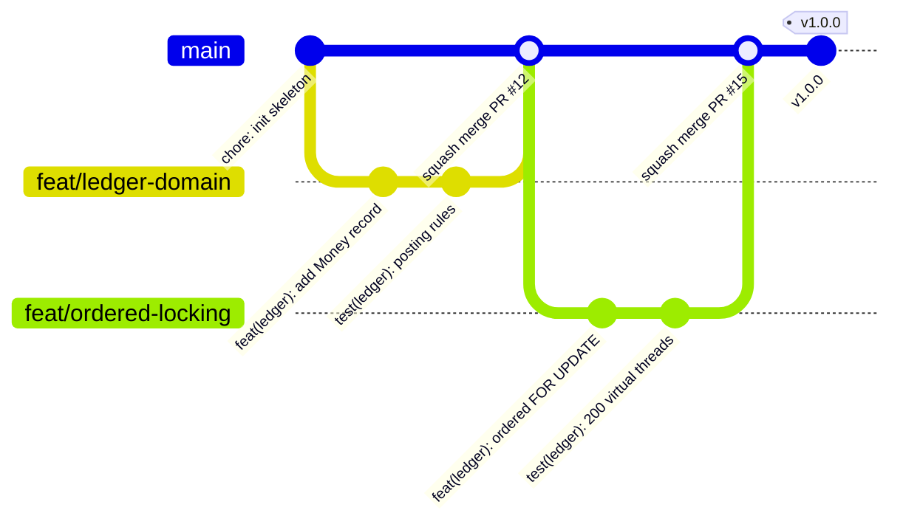

# 05. Quy ước làm việc

> Dự án solo, nhưng **làm việc như trong một team**: có PR, review, design doc, ADR. Đây là cách bù cho điểm yếu "dự án cá nhân thiếu tín hiệu làm việc nhóm".

## 1. Git workflow



- **Trunk-based** với nhánh ngắn: mỗi nhánh sống 1–3 ngày, tương ứng một issue.
- Nhánh `main` được bảo vệ: không push trực tiếp, không force-push, bắt buộc CI xanh.
- Merge bằng **squash merge**. Tiêu đề PR theo Conventional Commits, và nó trở thành commit trên `main`.
- Tên nhánh: `<type>/<mô-tả-ngắn>`, ví dụ `feat/idempotency-key`, `fix/relay-ordering`, `docs/adr-0004`.

## 2. Conventional Commits

```text
<type>(<scope>): <mô tả ở thể mệnh lệnh, tiếng Anh, chữ thường>

[thân: vì sao thay đổi, không phải thay đổi gì]

[footer: Refs #12, BREAKING CHANGE: ...]
```

| Type | Dùng khi |
|---|---|
| `feat` | Thêm tính năng |
| `fix` | Sửa bug |
| `test` | Thêm hoặc sửa test |
| `perf` | Cải thiện hiệu năng (kèm số liệu trong thân commit) |
| `refactor` | Đổi cấu trúc, không đổi hành vi |
| `docs` | Tài liệu, ADR |
| `build` | Gradle, dependency |
| `ci` | GitHub Actions |
| `chore` | Việc vặt khác |

**Scope:** `ledger`, `wallet`, `idempotency`, `outbox`, `bankgateway`, `topup`, `recon`, `mock-bank`, `notification`, `contracts`, `infra`, `perf`.

Ví dụ: `feat(idempotency): return 409 with Retry-After for in-progress keys`

## 3. Pull Request

Mỗi PR dùng mẫu `.github/pull_request_template.md` và phải:

- Liên kết tới issue (`Closes #N`).
- Nhỏ: dưới 400 dòng thay đổi, không tính test và tài liệu.
- Tự review trên giao diện GitHub **sau ít nhất vài giờ** (đọc lại với con mắt mới).
- Có test cho mọi hành vi mới.
- Cập nhật tài liệu nếu thay đổi API, schema hoặc kiến trúc.

## 4. Definition of Done cho một task

- [ ] Code + test, CI xanh
- [ ] Không còn `TODO` nào chưa gắn issue
- [ ] Tài liệu liên quan đã cập nhật (README / ADR / OpenAPI)
- [ ] Giải thích được **từng dòng** (đặc biệt là code có AI hỗ trợ)
- [ ] Tick task trong file tuần tương ứng

## 5. Quy ước code Java

| Chủ đề | Quy ước |
|---|---|
| Format | Palantir Java Format (Spotless), 4 dấu cách, 120 cột |
| Null | JSpecify `@NullMarked` cho mọi package. Giá trị có thể null thì đánh dấu `@Nullable` |
| Kiểu dữ liệu | Ưu tiên `record` cho dữ liệu bất biến, `sealed interface` cho kết quả nghiệp vụ |
| Lombok | **Không dùng** |
| Inject | Chỉ dùng constructor injection, field là `final`. Không `@Autowired` trên field |
| Transaction | `@Transactional` chỉ ở `internal.application`. Không đặt trên controller hay repository |
| Tiền | `Money` (long + currency). **Cấm** `double`/`float` cho tiền |
| Thời gian | Inject `Clock`, không gọi `Instant.now()` trực tiếp trong domain, để test được |
| Exception | Lỗi nghiệp vụ là **giá trị trả về** (sealed result), không phải exception. Exception dành cho lỗi kỹ thuật |
| Log | SLF4J, có cấu trúc, không log dữ liệu nhạy cảm. Mức `INFO` cho sự kiện nghiệp vụ quan trọng |
| Tính năng JDK | Chỉ dùng tính năng final. Không `--enable-preview` |

### Quy ước cho service Python (`assistant/`, từ tuần A1)

| Chủ đề | Quy ước |
|---|---|
| Công cụ | `uv` quản lý môi trường và khóa phiên bản, `ruff` format và lint, `pyright` ở chế độ strict, `pytest` |
| Kiểu | Mọi hàm công khai có type hint. Dữ liệu qua ranh giới (HTTP, tool) là model có schema, không phải `dict` trần |
| Tiền | Số nguyên theo đơn vị nhỏ nhất, hoặc chuỗi khi đi qua JSON. **Cấm** `float`, giống phía Java |
| Bí mật | API key và token chỉ đọc từ biến môi trường. Không ghi vào log, transcript hay kết quả eval |
| Prompt | System prompt và mô tả tool là file có phiên bản trong repo. Đổi prompt là một commit, và phải chạy lại bộ hồi quy |
| Gọi model | Chỉ qua một module. Model, effort và giới hạn token là cấu hình, không viết cứng trong code |

## 6. Phiên bản và phát hành

- **SemVer**: `v1.0.0` là MVP, `v1.1.0` là bản có trợ lý AI, `v1.2.0` là bản có các mục *Should* của tuần 9–11.
- Phiên bản trong `gradle.properties` có hậu tố `-SNAPSHOT` giữa các lần phát hành.
- `CHANGELOG.md` sinh từ Conventional Commits.

## 7. Chính sách dùng AI

AI được dùng như **một đồng nghiệp để hỏi và review**, không phải để sinh code mà không hiểu.

1. Mọi đoạn code có AI gợi ý phải được đọc hiểu, viết test và chạy test **trước khi** commit.
2. Ghi lại trong `docs/ai-usage.md`: AI gợi ý gì, mình **bác bỏ** gì và vì sao, mình kiểm chứng bằng test nào.
3. AI chỉ soạn nháp ADR khi được yêu cầu rõ ràng. Tác giả phải review, hiểu và chịu trách nhiệm từng dòng như khi tự viết, và ghi việc này vào `docs/ai-usage.md`. ADR vẫn là bằng chứng tư duy của tác giả: không bảo vệ được lập luận nào thì sửa hoặc bỏ lập luận đó.
4. Trước khi merge, tự hỏi: *"Nếu người phỏng vấn yêu cầu giải thích dòng này, mình có trả lời được không?"*

Chính sách trên nói về AI như **công cụ viết code**. Từ tuần A1 dự án còn có AI như **một tính năng** (trợ lý ví). Hai việc đó tách bạch: `docs/ai-usage.md` ghi việc thứ nhất, còn chất lượng của việc thứ hai được chứng minh bằng bộ eval ([04-chien-luoc-kiem-thu §7](04-chien-luoc-kiem-thu.md#7-eval-cho-lớp-ai-kế-hoạch-tuần-a2a3)), không bằng lời mô tả.

Mẫu một mục trong `docs/ai-usage.md`:

```markdown
### 2026-11-03: Thiết kế bảng idempotency_keys
- Hỏi AI: phương án lưu response.
- AI gợi ý: lưu toàn bộ response vào Redis với TTL.
- Quyết định: bác bỏ, vì cần atomic với transaction nghiệp vụ (xem ADR-0005).
- Kiểm chứng: IdempotencyCrashRecoveryIT.
```
