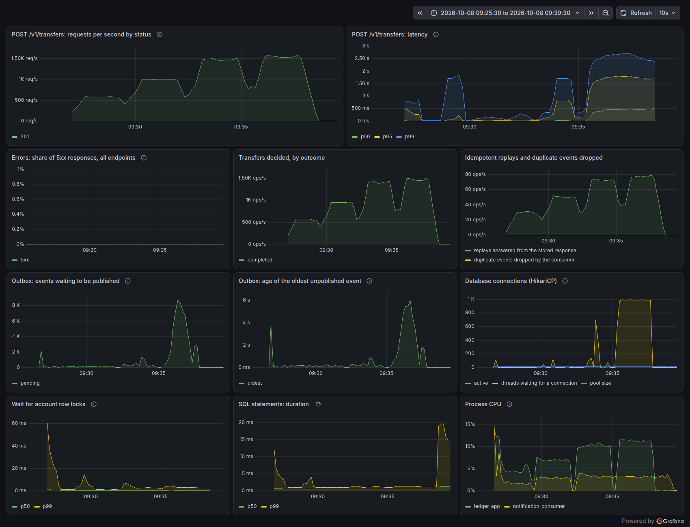

# Benchmark

> Tài liệu này do AI soạn theo yêu cầu của tác giả (xem [ai-usage](ai-usage.md)). Mọi con số là kết quả chạy thật trên **máy dev**, có dữ liệu từng request trong `perf/results/`. Chúng mô tả máy đó với cấu hình đó, không phải năng lực của hệ thống trên máy chủ. Phương pháp: [04-chien-luoc-kiem-thu §6](04-chien-luoc-kiem-thu.md#6-phương-pháp-benchmark).

## Mục lục

1. [Kết quả chính](#1-kết-quả-chính)
2. [Đo cái gì, đo thế nào](#2-đo-cái-gì-đo-thế-nào)
3. [Môi trường](#3-môi-trường)
4. [Baseline: 300 request mỗi giây](#4-baseline-300-request-mỗi-giây)
5. [Tăng tải: thứ gì gãy trước](#5-tăng-tải-thứ-gì-gãy-trước)
6. [Chi phí của việc xuất metric và trace](#6-chi-phí-của-việc-xuất-metric-và-trace)
7. [Lần đo hỏng và nguyên nhân](#lần-đo-hỏng-và-nguyên-nhân)
8. [Giới hạn của các con số này](#8-giới-hạn-của-các-con-số-này)
9. [Cách chạy lại](#9-cách-chạy-lại)

## 1. Kết quả chính

| Câu hỏi | Trả lời | Xem |
|---|---|---|
| Ở 300 request mỗi giây, độ trễ là bao nhiêu? | p50 **2,17 ms**, p95 **4,21 ms**, p99 **17,14 ms**, không lỗi (trung vị ba lượt, mỗi lượt 5 phút) | [mục 4](#4-baseline-300-request-mỗi-giây) |
| Con số đó vững tới đâu? | Khi server không bị đứng, p99 là 17 đến 23 ms (7 lượt). Nhưng 4 trên 11 lượt có đợt cả server đứng 0,5 đến 6 giây, và nguyên nhân **chưa tìm ra** | [mục 4.3](#43-con-số-này-vững-tới-đâu), [4.4](#44-các-đợt-đứng-biết-gì-và-chưa-biết-gì) |
| Trần thông lượng? | Khoảng **1.560 lần chuyển mỗi giây** khi `ledger-app` có 2 nhân. Thứ hết trước là CPU của ứng dụng, không phải PostgreSQL | [mục 5](#5-tăng-tải-thứ-gì-gãy-trước) |
| CPU đó đi đâu? | Gần 40% vào đo đạc (observation, tracing, metric). Code của Ledgerly chưa tới 2% | [mục 5.1](#51-cpu-của-ứng-dụng-đi-đâu) |
| Quá tải có làm sai sổ cái không? | Không. Ở mọi mức tải, kể cả lần đo hỏng: bất biến đúng, mỗi giao dịch đúng một sự kiện và một thông báo. Nhưng request xếp hàng tới 7 giây, vì chưa có gì chặn quá tải | [mục 5](#5-tăng-tải-thứ-gì-gãy-trước) |
| Bài đo có đáng tin không? | Lần đo đầu bị chính bài đo làm hỏng. Nó được giữ lại, kèm nguyên nhân | [mục 7](#lần-đo-hỏng-và-nguyên-nhân) |

Mọi con số ở đây là của **một laptop chạy tất cả mọi thứ, qua loopback, với dữ liệu nhỏ**. Đọc [giới hạn](#8-giới-hạn-của-các-con-số-này) trước khi so chúng với bất cứ thứ gì.

## 2. Đo cái gì, đo thế nào

- **Kịch bản:** `perf/k6/transfer-constant-rate.js`. `POST /v1/transfers` giữa hai ví ngẫu nhiên trong 1.000 ví, mỗi request một `Idempotency-Key` mới, số tiền 1 đến 100. 5% request **lặp lại** request trước của cùng người dùng ảo (cùng key, cùng body) để đo đường replay. Mỗi ví có sẵn 10.000.000, nên không lần chuyển nào bị từ chối vì thiếu tiền.
- **Vòng mở:** executor `constant-arrival-rate`. Request được gửi đúng nhịp dù server nhanh hay chậm, nên lúc server chậm vẫn được đo. `dropped_iterations` phải bằng 0, nếu không thì k6 đã không giữ được nhịp và kết quả bị loại.
- **Mỗi lượt:** `setup()` tạo ví và nạp tiền, 1 phút warm-up không tính, rồi 5 phút đo. Threshold về độ trễ, tỉ lệ lỗi và mọi con số dưới đây chỉ tính trên 5 phút đo. Riêng `dropped_iterations` tính trên cả lượt, kể cả warm-up ([mục 4.1](#41-vì-sao-lượt-2-vẫn-được-tính-và-lượt-4-5-thì-không)).
- **Ba lượt, báo cáo trung vị** của ba lượt, và công bố cả ba. Database **không** được xóa giữa các lượt, nên lượt sau chạy trên bảng lớn hơn lượt trước.
- **Con số được báo cáo là của k6** (`http_req_duration` của request có tag `name:transfer`): thời gian từ lúc gửi tới lúc nhận xong response, đo ở phía client. Replay được báo cáo riêng. Số phía server (histogram trong Prometheus) chỉ dùng để tìm xem thời gian nằm ở đâu.
- **Sau mỗi lượt**, `perf/run-baseline.sh` chờ outbox xả hết và consumer đuổi kịp rồi kiểm tra: số giao dịch chuyển tiền, số sự kiện outbox và số thông báo phải bằng nhau, không còn sự kiện chưa phát, `scripts/invariants.sql` và `scripts/invariants-events.sql` trả 0 dòng. Sai một trong các điều đó thì lượt bị hủy.
- **SLO khai báo trong script:** lỗi dưới 0,1%, p95 dưới 150 ms, p99 dưới 200 ms.

Mỗi thư mục `perf/results/<tên>/run-N/` có:

| File | Nội dung |
|---|---|
| `k6-summary.txt`, `summary.json` | Tóm tắt của k6, dạng chữ và dạng JSON |
| `requests.csv.gz` | Một dòng cho mỗi request: giây thứ mấy, pha, loại, mã HTTP, thời gian. Đủ để tính lại mọi phân vị |
| `server-metrics.json` | Trong pha đo, theo Prometheus: CPU, p99 phía server, p99 của câu SQL, p99 chờ khóa, connection pool, outbox |
| `checks.txt` | Các phép kiểm tra sau lượt, dung lượng database, thời gian máy bị nghẽn vì bộ nhớ, CPU và ổ đĩa trong lúc k6 chạy (hai dòng sau chỉ có ở các lượt chạy từ 09:03 ngày 08/10) |

## 3. Môi trường

Bản đầy đủ cho từng lần đo nằm trong `env.md` của thư mục kết quả.

| Thành phần | Giá trị |
|---|---|
| Máy | Laptop, Intel Core i7-11800H (8 nhân, 16 luồng), 7 GB RAM, 4 GB swap, SSD NVMe (ext4), cắm sạc, governor `powersave` |
| Hệ điều hành | Ubuntu 26.04 LTS, kernel 7.0.0-34 |
| Docker | Engine 29.7.2, Compose 5.5.0. Các container **không** bị giới hạn CPU hay RAM |
| PostgreSQL | 18.6 (`postgres:18-alpine`), cấu hình mặc định của image: `shared_buffers` 128 MB, `synchronous_commit=on` |
| Kafka | 4.3.1, một broker KRaft, topic 3 partition |
| JDK | Temurin 25.0.4.1, G1 (mặc định) |
| `ledger-app` | Chạy bằng `java -jar` ngoài Docker, **ghim vào 2 nhân** (`taskset -c 0,1`, hai nhân vật lý khác nhau), `-Xmx512m`, virtual threads bật, pool HikariCP 10 connection (mặc định), một instance, relay chạy trong cùng tiến trình |
| `notification-consumer` | `java -jar`, `-Xmx256m`, không ghim |
| Observability | Profile `observability`: metric gửi 10 giây một lần, trace lấy mẫu **10%**, tới container `grafana/otel-lgtm:0.35.0` trên cùng máy |
| Bộ sinh tải | k6 v2.3.0 trong Docker (`--network host`), **cùng máy**, không giới hạn CPU |
| Dữ liệu | Database trống lúc bắt đầu. Mỗi lượt thêm 1.000 ví và khoảng 102.500 lần chuyển tiền |
| Đường tới database | `localhost:5433` và `localhost:9092` là cổng publish của Docker, nên mọi câu SQL và mọi record Kafka đi qua `docker-proxy` |
| Những thứ khác đang chạy | Phiên desktop của tác giả (Chrome, VS Code) và công cụ AI điều khiển bài đo. Swap đã có 1,2 đến 1,8 GB đang dùng trước khi đo |

Vì sao ghim `ledger-app` vào 2 nhân: để ứng dụng không mượn được 14 luồng còn lại của máy, và để lần đo sau trên máy này so sánh được với lần này. PostgreSQL, Kafka và k6 **không** bị ghim, nên đây không phải số đo của "một hệ thống 2 nhân".

## 4. Baseline: 300 request mỗi giây

Lô đo chính thức là `perf/results/2026-10-08-baseline/`: code cuối của tuần 7, database trống lúc bắt đầu, các lượt chạy nối tiếp nhau. Kế hoạch là ba lượt. Thư mục có năm: lượt 2 trượt một threshold nên hai lượt được chạy bù, và cả hai lượt bù đều bị nhiễu. Cả năm được công bố.

| Lượt | Giao dịch có sẵn | Request trong pha đo | p50 (ms) | p95 (ms) | p99 (ms) | max (ms) | Lỗi | dropped | Bất biến | Dùng được |
|:-:|--:|--:|--:|--:|--:|--:|--:|--:|:-:|:-:|
| 1 | 0 | 90.000 | 2,20 | 4,87 | 17,14 | 327 | 0 | 0 | ✅ | ✅ |
| 2 | 102.610 | 90.001 | 2,17 | 4,19 | 17,38 | 177 | 0 | 200, đều trong warm-up | ✅ | ✅ pha đo nguyên vẹn |
| 3 | 204.994 | 90.001 | 2,17 | 4,21 | 17,01 | 140 | 0 | 0 | ✅ | ✅ |
| 4 | 307.658 | 88.949 | 2,22 | 354,43 | 2.311,66 | 6.238 | 0 | 1.052 | ✅ | ❌ |
| 5 | 409.218 | 89.877 | 2,10 | 3,12 | 17,89 | 1.980 | 0 | 375, trong đó 124 ở pha đo | ✅ | ❌ |
| **Trung vị lượt 1–3** | | | **2,17** | **4,21** | **17,14** | | | | | |

Các cột độ trễ là của request `name:transfer` trong pha đo. Lỗi là số response khác 201. "Bất biến" gộp mọi phép kiểm tra sau lượt: sau năm lượt database có 102.610, 204.994, 307.658, 409.218 rồi 511.360 giao dịch chuyển tiền, mỗi lần đúng bằng số sự kiện outbox và số thông báo, không sự kiện nào chưa phát, hai script bất biến trả 0 dòng. Counter `ledgerly_transfers_total{outcome="completed"}` sau lượt 5 cũng là 511.360.

**Baseline: ở 300 request mỗi giây, p50 2,17 ms, p95 4,21 ms, p99 17,14 ms** (trung vị của lượt 1 đến 3). SLO trong script (p95 dưới 150 ms, p99 dưới 200 ms) đạt với khoảng cách rất xa, nhưng xem [giới hạn](#8-giới-hạn-của-các-con-số-này) trước khi so con số này với bất cứ thứ gì.

Đường replay (5% request, cùng key và body với request trước): p50 0,47 ms ở cả ba lượt, p99 5,12, 4,07 và 3,50 ms. Replay nhanh hơn khoảng 4,6 lần ở trung vị, vì nó chỉ đọc lại response đã lưu.

### 4.1 Vì sao lượt 2 vẫn được tính, và lượt 4, 5 thì không

Threshold `dropped_iterations == 0` của script tính trên **cả lượt**, kể cả warm-up. Ở lượt 2, server đứng khoảng 2 giây ở giây 46 đến 48, tức trong warm-up, và k6 bỏ 200 lượt gửi ở đó. Pha đo sau đó đủ 90.001 request, không rớt lượt nào, request chậm nhất 177 ms. Theo đúng chữ của threshold thì lượt 2 trượt. Theo điều threshold đó bảo vệ (k6 phải giữ được nhịp **trong lúc đo**) thì số đo của lượt 2 nguyên vẹn. Báo cáo này tính lượt 2, và nói rõ điều đó ở đây. Bỏ lượt 2 thì kết luận không đổi: lượt 1 và 3 cho p99 17,14 và 17,01 ms.

Lượt 4 và 5 có đợt đứng **trong pha đo**, nên bị loại. Chúng không vô ích:

- **Lượt 4** là hình ảnh của một lượt hỏng nặng: nhiều đợt đứng, request chậm nhất 6,2 giây, 4.735 lần chuyển mất hơn 200 ms, 376 luồng xếp hàng chờ connection.
- **Lượt 5 cho thấy p99 cũng che được sự cố.** Server đứng 2 giây một lần giữa pha đo: k6 bỏ 124 lượt gửi và 396 request khác mất hơn 200 ms. Vậy mà p99 là 17,89 ms, p95 là 3,12 ms, đẹp hơn cả ba lượt sạch. Lý do: 2 giây chỉ là 0,7% của 5 phút, dưới ngưỡng 1% mà p99 nhìn thấy. Vì thế bảng trên có cột max và dropped, và script kiểm tra cả hai.

### 4.2 Thời gian nằm ở đâu

Số phía server trong pha đo của lượt 1 đến 3 (`server-metrics.json`):

| Chỉ số | Lượt 1 | Lượt 2 | Lượt 3 |
|---|--:|--:|--:|
| CPU của `ledger-app` (trên 2 nhân được cấp) | 0,36 nhân | 0,36 nhân | 0,36 nhân |
| p99 của `POST /v1/transfers` đo ở server | 16,1 ms | 15,3 ms | 15,7 ms |
| p99 của một câu SQL | dưới 1 ms | dưới 1 ms | dưới 1 ms |
| p99 chờ khóa account | dưới 1 ms | dưới 1 ms | dưới 1 ms |
| Connection đang dùng nhiều nhất (pool 10) | 3 | 9 | 7 |
| Luồng chờ connection nhiều nhất | 0 | 10 | 0 |
| Sự kiện outbox chờ phát nhiều nhất | 70 | 62 | 63 |
| Tuổi lớn nhất của sự kiện chưa phát | 236 ms | 278 ms | 213 ms |

Đọc bảng này:

- **Ở 300 request mỗi giây, không tài nguyên nào bị dùng hết.** CPU ở mức 18% của hai nhân, khóa không tranh chấp, và pool gần như không ai phải chờ: ở lượt 2 có đúng một thời điểm (20 giây cuối pha đo) 10 luồng xếp hàng trong lúc 9 connection đang bận, ứng với request chậm nhất của lượt, 177 ms. Baseline này đo một hệ thống **còn rảnh**, không đo giới hạn của nó. Giới hạn ở [mục 5](#5-tăng-tải-thứ-gì-gãy-trước).
- **Trung vị 2,17 ms là thời gian của 12 câu SQL trong hai transaction** (giữ key, rồi chuyển tiền và lưu response), mỗi câu dưới 1 ms qua loopback.
- **p99 gấp 8 lần trung vị**, và p99 đo ở server (15 đến 16 ms) gần bằng p99 đo ở k6 (17 ms). Phần đuôi nằm trong server, không nằm ở k6 hay mạng. **Chưa biết nó nằm ở đâu.** "p99 của một câu SQL dưới 1 ms" không loại được SQL: một request có 12 câu, nên p99 của request ứng với khoảng p99,9 của từng câu, và bài đo không ghi p99,9. Commit (`fsync`), GC và lịch CPU đều là ứng viên, chưa cái nào được đo riêng.
- **Relay theo kịp.** Sự kiện cũ nhất chưa phát chưa bao giờ quá 0,3 giây, tức khoảng một chu kỳ quét 200 ms cộng thời gian gửi.

### 4.3 Con số này vững tới đâu

Trong ngày 08/10 có 11 lượt ở 300 request mỗi giây, cùng máy và cùng cấu hình ứng dụng (ba lô: [lần đo hỏng](#lần-đo-hỏng-và-nguyên-nhân), `2026-10-08-attempt-2`, và lô baseline).

| | Số lượt | p50 (ms) | p99 (ms) | max (ms) |
|---|:-:|--:|--:|--:|
| Pha đo không có đợt đứng nào | 7 | 2,17 đến 2,29 | 17,01 đến 22,94 | 140 đến 371 |
| Pha đo có ít nhất một đợt đứng | 4 | 2,10 đến 2,78 | 17,89 đến 2.311,66 | 779 đến 6.238 |

Hai điều rút ra:

- **Khi máy không bị đứng, p99 là 17 đến 23 ms.** Lô `attempt-2` (trước lần sửa code cuối) cho 18,36 đến 22,94 ms, lô baseline cho 17,01 đến 17,38 ms. Hai lô gần như cùng cấu hình (khác ở lần sửa counter và ở chỗ k6 ghi file thô), và trung vị p99 của chúng chênh nhau khoảng 3 ms. Đó là độ phân giải của bài đo này: khác biệt nhỏ hơn thế giữa hai cấu hình không có nghĩa.
- **Cứ ba lượt thì hơn một lượt có đợt đứng**, và trung vị không hề cho thấy điều đó.

### 4.4 Các đợt đứng: biết gì và chưa biết gì

Một đợt đứng trông như sau: trong 0,5 đến 6 giây gần như không request nào xong, rồi tất cả xong dồn một lúc. Lô đầu có hai lỗi của chính bài đo, đã sửa ([mục dưới](#lần-đo-hỏng-và-nguyên-nhân)). Lô baseline vẫn có đợt đứng ở lượt 2, 4 và 5, và **nguyên nhân chưa được xác định**. Những gì đã loại trừ hoặc quan sát được:

| Giả thuyết | Dữ kiện | Kết luận |
|---|---|---|
| k6 tự đứng, server vẫn chạy | Histogram phía server ghi nhận khoảng 185 request trên 1 giây trong đợt đứng của lượt 2 | Loại. Server có đứng |
| Thiếu bộ nhớ | Thời gian nghẽn vì bộ nhớ trong cả lượt: 43 đến 119 ms | Loại cho lô này |
| Checkpoint của PostgreSQL | Log checkpoint: ghi rải trong 270 giây, `sync` 0,04 đến 0,07 giây | Loại |
| Dữ liệu lớn dần | Lượt 5 chạy trên 409.000 giao dịch có sẵn và có p50, p95 thấp nhất trong năm lượt | Loại |
| Lần sửa code cuối (counter tăng sau commit) | Lô `attempt-2` chạy code trước lần sửa và sạch cả ba lượt, nhưng lô đầu tiên cũng chạy code đó và có đợt đứng | Không đủ để kết luận |
| GC | Lần dừng GC bình thường dài 2 đến 5 ms. Mở đầu các đợt đứng có những lần dừng dài bất thường: 362 ms (lượt 2), 164 ms (mức 600 của bài tăng tải), ba lần 115 đến 148 ms (lần chạy 4 nhân dưới đây) | Là **mồi**, không phải toàn bộ. Tổng thời gian dừng vì GC chỉ khoảng nửa giây trong một đợt đứng dài 2 đến 12 giây |
| Tiến trình khác chiếm hai nhân của ứng dụng | Ở mức 600 của bài tăng tải, CPU được lấy mẫu từng giây. Trong hai đợt đứng, hai nhân bận kín **bởi chính ứng dụng** (nó dùng trọn cả hai, bình thường 0,73 nhân), các tiến trình khác lấy nhiều nhất 0,66 nhân trong một giây | Loại, cho hai đợt được lấy mẫu |
| Hai nhân là quá ít lúc dồn việc | Chạy lại mức 600 với 4 nhân (`2026-10-08-ramp-0600-4cpu`): một đợt đứng dài 12 giây, tệ nhất trong ngày. Trong đợt đó ứng dụng dùng 2,5 tới trọn 4 nhân (trước đó khoảng 0,8), và heap còn sống sau mỗi lần GC tăng từ 88 lên 176 MB trong 9 giây | Loại. Thêm nhân không hết đứng. (Lần chạy này có database lớn gấp đôi mức 600 gốc) |
| HikariCP quay vòng khi pool cạn và người chờ là luồng ảo | Profile JFR lúc quá tải: HikariCP chiếm 1,2% mẫu | Không thấy. Nhưng profile đó chụp lúc quá tải đều, chưa có profile nào chụp đúng một đợt đứng |

Tóm lại những gì đo được: một đợt đứng mở đầu bằng một lần dừng ngắn (0,1 đến 0,4 giây), rồi ứng dụng **dùng CPU gấp khoảng ba đến năm lần bình thường mà request không xong**, giữ ngày càng nhiều object, trong 2 đến 12 giây, rồi tự hồi. Nó không bị tiến trình khác chèn, không thiếu RAM, và thêm nhân không giúp. **Chưa biết nó dùng CPU vào việc gì.**

Việc cần làm tiếp, chưa làm trong tuần này (issue [#105](https://github.com/HoangThanhMan/ledgerly/issues/105)):

- Bật JFR liên tục (`-XX:StartFlightRecording`) cho mọi lượt, để đợt đứng kế tiếp có sẵn profile.
- Cố định heap (`-Xms` bằng `-Xmx`), để loại việc nới heap khỏi danh sách nghi vấn.
- Thử pool lớn hơn 10 và một giới hạn số request đồng thời. Việc này trùng với tuần 10 (ADR-0009).

Tới lúc đó, câu trả lời trung thực là: **p99 khoảng 17 ms, kèm một rủi ro đứng vài giây chưa giải thích được.**

## 5. Tăng tải: thứ gì gãy trước

Một bài thăm dò, không phải baseline: mỗi mức **một lượt**, 30 giây warm-up và 2 phút đo, chạy nối tiếp trên database đã có 614.000 giao dịch, `ledger-app` vẫn ở 2 nhân. Kết quả ở `perf/results/2026-10-08-ramp-*/`.

| Gửi mỗi giây | Xong mỗi giây | p50 (ms) | p95 (ms) | p99 (ms) | max (ms) | Lỗi | dropped | CPU của app (trên 2 nhân) | Luồng chờ connection | Outbox chờ phát | Sự kiện cũ nhất |
|--:|--:|--:|--:|--:|--:|--:|--:|--:|--:|--:|--:|
| 600 | 589 | 2,30 | 8,93 | 1.034 | 2.433 | 0 | 1.386 | 0,74 | 0 | 118 | 0,2 giây |
| 1.000 | 998 | 3,12 | 27,69 | 144 | 737 | 0 | 200 | 1,11 | 118 | 186 | 0,2 giây |
| 1.500 | 1.482 | 6,40 | 458 | 1.237 | 5.869 | 0 | 2.199 | 1,65 | 687 | 1.356 | 0,9 giây |
| 2.000 | **1.558** | 461 | 1.729 | 2.590 | 7.129 | 0 | 63.714 | 1,81 | 991 | 8.733 | 6,0 giây |

Ba cột cuối là giá trị lớn nhất trong pha đo. "Lỗi" là số response khác 201.



*Dashboard `Ledgerly` trong 14 phút của bài tăng tải (09:25 đến 09:39 ngày 08/10): bốn bậc 600, 1.000, 1.500 và 2.000 request mỗi giây. Ảnh chụp sau khi bài đo kết thúc.*

**Thứ hết trước là CPU của `ledger-app`.**

- Ở mức gửi 2.000, ứng dụng chỉ xong được **khoảng 1.560 lần chuyển mỗi giây** và dùng 1,81 trên 2 nhân. Đó là trần của cấu hình này.
- PostgreSQL không có dấu hiệu là giới hạn: khi thông lượng chạm trần, p99 của một câu SQL vẫn khoảng 1 ms và p99 chờ khóa dưới 3 ms. (CPU của PostgreSQL không được đo riêng.)
- Pool 10 connection cạn (gần 1.000 luồng xếp hàng), nhưng đó là **hệ quả**: luồng đang giữ connection phải chờ CPU mới gửi được câu SQL kế tiếp, nên giữ connection lâu hơn.
- Relay dùng chung CPU và pool với API, nên nó tụt lại: sự kiện cũ nhất chờ tới 6 giây. Consumer cũng tụt theo: lúc script kiểm tra (5 giây sau khi outbox xả hết), bảng thông báo còn thiếu 51.847 dòng ở mức 1.500 và 91.427 dòng ở mức 2.000. Một phút sau nó đuổi kịp: 1.276.729 giao dịch, 1.276.729 sự kiện, 1.276.729 thông báo, độ trễ của consumer group bằng 0. `checks.txt` của hai mức đó ghi lại con số **lúc chưa đuổi kịp**.

**Quá tải không làm sai sổ cái.** Ở mọi mức, kể cả khi request phải chờ 7 giây: không response nào khác 201, hai script bất biến trả 0 dòng, mỗi giao dịch có đúng một sự kiện và (sau khi consumer đuổi kịp) đúng một thông báo, và counter `ledgerly_transfers_total` bằng đúng số giao dịch trong database (662.832 kể từ lúc ứng dụng khởi động lại).

**Nhưng quá tải cũng không được chặn.** Ứng dụng nhận mọi request và để chúng xếp hàng. Không có giới hạn số request đồng thời, không có 503 sớm. Người gọi chờ 7 giây rồi vẫn nhận 201. Chống quá tải là việc của tuần 10 (ADR-0009).

**Bảng này không đơn điệu, và đó là thật.** Mức 600 có p99 tệ hơn mức 1.000, vì trong 2 phút của mức 600 có hai [đợt đứng](#44-các-đợt-đứng-biết-gì-và-chưa-biết-gì). Một lượt 2 phút cho mỗi mức là quá ít để vẽ đường cong độ trễ. Bảng này dùng được cho một kết luận: trần thông lượng và thứ chạm trần.

### 5.1 CPU của ứng dụng đi đâu

Trong một lượt riêng (không lưu kết quả k6), ứng dụng bị ép ở mức 2.000 request mỗi giây trên 2 nhân và Java Flight Recorder lấy mẫu 30 giây (2.542 mẫu thực thi). File JFR không nằm trong repo, chỉ có bảng tổng hợp dưới đây. Mỗi mẫu được tính cho đoạn code không thuộc JDK nằm gần đỉnh stack nhất:

| Phần | Tỉ lệ mẫu |
|---|--:|
| Observation cho từng câu SQL (`datasource-micrometer`, `datasource-proxy`) | 13,6% |
| Tracing (`micrometer-tracing`, OpenTelemetry SDK) | 10,8% |
| Micrometer Observation API | 9,4% |
| Micrometer meter (timer, histogram) | 4,3% |
| Phần nối của Spring Boot và luồng xuất OTLP | 0,9% |
| **Cộng: đo đạc** | **38,9%** |
| Driver JDBC của PostgreSQL | 10,5% |
| Spring (lõi, bean, Boot) | 8,9% |
| Spring JDBC, transaction, AOP | 8,5% |
| Tomcat | 7,9% |
| Kafka client | 6,1% |
| Spring Web MVC | 4,2% |
| Jackson | 3,5% |
| Logback | 2,9% |
| Luồng ảo và phần còn lại của JDK | 2,8% |
| Bean Validation | 2,4% |
| **Code của Ledgerly** | **1,8%** |
| HikariCP | 1,2% |

Gần 40% CPU phần Java của ứng dụng là **đo đạc**, và khoản lớn nhất là observation cho từng câu SQL: một lần chuyển tiền có 12 câu, mỗi câu mở một observation, một timer có histogram và (với 10% request) một span. Code nghiệp vụ của chính dự án chiếm chưa tới 2%.

Giới hạn của bảng: JFR chỉ lấy mẫu luồng Java đang chạy code Java. Thời gian trong system call (đọc ghi socket), luồng GC và luồng JIT không nằm trong đó. Đây là một lần lấy mẫu, lúc quá tải.

### 5.2 Một phép thử không kết luận được

Để biết observation của SQL tốn bao nhiêu, mức 1.000 được chạy lại với `jdbc.datasource-proxy.enabled=false` (`2026-10-08-ramp-1000-no-jdbc-obs`). Kết quả **ngược** với dự đoán: p95 là 1.068 ms so với 27,69 ms, CPU của ứng dụng 1,56 nhân so với 1,06.

Nhưng lượt này khác lượt gốc ở ba điểm nữa: ứng dụng vừa khởi động lại (lượt gốc đã chạy nóng 3 phút), database lớn gấp đôi (1,42 triệu so với 0,70 triệu giao dịch), và máy bận hơn hẳn (27,5 giây nghẽn CPU so với 7,4 giây). Không tách được biến nào gây ra gì, nên phép thử này **không nói được gì** về chi phí của observation. Nó được giữ lại như một ví dụ về so sánh sai cách: đổi bốn thứ cùng lúc.

## 6. Chi phí của việc xuất metric và trace

Có ba dữ kiện, chưa cái nào đủ để thành một con số.

**1. Tắt xuất, một lượt.** Ngay sau lượt 5 của baseline, hai ứng dụng được khởi động lại không có profile `observability` và chạy một lượt 300 request mỗi giây (`perf/results/2026-10-08-no-export/`).

| | Bật xuất (baseline, lượt 1 đến 3) | Tắt xuất (một lượt) |
|---|--:|--:|
| p50 (ms) | 2,17 đến 2,20 | 2,08 |
| p95 (ms) | 4,19 đến 4,87 | 3,15 |
| p99 (ms) | 17,01 đến 17,38 | 12,90 |
| max (ms) | 140 đến 327 | 173 |
| CPU của `ledger-app` trong pha đo, đọc từ `/proc` | 0,32 đến 0,36 nhân (năm lượt bật xuất có số đo này trong ngày) | 0,32 nhân |

CPU không phân biệt được. p99 thấp hơn khoảng 4 ms, nhiều hơn mức chênh 3 ms giữa hai lô cùng cấu hình, nhưng đây là **một** lượt và p95 của nó (3,15 ms) bằng p95 của lượt 5 có bật xuất (3,12 ms). Có dấu hiệu, chưa phải kết luận.

"Tắt xuất" không tắt việc đo: observation, span và timer vẫn được tạo trong tiến trình, chỉ không được gửi đi. Hai gauge của outbox thì không còn ai đọc, nên hai câu SQL của chúng không chạy nữa.

**2. Profile lúc quá tải.** 38,9% mẫu CPU phần Java nằm trong code đo đạc ([mục 5.1](#51-cpu-của-ứng-dụng-đi-đâu)). Đó là tỉ lệ mẫu, không phải mức tiết kiệm được nếu tắt đi.

**3. Tắt observation của SQL.** Không kết luận được ([mục 5.2](#52-một-phép-thử-không-kết-luận-được)).

Điều nói được: việc **gửi** metric và trace đi ở mức lấy mẫu 10% rẻ tới mức bài đo này không nhìn thấy. Phần đắt là việc đo trong tiến trình, trước hết là 12 observation SQL cho mỗi lần chuyển tiền. Đắt bao nhiêu thì chưa đo được: cần một phép so sánh đúng cách (cùng database, cùng độ nóng của JVM, ba lượt mỗi bên) cho `jdbc.includes` và cho histogram.

## Lần đo hỏng và nguyên nhân

Lần đo đầu tiên trong ngày 08/10 (`perf/results/2026-10-08-attempt-1/`) bị nhiễu và **không** được dùng làm baseline. Nó được giữ lại vì xóa đi thì bảng kết quả đẹp hơn sự thật, và vì nó cho thấy một lượt đo hỏng trông như thế nào.

| Lượt | p50 (ms) | p95 (ms) | p99 (ms) | max (ms) | dropped | Request trên 200 ms | Người dùng ảo tối đa |
|:-:|--:|--:|--:|--:|--:|--:|--:|
| 1 | 2,22 | 4,96 | 19,34 | 260 | 0 | 20 | 10 |
| 2 | 2,78 | 19,95 | **746,31** | 2.750 | **512** | 1.453 | 345 |
| 3 | 2,48 | 9,17 | 71,84 | 779 | 0 | 330 | 157 |

Cả ba lượt, các phép kiểm tra sau lượt vẫn đúng: 102.707, 204.938 rồi 307.536 giao dịch, đúng bằng số sự kiện và số thông báo, hai script bất biến trả 0 dòng. **Máy chậm không làm sai sổ cái.** Thứ hỏng là số đo độ trễ.

Lượt 2 có hai đợt server đứng hẳn: giây 200 đến 250 (request chậm nhất 2,75 giây) và giây 330 đến 340 (2,28 giây). Phía server lúc đó, p99 của câu SQL là 1,7 ms và p99 chờ khóa là 3,1 ms, nhưng có tới 263 luồng xếp hàng chờ connection trong khi cả 10 connection đang bận. Tức không phải câu SQL nào chậm: cả tiến trình bị dừng lại.

Hai lỗi, đều của bài đo chứ không phải của ứng dụng:

1. **Script đo tự chụp ảnh dashboard giữa lượt 2.** Nó mở một Chrome headless ở giây 330. Đợt đứng thứ hai trùng đúng lúc đó.
2. **Output thô của k6 được ghi không nén vào RAM.** Thư mục tạm của bài đo nằm trên `/tmp`, mà `/tmp` của máy này là tmpfs. Mỗi lượt k6 ghi khoảng 400 MB vào đó (ước từ một lượt thử nhỏ: 3,7 KB mỗi request), trên một máy 7 GB đã dùng gần 2 GB swap. Đợt đứng thứ nhất của lượt 2 và các đợt của lượt 3 **không** trùng với lần chụp ảnh nào. Lúc đó thiếu bộ nhớ là cách giải thích hợp lý nhất, nhưng lần đo này chưa ghi lại áp lực bộ nhớ, và lượt 1 cũng ghi file thô vào RAM mà vẫn sạch.

Các lần đo sau làm cách giải thích đó yếu đi: lô baseline vẫn có những đợt đứng cùng kiểu trong khi máy **không** thiếu bộ nhớ ([mục 4.4](#44-các-đợt-đứng-biết-gì-và-chưa-biết-gì)). Nên không khẳng định được hai lỗi trên gây ra bao nhiêu phần của lượt 2 và lượt 3. Điều chắc chắn là chúng là lỗi của bài đo, và một bài đo có lỗi như vậy thì không dùng làm baseline được.

Sửa ba chỗ rồi đo lại (`perf/results/2026-10-08-attempt-2/`): không chụp ảnh trong lượt đo, k6 tự nén output (khoảng 15 MB một lượt), và script ghi lại thời gian máy bị nghẽn vì thiếu bộ nhớ (`/proc/pressure/memory`). Kết quả ba lượt: p99 **22,94**, **20,05**, **18,36** ms, không lượt nào rớt request, mỗi lượt có 29 đến 83 request trên 200 ms. Trong 5 phút đo của mỗi lượt, tổng thời gian có tiến trình bị nghẽn vì bộ nhớ là 19 đến 49 ms, dù swap đã dùng vẫn khoảng 1,8 GB.

Bài học đã thành quy tắc 8 ở [04-chien-luoc-kiem-thu §6.2](04-chien-luoc-kiem-thu.md#62-quy-tắc). Một điều nữa đáng nhớ: nếu chỉ nhìn trung vị (2,22 → 2,78 ms) thì lượt 2 trông gần như bình thường.

## 8. Giới hạn của các con số này

- **Mọi thứ chạy trên một laptop.** k6, ứng dụng, PostgreSQL, Kafka và bộ LGTM tranh nhau CPU, RAM và ổ đĩa. k6 không bị giới hạn CPU nên có lúc chạy trên chính hai nhân của ứng dụng.
- **Máy đang được dùng, và thiếu RAM.** 7 GB cho ngần ấy thứ cộng một phiên desktop của tác giả. Số đo của một lượt chỉ đáng tin khi `checks.txt` cho thấy máy không bị nghẽn.
- **Có những đợt server đứng vài giây chưa giải thích được** ([mục 4.4](#44-các-đợt-đứng-biết-gì-và-chưa-biết-gì)). Baseline là số đo của những lượt không gặp chúng.
- **Database nằm sau `docker-proxy`.** Mọi câu SQL đi qua một tiến trình chuyển tiếp của Docker. Trong container cùng mạng với database thì không có chặng này.
- **Không có mạng.** Mọi kết nối đi qua loopback. Một lần chuyển tiền là 12 câu SQL, nên nếu mỗi lượt đi về tới database mất 0,5 ms thì riêng mạng đã thêm khoảng 6 ms, gấp gần ba lần trung vị đo được ở đây. Đây là ước tính, chưa đo.
- **Dữ liệu nhỏ.** Baseline chạy trên tối đa khoảng 300.000 giao dịch và 3.000 ví, bài tăng tải lên tới 1,5 triệu giao dịch. Chưa đo với bảng hàng chục triệu dòng.
- **Tải trải đều.** Ví nguồn và ví đích là ngẫu nhiên trong 1.000 ví, nên hầu như không có hai request nào tranh một khóa (p99 chờ khóa khoảng 1 ms). Kịch bản ví nóng thuộc tuần 11.
- **Một endpoint.** Chỉ đo `POST /v1/transfers` và đường replay của nó. Đọc số dư và sao kê chưa được đo.
- **5 phút là ngắn.** Không thấy được autovacuum, checkpoint lớn hay việc dọn bảng idempotency.
- **Ba lượt là ít.** p99 của ba lượt cùng cấu hình đã chênh nhau vài mili giây. Chênh lệch nhỏ hơn mức đó giữa hai cấu hình không có nghĩa gì.
- **Một instance, một relay.** Chưa có số liệu nào về chạy nhiều instance.
- **Số phía server là ước lượng.** Phân vị tính từ bucket của histogram, nội suy trong từng bucket. Giá trị "0,99 ms" cho SQL thực chất nghĩa là "nằm trong bucket dưới 1 ms".

## 9. Cách chạy lại

```bash
# 1. Hạ tầng và hai ứng dụng
docker compose --profile observability up -d --wait
./gradlew :ledger-app:bootJar :notification-consumer:bootJar
export SPRING_PROFILES_ACTIVE=observability
export MANAGEMENT_TRACING_SAMPLING_PROBABILITY=0.1   # profile đặt 100%, baseline đo ở 10%
taskset -c 0,1 java -Xmx512m -jar ledger-app/build/libs/ledger-app-0.1.0-SNAPSHOT.jar &
java -Xmx256m -jar notification-consumer/build/libs/notification-consumer-0.1.0-SNAPSHOT.jar &

# 2. Ba lượt ở 300 request mỗi giây, kết quả vào perf/results/<tên>/
perf/run-baseline.sh "$(date +%F)-baseline" 300 3

# 3. Xem: Grafana ở http://localhost:3000 (dashboard Ledgerly là trang chủ)
```

Trong lúc script chạy, **không chạy thêm gì trên máy**. Lý do ở [mục lần đo hỏng](#lần-đo-hỏng-và-nguyên-nhân).

Tính lại phân vị từ dữ liệu thô (lấy phần tử gần nhất, nên có thể lệch k6 ở chữ số cuối: lệnh dưới in `p50 2.196 p95 4.873 p99 17.136`, k6 báo 2,20, 4,87 và 17,14):

```bash
zcat perf/results/2026-10-08-baseline/run-1/requests.csv.gz \
  | awk -F, '$2=="measure" && $3=="transfer" {print $5}' | sort -n \
  | awk '{v[NR]=$1} END {print "p50", v[int(NR*0.50)], "p95", v[int(NR*0.95)], "p99", v[int(NR*0.99)]}'
```
