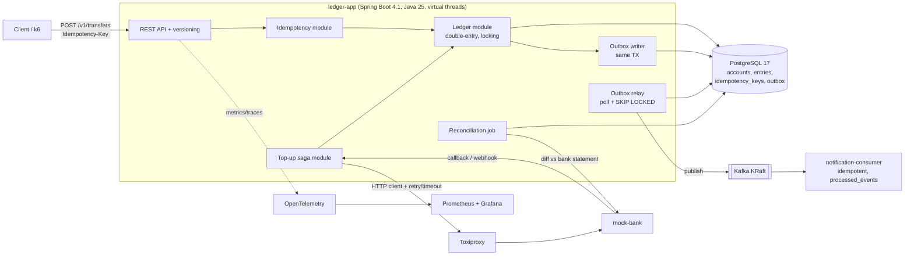

# Xây sổ cái ví điện tử chứng minh năng lực Java

Nên chọn **một hệ thống ví điện tử theo mô hình sổ cái kép (double-entry ledger)**, viết bằng **Java 25 LTS và Spring Boot 4.1**. Dự án cần chứng minh được bốn đảm bảo: API chuyển tiền idempotent, không chi tiêu trùng khi có tải đồng thời, ghi DB và phát sự kiện nhất quán qua transactional outbox, và có job đối soát (reconciliation). Bằng chứng là kiểm thử bất biến, kiểm thử chèn lỗi (chaos test) và benchmark có phương pháp công khai. Lý do: thị trường fresher 2025–2026 co hẹp mạnh. Cơ hội việc làm cho sinh viên mới tốt nghiệp giảm 12,96% so với 2024 ([Tuổi Trẻ](https://tuoitre.vn/nld/sinh-vien-moi-ra-truong-ngay-cang-kho-tim-viec-19625122314251443.htm)), và thị trường IT Việt Nam được mô tả là "thiếu người giỏi, thừa người code cơ bản" ([VnExpress](https://vnexpress.net/thi-truong-it-viet-thieu-nguoi-gioi-du-nguoi-code-co-ban-5059102.html)). Vì vậy CV phải giảm "rủi ro đào tạo lại" cho nhà tuyển dụng, không phải liệt kê thêm công nghệ. Bạn đã có kinh nghiệm microservice bằng TypeScript và Python. Một bộ CRUD microservice nữa bằng Java chỉ lặp lại điều đã chứng minh. Một hệ thống nhỏ, sâu, đúng đắn khi có lỗi thì cho thấy điều còn thiếu: Java hiện đại dùng đúng chỗ và tư duy về tính nhất quán. Đề tài sổ cái cũng khớp trực tiếp với nhóm tuyển Java lớn ở Việt Nam là thanh toán và ngân hàng. VNPAY tuyển lập trình viên Java cổng thanh toán **không yêu cầu kinh nghiệm**, lương 12–25 triệu, và ưu tiên hiểu biết về cổng thanh toán ([TopCV](https://www.topcv.vn/viec-lam/lap-trinh-vien-java-cong-thanh-toan/889207.html)). Hai phương án dự phòng là **flash-sale engine chống bán vượt tồn kho** (hợp với các công ty thương mại điện tử) và **distributed job scheduler dùng PostgreSQL `SKIP LOCKED`** (ít bị trùng ý tưởng hơn). Cả ba đều làm được trong 10–12 tuần part-time nếu giữ kỷ luật phạm vi.

## Nhà tuyển dụng sàng lọc theo hai tầng, không theo số công nghệ

Thị trường Việt Nam có hai tầng tuyển fresher Java khá rõ.

**Tầng một là các công ty outsourcing và chương trình đào tạo** như FPT, Rikkeisoft, NTQ. Họ kiểm tra Java Core, OOP, SQL và coi Spring/Hibernate là điểm cộng hoặc yêu cầu. FPT Software yêu cầu GPA ≥ 2.8, SQL, OOP, Java Core và TOEIC 650+, còn Spring/Hibernate chỉ là nice-to-have ([TopCV/FPT](https://www.topcv.vn/brand/fptsoftwareacademy/tuyen-dung/fresher-java-j866562.html)). Thực tập Java Spring Boot tại NTQ trả tối đa 7 triệu/tháng ([Indeed VN](https://vn.indeed.com/q-th%E1%BB%B1c-t%E1%BA%ADp-java-spring-boot-l-h%C3%A0-n%E1%BB%99i-vi%E1%BB%87c-l%C3%A0m.html)).

**Tầng hai là công ty sản phẩm và big tech**. Tầng này lọc mạnh bằng thuật toán và GPA, gần như không quan tâm ngôn ngữ. Zalo Tech Fresher 2026 yêu cầu GPA ≥ 3.0/4, thi offline về thuật toán và tư duy logic, lương 15 triệu cộng phụ cấp ([Zalo](https://zalo.careers/techfresher)). Axon Vietnam chỉ cần thành thạo "một ngôn ngữ OOP như Java, Python, Scala, Go, C#" ([startup.jobs](https://startup.jobs/2026-vietnam-software-engineering-internship-axon-2-7797282)). Grab tuyển backend intern với yêu cầu tương tự, kèm hiểu biết về database và CI/CD ([Built In](https://builtin.com/job/intern-software-engineer-backend/4719556)).

Hệ quả thực tế: **dự án cá nhân không thay được LeetCode** ở tầng hai. Nó là thứ giúp bạn vượt qua vòng đọc CV và có nội dung để nói trong vòng phỏng vấn dự án. Bạn vẫn phải luyện thuật toán song song.

Về công nghệ, mẫu số chung gần như ở mọi tin tuyển là **Java + Spring Boot + SQL (MySQL/PostgreSQL) + REST + Git**. Docker, CI/CD và unit test thường là điểm cộng. Kafka, Redis, Kubernetes và observability hiếm khi xuất hiện ở tin fresher thật sự, mà chủ yếu ở tin "all levels". Ví dụ, tin "Java Engineer (All levels)" của NAB Việt Nam yêu cầu Docker/K8s, Jenkins, độ phủ unit test tốt, và cả "kinh nghiệm với Anthropic Claude" ([ITviec](https://itviec.com/it-jobs/java-engineer-all-levels-nab-innovation-centre-vietnam-0402)).

Số liệu toàn ngành ủng hộ cách chọn này. Theo Stack Overflow 2025, PostgreSQL được 55,6% dùng, Docker 71,1%, Redis 28% ([Stack Overflow](https://survey.stackoverflow.co/2025/technology)). Theo JetBrains, Java 21 chiếm 40% và Java 17 chiếm 39% trong production, còn Spring được 65% sử dụng ([JetBrains](https://lp.jetbrains.com/the-state-of-java-2025/)).

Hệ sinh thái tại thời điểm tháng 10/2026 như sau. **Java 25 là LTS hiện hành** ([Oracle](https://www.oracle.com/news/announcement/oracle-releases-java-25-2025-09-16/)). JDK 27 vừa ra ngày 15/9/2026 nhưng không phải LTS, và structured concurrency vẫn ở bản preview thứ bảy ([Inside.java](https://inside.java/2026/09/15/jdk-27-available/)). Spring Boot 4.0 GA ngày 20/11/2025, kèm API versioning, JSpecify null-safety và HTTP service client ([spring.io](https://spring.io/blog/2025/11/20/spring-boot-4-0-0-available-now/)). **Boot 4.1 là bản hiện tại. Boot 3.5 đã hết hỗ trợ OSS từ 30/6/2026** ([HeroDevs](https://www.herodevs.com/blog-posts/spring-boot-versions-eol-dates-and-latest-releases-april-2026)). Một dự án mới viết trên Boot 3.x lúc này đã nằm trên nhánh EOL.

Cũng cần nhớ phần lớn doanh nghiệp Việt Nam vẫn chạy Java 8/11/17. Vì vậy hãy nắm chắc các tính năng của Java 17–21 (records, sealed types, pattern matching, virtual threads) hơn là khoe các tính năng chỉ có ở Java 25.

Kỳ vọng về kỹ năng mềm và AI cũng đã thay đổi. ITviec ghi nhận chỉ **48,6% công ty có kế hoạch mở rộng đội IT, mức thấp nhất từ 2021**. Nhu cầu chuyển sang kỹ năng AI (47,6%) và khả năng giải quyết vấn đề, trong khi nhu cầu code lặp lại giảm ([ITviec](https://itviec.com/blog/tom-tat-chinh-bao-cao-ung-dung-ai-va-tuyen-dung-it-tai-vietnam/)). Addy Osmani nói thẳng: nếu junior dùng AI để sinh code, "họ phải giải thích được nó, không chấp nhận một cách mù quáng" ([Addy Osmani](https://addyo.substack.com/p/ai-wont-kill-junior-devs-but-your)). Khi code đẹp đã trở nên rẻ, tín hiệu tuyển dụng chuyển sang cách ứng viên "review, kiểm chứng, phục hồi, giao tiếp và chịu trách nhiệm về kết quả" ([The Long Commit](https://newsletter.thelongcommit.com/p/the-hiring-signal-is-moving-out-of)).

## CRUD và bản sao tutorial thua dự án sâu có bằng chứng

Các nguồn đồng thuận rằng thứ bị xem là nhàm chán không phải một lĩnh vực cụ thể. Đó là **dự án không có bài toán khó**.

Bộ tiêu chí phỏng vấn dự án của Ashby xếp "chủ yếu là CRUD, không có abstraction thú vị" và "dự án dang dở" vào nhóm tín hiệu yếu. Tín hiệu mạnh là giải quyết thử thách mơ hồ và làm đến nơi đến chốn ([Ashby](https://www.ashbyhq.com/resources/engineer-past-projects-deep-dive)). Trên Blind, một kỹ sư Postman nhận xét về dự án clone: chúng "dễ làm đến mức ai cũng làm được, vậy tại sao recruiter phải ưu tiên bạn" ([Blind](https://www.teamblind.com/post/clone-projects-worth-putting-in-resume-jpxqnbwf)).

CodeGym Việt Nam nói rõ rằng dự án chỉ là bài tập Udemy hay tutorial YouTube không thể hiện khả năng giải quyết vấn đề. Họ khuyên làm 2 dự án lớn thay vì 5 dự án dở dang. Họ cũng cảnh báo việc liệt kê cả rổ công nghệ như Java, Python, C++, React, Node, Docker, K8s cùng lúc ([CodeGym](https://codegym.vn/blog/cv-backend-junior-bi-loai-sua-sao-de-duoc-goi-phong-van/)). Viblo coi link GitHub trả về 404 trên CV là một red flag ([Viblo](https://viblo.asia/p/huong-dan-viet-cv-tu-a-den-z-cho-fresher-web-quet-lai-cv-cua-chinh-minh-4-nam-ve-truoc-38X4ENgzJN2)).

Những gì gây ấn tượng được nhắc đi nhắc lại khá nhất quán:

- **Hệ thống chạy được**, sẵn sàng như sản phẩm thật. CEO Wellfound mô tả junior hấp dẫn là người có "dự án chứng minh rõ ràng họ xây được phần mềm production-ready" ([Pragmatic Engineer](https://newsletter.pragmaticengineer.com/p/tech-jobs-market-2025-part-3)).
- **Con số đo được.**
- **README rõ ràng** ([Built In](https://builtin.com/articles/github-advice-job-seeker)).
- **Giải thích được vì sao** chọn từng giải pháp.

Cũng có góc nhìn hoài nghi đáng ghi nhận. Một kỹ sư duy trì dự án open source nổi tiếng cho biết chỉ khoảng 1% công ty hỏi đến nó ([Blind](https://www.teamblind.com/post/do-companies-actually-look-at-your-githubprojects-in-resume-screen-izckluxp)). Trên HN có người nhận xét rằng dự án solo thiếu design doc và phản hồi từ đồng đội ([HN](https://hn.algolia.com/api/v1/search?query=side%20projects%20resume%20new%20grad%20hiring&tags=comment&hitsPerPage=20)). Kết luận của tôi: dự án cá nhân là **điều kiện cần với người chưa có kinh nghiệm làm việc**, nhưng giá trị của nó chủ yếu nằm ở vòng phỏng vấn sâu. Muốn bù phần thiếu "làm việc nhóm", hãy viết design doc và ADR như thể có reviewer đọc.

Bảng dưới đánh giá các ý tưởng phổ biến theo hai tiêu chí: mức độ bão hòa và khả năng tạo ra bằng chứng kỹ thuật.

| Ý tưởng | Mức bão hòa | Bài toán khó cốt lõi | Đánh giá |
|---|---|---|---|
| Todo/blog/e-commerce CRUD 8 microservice (Eureka, Config Server) | Rất cao | Hầu như không có | Tránh. Bạn đã chứng minh phần này bằng TS/Python |
| URL shortener, chat app cơ bản | Rất cao | Sinh ID, cache | Quá nhỏ, nhiều repo tutorial |
| Rate limiter độc lập | Cao. Spring Cloud Gateway đã có sẵn `RedisRateLimiter` ([Spring docs](https://docs.spring.io/spring-cloud-gateway/reference/spring-cloud-gateway-server-webflux/gatewayfilter-factories/requestratelimiter-factory.html)) | Atomicity, fail-open/closed | Hợp làm thành phần phụ, mỏng nếu làm dự án chính |
| Clone Redis / Raft KV kiểu "build your own X" | Trung bình, vì nhiều người cùng làm các stage của CodeCrafters | TCP, protocol, đồng thuận | Rất sâu nhưng dễ bỏ dở. Ít khớp thị trường Spring Boot Việt Nam |
| **Sổ cái ví / thanh toán** | Trung bình, nhưng hiếm repo có bằng chứng đúng đắn | Double-spend, idempotency, outbox, đối soát | **Dự án chính** |
| Flash-sale chống oversell | Trung bình | Hot key, oversell, peak shaving | Dự phòng 1 |
| Job scheduler phân tán | Thấp | Claim job, crash recovery, dedupe | Dự phòng 2 |

## Dự án đề xuất: Ledgerly, ví điện tử sổ cái kép với bất biến được kiểm chứng

### Bài toán và nguyên lý thiết kế

Ledgerly là backend ví điện tử với ba nhóm chức năng: mở ví, nạp tiền qua một "ngân hàng giả lập", và chuyển tiền giữa các ví.

Thiết kế dựa trên các tài liệu tham chiếu công khai, có thể dẫn trong README:

- **Mô hình dữ liệu ba bảng** (Accounts, Transactions, Entries) theo Modern Treasury. Các nguyên tắc đi kèm: bút toán bất biến, mỗi dịch chuyển tiền đều có nguồn và đích, và có kiểm soát đồng thời để chống chi tiêu trùng ([Modern Treasury](https://www.moderntreasury.com/journal/how-to-scale-a-ledger-part-i)).
- **Idempotency theo mô hình của Stripe.** Client gửi header `Idempotency-Key`. Khi client retry với cùng key, server trả lại kết quả đã lưu. Client retry với exponential backoff cộng jitter ([Stripe](https://stripe.com/blog/idempotency)).
- **Nguyên lý exactly-once** trong System Design Interview Vol. 2: exactly-once bằng at-least-once (retry) cộng at-most-once (idempotency). Sách cũng so sánh 2PC, TCC và Saga cho giao dịch phân tán ([ghi chú SDI Vol.2](https://www.vchalyi.com/books/system-design-interview-volume-2/)).
- **Transactional outbox.** Sự kiện được ghi vào bảng outbox trong cùng transaction với thay đổi nghiệp vụ, sau đó relay phát lên Kafka. Vì relay có thể phát trùng, **consumer bắt buộc phải idempotent** ([microservices.io](https://microservices.io/patterns/data/transactional-outbox.html)). Lưu ý thêm: Kafka exactly-once chỉ bao phủ luồng Kafka-đến-Kafka. Mọi side effect ghi ra DB bên ngoài vẫn cần consumer idempotent ([Nejc Korasa](https://nejckorasa.github.io/posts/idempotent-kafka-procesing/)).

Lý do chọn đề tài này không chỉ vì nó "khó". Nó có một **bất biến kiểm chứng được bằng máy**: tổng bút toán của mọi giao dịch bằng 0, và tổng số dư toàn hệ thống được bảo toàn. Bất biến này biến câu "hệ thống của em đúng" thành một khẳng định mà bất kỳ ai cũng có thể chạy lại để kiểm tra. Đây chính là thứ phân biệt Ledgerly với hàng nghìn repo "payment service" chỉ có endpoint.

### Kiến trúc: modular monolith cộng hai tiến trình vệ tinh

Bạn đã chứng minh được năng lực microservice, nên ở đây nên chủ động **không** chia nhỏ hệ thống. Lõi ledger là một **modular monolith** có ranh giới module được ArchUnit kiểm tra. Bên cạnh nó có hai tiến trình riêng, chỉ để tạo ra ranh giới mạng thật cần xử lý lỗi:

- **mock-bank**: ngân hàng giả lập, có thể cấu hình độ trễ và tỉ lệ lỗi.
- **notification-consumer**: consumer idempotent nhận sự kiện từ Kafka.

Quyết định này nên được ghi thành ADR-0001. Nó cũng là câu trả lời sẵn có khi người phỏng vấn hỏi "sao không làm microservice?".



Luồng cốt lõi nên có thêm một sơ đồ tuần tự trong README:

```mermaid
sequenceDiagram
    participant C as Client
    participant A as ledger-app
    participant DB as PostgreSQL
    participant R as Outbox relay
    participant K as Kafka
    C->>A: POST /transfers (Idempotency-Key: k1)
    A->>DB: INSERT idempotency_keys(k1, IN_PROGRESS) ON CONFLICT
    alt key đã COMPLETED
        A-->>C: trả response đã lưu (200, cùng body)
    else key mới
        A->>DB: BEGIN; SELECT accounts ... FOR UPDATE (theo thứ tự id)
        A->>DB: INSERT 2 entries (debit/credit), UPDATE balances
        A->>DB: INSERT outbox(TransferCompleted); UPDATE key=COMPLETED + response; COMMIT
        A-->>C: 201 Created
        R->>DB: SELECT ... FROM outbox FOR UPDATE SKIP LOCKED
        R->>K: publish (key = transferId)
        R->>DB: mark published
    end
```

### Tech stack cụ thể, mỗi thứ có lý do tồn tại

| Lớp | Lựa chọn | Lý do và điểm để nói khi phỏng vấn |
|---|---|---|
| Ngôn ngữ | **Java 25 LTS** (biên dịch target 25, chỉ dùng tính năng final) | Records cho `Entry`/`Money`; sealed interface `TransferResult` (Success / InsufficientFunds / Duplicate) với switch pattern matching; Scoped Values (JEP 506, đã final) thay ThreadLocal cho request context ([JEP 506](https://openjdk.org/jeps/506)). **Không** dùng structured concurrency trong code chính vì vẫn là preview ([JEP 505](https://openjdk.org/jeps/505)) |
| Framework | **Spring Boot 4.1**, Spring Framework 7 | API versioning first-class, `@ConcurrencyLimit` và retry tích hợp sẵn trong core, JSpecify, Jackson 3 (package `tools.jackson`) ([InfoQ](https://www.infoq.com/news/2025/11/spring-7-spring-boot-4)) |
| Đồng thời | Virtual threads (`spring.threads.virtual.enabled=true`) | Từ JDK 24, JEP 491 đã bỏ hiện tượng pinning trong `synchronized`. Rủi ro chính chuyển sang việc làm cạn connection pool HikariCP, nên phải giới hạn bằng Semaphore hoặc `@ConcurrencyLimit` ([InfoQ](https://www.infoq.com/articles/virtual-threads-after-jdk24/)) |
| Lưu trữ | PostgreSQL + Spring Data JPA cho phần đơn giản, **JdbcClient/SQL tường minh** cho đường nóng; Flyway | Cần chứng minh hiểu `FOR UPDATE`, isolation level, constraint. Kỹ năng này chuyển được sang Oracle, DB mà VNPAY ưu tiên |
| Messaging | Kafka (KRaft, 1 broker trong Compose) | Outbox relay, consumer idempotent bằng bảng `processed_events` |
| Cache (tùy chọn) | Redis | Chỉ thêm nếu benchmark cho thấy cần, và ghi lý do trong một ADR |
| Kiểm thử | JUnit 5, **Testcontainers** (Postgres, Kafka), **Toxiproxy module**, ArchUnit, jqwik (property-based) | Testcontainers chạy test với "cùng loại database như production thay vì mock" ([Testcontainers](https://testcontainers.com/guides/testing-spring-boot-rest-api-using-testcontainers/)). Toxiproxy chèn độ trễ hoặc cắt kết nối ngay giữa test ([Testcontainers Toxiproxy](https://java.testcontainers.org/modules/toxiproxy/)). ArchUnit kiểm tra ranh giới module ([ArchUnit](https://www.archunit.org/)) |
| Chất lượng | Spotless, Error Prone hoặc SpotBugs, JaCoCo, GitHub Actions, Conventional Commits | CI xanh cộng badge trong README |
| Đóng gói | Dockerfile multi-stage dạng layered, AOT cache của Java 25 | Đây là hướng dẫn chính thức của Spring Boot để giảm thời gian khởi động ([Spring Boot docs](https://docs.spring.io/spring-boot/reference/packaging/container-images/dockerfiles.html)) |
| Quan sát | OpenTelemetry Java agent, Prometheus, Grafana | Instrument không cần sửa code cho HTTP và DB ([OpenTelemetry](https://opentelemetry.io/docs/zero-code/java/agent/)) |
| Tải | **k6 với executor `constant-arrival-rate`**, JMH cho micro-benchmark | Tránh lỗi coordinated omission (giải thích ở phần benchmark) |

### Phạm vi MVP và phần mở rộng

**MVP (bắt buộc hoàn thành)** gồm sáu phần:

1. Mở ví và xem số dư.
2. Chuyển tiền nội bộ idempotent, chống chi tiêu trùng bằng khóa bi quan với thứ tự khóa cố định để tránh deadlock.
3. Lịch sử bút toán bất biến (không bao giờ UPDATE hay DELETE một entry).
4. Outbox relay lên Kafka, cùng một consumer idempotent.
5. Kiểm thử bất biến bảo toàn tiền sau mỗi lần chạy tải.
6. Docker Compose khởi động toàn bộ hệ thống bằng một lệnh, và CI xanh.

**Phần mở rộng**, làm theo thứ tự ưu tiên:

1. Saga nạp tiền qua mock-bank, có trạng thái `PENDING → SETTLED / FAILED`, timeout và bút toán bù trừ.
2. Job đối soát so sánh sổ cái với "sao kê" của mock-bank và báo cáo chênh lệch. Rất ít dự án sinh viên làm phần này, trong khi đây là nghiệp vụ fintech thật.
3. Benchmark so sánh ba chiến lược đồng thời trên "hot account": khóa bi quan, khóa lạc quan có retry, và gom bút toán vào một tài khoản trung gian.
4. Benchmark so sánh virtual threads với platform thread pool dưới cùng một profile tải.
5. Rate limit theo ví như một filter nhỏ.
6. Một ADR ghi lại một quyết định đã bị đảo ngược (trạng thái *superseded*). ADR loại này cho thấy bạn biết lặp lại và trung thực về sai lầm của mình.

### Các thử thách kỹ thuật và bằng chứng tương ứng

Mỗi thử thách phải để lại một **dấu vết kiểm chứng được** trong repo: một test, một bảng kết quả, hoặc một ADR. Đó là thứ biến dòng chữ trên CV thành chủ đề bạn làm chủ được khi phỏng vấn.

**Concurrency.** Test cho 200 luồng ảo cùng chuyển tiền qua lại giữa 10 ví. Sau khi chạy xong, assert ba điều:

- Không có số dư âm.
- Tổng số dư không đổi.
- Mọi transaction đều có tổng entries bằng 0.

**Tính nhất quán.** Bút toán và bản ghi outbox nằm trong cùng một transaction. Test kill tiến trình relay ngay giữa batch rồi khởi động lại. Kết quả mong đợi: không mất sự kiện nào. Có thể có sự kiện bị phát trùng, nhưng consumer phải loại bỏ được chúng.

**Idempotency.** Test gửi cùng một `Idempotency-Key` 50 lần đồng thời. Kết quả mong đợi: đúng một transaction được tạo, và 49 response giống hệt nhau. Bạn còn phải xử lý thêm hai trường hợp:

- Cùng key nhưng body khác: trả về 422.
- Key đang ở trạng thái `IN_PROGRESS`: trả về 409, kèm header `Retry-After`.

**Fault tolerance.** Ma trận chèn lỗi bằng Toxiproxy được đưa thẳng vào README:

| Kịch bản lỗi | Cách chèn | Kết quả kỳ vọng phải chứng minh |
|---|---|---|
| mock-bank chậm 3 giây | Toxiproxy latency toxic | Timeout, retry có backoff và jitter, top-up ở trạng thái PENDING rồi được đối soát |
| mock-bank mất kết nối | bandwidth = 0 | Không trừ tiền hai lần. Saga bù trừ đúng |
| Kafka down 60 giây | dừng container | API vẫn nhận giao dịch. Outbox tồn đọng rồi xả hết khi Kafka lên lại. Không mất sự kiện |
| Relay bị `kill -9` giữa batch | kill tiến trình | Có phát trùng nhưng consumer khử trùng. Đếm được số bản trùng |
| PostgreSQL chậm 500 ms | latency toxic | `@ConcurrencyLimit` ngăn cạn pool. Lỗi trả về là 503, không treo |

**Benchmark trung thực.** Nhiều bộ sinh tải hoạt động kiểu vòng kín: chỉ gửi request tiếp theo sau khi nhận được response. Cách này che mất đúng những khoảng thời gian server chậm, gọi là coordinated omission. Trong ví dụ của README wrk2, p99 đo theo cách ngây thơ là 6 ms, trong khi giá trị đúng là **1,27 giây** ([wrk2](https://github.com/giltene/wrk2)). Vì vậy:

- Dùng executor `constant-arrival-rate` của k6.
- Khai báo ngưỡng SLO ngay trong script, ví dụ `p(95)<200`. Lưu ý k6 không in p99 theo mặc định, phải yêu cầu thêm ([Grafana k6](https://grafana.com/docs/k6/latest/using-k6/thresholds/)).
- Ghi rõ CPU/RAM, phiên bản JDK, cờ JVM, kích thước dữ liệu, thời gian warm-up, và việc bộ sinh tải có chạy chung máy với server hay không.
- Báo cáo p50/p95/p99 kèm tỉ lệ lỗi tại một mức RPS cụ thể.
- Commit script và kết quả thô.
- Chỉ so sánh trước/sau của **một** thay đổi trên **cùng một** máy.

JMH chỉ dùng cho các khẳng định ở mức micro. Nó phải được dựng thành project riêng, không chạy từ IDE ([openjdk/jmh](https://github.com/openjdk/jmh)).

## Phương án dự phòng khi muốn nghiêng về thương mại điện tử hoặc hạ tầng

**Dự phòng 1: Flash-sale engine chống oversell.** Phù hợp nếu bạn nhắm tới Shopee, Tiki, Lazada. Phần cốt lõi là trừ tồn kho nguyên tử bằng Redis Lua. Script trả về mã kết quả cho từng trường hợp: thành công, hết hàng, hoặc vượt hạn mức mỗi người. Đơn hàng được ghi xuống DB bất đồng bộ qua Kafka. Hot key được xử lý bằng cách chia tồn kho thành nhiều sub-key, và có cờ "sold out" trong bộ nhớ để cắt request sớm. Thiết kế này dựa trên một bản tái dựng độc lập kiểu Shopee, **không phải** tài liệu chính thức của Shopee ([tanhdev](https://tanhdev.com/series/shopee-architecture/02-flash-sale-engine/)).

Điểm làm dự án này khác biệt là **bảng so sánh ba chiến lược**: khóa bi quan, khóa lạc quan theo version, và Redis Lua. Đây chính là ba cách SDI Vol.2 đưa ra cho bài toán double-booking ([ghi chú SDI Vol.2](https://www.vchalyi.com/books/system-design-interview-volume-2/)). Cả ba chạy dưới cùng một bài spike test, ví dụ nhiều VU tranh 100 sản phẩm. Bất biến cần chứng minh là số đã bán bằng đúng tồn kho và không có oversell. Thời gian ước tính 6–9 tuần. Nhược điểm: phần Java Core ít đất diễn hơn, vì logic nóng nằm trong Lua.

**Dự phòng 2: Distributed job scheduler trên PostgreSQL.** Phù hợp nếu bạn muốn một đề tài ít trùng lặp, chỉ cần một DB, và thiên về hạ tầng. Các bài toán cốt lõi:

- Chống chạy trùng bằng `SELECT ... FOR UPDATE SKIP LOCKED`.
- Lease và heartbeat để giành lại job từ worker đã chết.
- Retry với exponential backoff.
- Bầu leader cho cron trigger.

JobRunr mô tả đúng cách làm này. Đó là nguồn của vendor nên cần đọc có phê phán. Họ cũng so sánh với Quartz clustering cần tới 11 bảng ([JobRunr](https://www.jobrunr.io/en/blog/distributed-job-scheduling-java/)). Bằng chứng cần có: `kill -9` các worker trong lúc chạy tải mà không mất job nào, đo được tỉ lệ chạy trùng, và vẽ được throughput (jobs/s) theo số worker. Dự án này phô diễn virtual threads và `java.util.concurrent` rất tự nhiên.

Raft KV hay clone Redis chỉ nên chọn nếu bạn chấp nhận rủi ro bỏ dở, vì phạm vi ước tính 10–14 tuần trở lên. Chúng cũng ít khớp với thị trường Spring Boot ở Việt Nam.

## Lộ trình 12 tuần part-time, mỗi tuần kết thúc bằng thứ chạy được

Giả định khoảng 12–15 giờ mỗi tuần. Nguyên tắc: **tuần 8 phải có MVP hoàn chỉnh, deploy được**. Bốn tuần sau là mở rộng và hoàn thiện. Nếu chậm tiến độ, cắt phần mở rộng, không cắt kiểm thử.

| Tuần | Mục tiêu | Sản phẩm kiểm chứng được |
|---|---|---|
| 1 | Đọc tài liệu tham chiếu (Stripe, Modern Treasury, outbox, SDI ch.11–12). Viết mini design doc 2 trang: goals và non-goals, các phương án đã cân nhắc | `docs/design.md`, ADR-0001 (modular monolith), ADR-0002 (PostgreSQL + SQL tường minh) |
| 2 | Khung dự án: Gradle multi-module, Boot 4.1, Flyway schema, Compose (Postgres, Kafka), CI với Spotless và test | CI xanh, `docker compose up` chạy được |
| 3 | Domain: records `Money`, `Entry`; sealed `TransferResult`; API mở ví và chuyển tiền đơn luồng; ArchUnit rules | Unit test và Testcontainers IT |
| 4 | Concurrency: khóa có thứ tự, test 200 virtual threads, test bất biến bảo toàn bằng jqwik | ADR-0003 (chiến lược khóa), test bất biến xanh |
| 5 | Idempotency: bảng key, các trạng thái IN_PROGRESS/COMPLETED, xung đột body, TTL | Test 50 request trùng key đồng thời |
| 6 | Outbox, relay `SKIP LOCKED`, Kafka, consumer idempotent | ADR-0004 (outbox thay vì dual-write), test kill relay |
| 7 | Quan sát: OTel agent, Prometheus, dashboard Grafana. Viết k6 script `constant-arrival-rate` | Bảng benchmark baseline đầu tiên kèm phương pháp |
| 8 | **Mốc MVP:** README đầy đủ, OpenAPI, deploy demo, sửa lỗi | Tag `v1.0.0`, link demo |
| 9 | mock-bank và saga top-up với timeout, retry, bù trừ | ADR-0005 (Saga thay vì 2PC/TCC) |
| 10 | Ma trận chaos bằng Toxiproxy. `@ConcurrencyLimit` chống cạn pool | Bảng kết quả chaos trong README |
| 11 | Job đối soát. Benchmark so sánh (khóa bi quan vs lạc quan; virtual vs platform threads) | Bảng trước/sau, ADR superseded nếu có |
| 12 | Viết blog (Viblo bản tiếng Việt, dev.to bản tiếng Anh), quay GIF demo, luyện trình bày 5 phút, chốt CV | Bài viết, CV, `v1.1.0` |

Về deploy: tính đến tháng 9/2026, Fly.io không còn free tier cho tài khoản mới. Koyeb bỏ gói không cần thẻ. Render free không cần thẻ nhưng ngủ sau 15 phút, chỉ có 512 MB RAM, và Postgres miễn phí hết hạn sau 30 ngày ([SnapDeploy](https://snapdeploy.dev/state-of-free-hosting); [Render](https://render.com/articles/platforms-with-a-real-free-tier-for-developers-in-2026)). Oracle Always Free Ampere A1 đã bị giảm còn 2 OCPU / 12 GB từ 15/6/2026 ([InfoQ](https://www.infoq.com/news/2026/07/oracle-cloud-free-tier-limits/)), nhưng vẫn đủ chạy toàn bộ Compose. Đổi lại, Oracle cần thẻ thật, không nhận thẻ trả trước, và có thể thu hồi máy để idle ([SnapDeploy](https://snapdeploy.dev/state-of-free-hosting)).

Khuyến nghị: dùng Oracle nếu có thẻ, không thì dùng Render. Dù chọn bên nào, **`docker compose up` mới là đường demo chính**. Trong README hãy ghi rõ rằng bản demo trực tuyến có thể mất thời gian khởi động lạnh.

## CV, GitHub và phỏng vấn: biến code thành câu chuyện kiểm chứng được

### README, ADR và kỷ luật repo

README theo khuyến nghị cơ bản của GitHub cần trả lời được: dự án làm gì, vì sao hữu ích, bắt đầu thế nào, hỏi ai khi cần giúp, ai duy trì ([GitHub Docs](https://docs.github.com/en/repositories/managing-your-repositorys-settings-and-features/customizing-your-repository/about-readmes)). GitHub render được Mermaid ngay trong README ([GitHub Docs](https://docs.github.com/en/get-started/writing-on-github/working-with-advanced-formatting/creating-diagrams)). Với sơ đồ C4, mức context và container là đủ cho hầu hết các đội ([C4 model](https://c4model.com/diagrams)).

Thứ tự README nên dùng:

1. Pitch một câu cùng badge (CI, coverage, Java 25).
2. GIF demo, hoặc ảnh chụp dashboard Grafana.
3. Phạm vi, gồm cả **những gì không làm**.
4. Sơ đồ C4 container và sơ đồ tuần tự.
5. Quickstart bằng một lệnh.
6. Link Swagger.
7. Phần kiểm thử, kèm ma trận chaos.
8. Bảng benchmark kèm phương pháp đo.
9. Danh sách ADR.
10. Phần "Giới hạn và hướng phát triển" viết thật lòng.

ADR theo mẫu của Nygard có năm phần: Title, Context, Decision ("We will…"), Status, Consequences. Mỗi ADR dài một đến hai trang, đánh số tuần tự, ADR bị thay thế được giữ lại và đánh dấu *superseded* ([Nygard](https://cognitect.com/blog/2011/11/15/documenting-architecture-decisions)). Theo Malte Ubl, design doc là nơi "ghi lại các trade-off bạn đã chọn" ([Industrial Empathy](https://www.industrialempathy.com/posts/design-docs-at-google/)). Nên viết từ 5 đến 7 ADR.

Commit theo chuẩn Conventional Commits (`feat:`, `fix:`, `perf:`, `test:`) ([conventionalcommits.org](https://www.conventionalcommits.org/en/v1.0.0/)), thay vì "update" hay "fix" trơn. Thêm một mục **"Cách tôi dùng AI"** liệt kê phần nào do AI gợi ý, phần nào bạn đã bác bỏ, và bạn kiểm chứng bằng test nào. Mục này biến việc dùng AI từ một rủi ro thành một tín hiệu tốt.

### Bullet CV theo công thức XYZ

ITviec trình bày công thức của Laszlo Bock: "Đạt được [X], đo bằng [Y], bằng cách [Z]". Họ cũng khuyên cấu trúc mỗi dự án gồm tên và thời gian, vai trò, công nghệ, các bullet, và link ([ITviec](https://itviec.com/blog/mau-cv-chuan-trinh-bay-du-an-it/)). Tech Interview Handbook nhấn mạnh CV gói trong một trang, lặp lại keyword của JD, và tránh nhồi keyword ([Tech Interview Handbook](https://www.techinterviewhandbook.org/resume/)). Nghiên cứu eye-tracking của Ladders cho thấy recruiter lướt CV khoảng 7,4 giây, và CV nhiều cột hoặc rối mắt bị đánh giá thấp ([HR Dive](https://www.hrdive.com/news/eye-tracking-study-shows-recruiters-look-at-resumes-for-7-seconds/541582/)). Vì vậy nên dùng bố cục một cột.

Các bullet mẫu dưới đây dùng **số giữ chỗ**. Bạn phải thay bằng số đo thật của mình, và chỉ ghi số nào bạn giải thích được cách đo:

> **Ledgerly: Double-entry wallet ledger** (Java 25, Spring Boot 4.1, PostgreSQL, Kafka) | github.com/…/ledgerly
> - Guaranteed zero double-spend and exact money conservation across **[N] concurrent transfers** on hot accounts, verified by property-based invariant tests run after every load test, by implementing ordered pessimistic locking with `SELECT … FOR UPDATE`.
> - Eliminated duplicate charges under client retries (**[50] concurrent identical requests → 1 transaction**) by designing a Stripe-style `Idempotency-Key` layer with in-progress/conflict handling.
> - Achieved **0 lost events across [5] fault-injection scenarios** (Kafka outage, relay `kill -9`, bank timeouts) using a transactional outbox, idempotent Kafka consumers and a compensating saga, tested with Testcontainers and Toxiproxy.
> - Sustained **[X] TPS at p99 < [Y] ms** (k6 constant-arrival-rate, [4 vCPU/8 GB], methodology in repo), and raised throughput by **[Z]%** by enabling virtual threads with `@ConcurrencyLimit` to prevent connection-pool exhaustion.

Với CV gửi công ty Việt Nam theo mẫu TopCV hoặc ITviec, có thể dịch các bullet sang tiếng Việt, giữ nguyên thuật ngữ. Theo TopDev, CV kiểu Việt Nam thường kèm ảnh chân dung lịch sự ([TopDev](https://topdev.vn/blog/cach-viet-cv-xin-viec-it-cho-nguoi-chua-co-kinh-nghiem/)). Bản quốc tế thì dùng tiếng Anh, một cột, không ảnh.

### Câu hỏi deep-dive cần chuẩn bị

Bộ tiêu chí của Ashby đào sâu vào bốn mặt: phạm vi bài toán, kiến trúc, "vì sao chọn công nghệ đó, trade-off, kiểm thử, độ tin cậy", và tác động đo được ([Ashby](https://www.ashbyhq.com/resources/engineer-past-projects-deep-dive)). Với fresher Java ở Việt Nam, kiến thức Spring nền tảng vẫn là phần chắc chắn bị hỏi: IoC/DI, vòng đời và scope của bean, luồng xử lý của DispatcherServlet, auto-configuration, `@Transactional`. Các chủ đề như N+1, AOP, Security được xếp vào mức middle trở lên ([ITviec](https://itviec.com/blog/cau-hoi-phong-van-spring/)). Dự án tốt là dự án giúp bạn trả lời được cả những câu "vượt cấp" bằng ví dụ của chính mình.

| Chủ đề | Câu hỏi cần trả lời trôi chảy |
|---|---|
| Đồng thời | Vì sao khóa bi quan mà không dùng khóa lạc quan cho hot account? Làm sao tránh deadlock khi A→B và B→A chạy cùng lúc? Isolation level đang dùng là gì, và chuyện gì xảy ra ở mức READ COMMITTED với SERIALIZABLE? |
| Idempotency | Key lưu ở đâu, TTL bao lâu? Hai request cùng key đến cùng lúc thì sao? Cùng key nhưng body khác thì sao? Server crash giữa chừng khi key đang IN_PROGRESS thì sao? |
| Outbox, Kafka | Vì sao không publish thẳng sau khi commit (dual-write)? Relay phát trùng thì consumer xử lý thế nào? Thứ tự sự kiện được đảm bảo ra sao (partition key)? Vì sao Kafka EOS không giải quyết được bài toán này? |
| Saga | Vì sao chọn Saga thay vì 2PC hay TCC? Bank timeout nhưng thực tế đã trừ tiền thì sao? Đối soát phát hiện chênh lệch bằng cách nào? |
| Virtual threads | Virtual thread khác platform thread thế nào? Pinning là gì và JEP 491 đã thay đổi gì? Vì sao bật virtual threads có thể làm hệ thống tệ hơn (cạn pool)? ScopedValue khác ThreadLocal ở đâu? |
| Spring | `@Transactional` hoạt động qua proxy như thế nào? Vì sao self-invocation làm mất transaction? Bean scope là gì? Spring Boot 4 thay đổi những gì so với Boot 3? |
| Benchmark | Số p99 đó đo thế nào, trên máy nào? Coordinated omission là gì? Nút cổ chai nằm ở đâu, và làm sao bạn biết? Nếu tải tăng 10 lần thì cái gì vỡ trước? |
| Dữ liệu | Có index nào, và vì sao? Vì sao dùng `BigDecimal` hoặc số nguyên đơn vị nhỏ nhất thay vì `double`? Vì sao entries không bao giờ bị UPDATE? |
| AI và quyền sở hữu code | Phần nào do AI viết? Bạn kiểm chứng nó đúng bằng cách nào? Hãy giải thích từng dòng của hàm `transfer()` |

### Những sai lầm làm hỏng một dự án tốt

Sai lầm phổ biến nhất là **dàn trải**: 8 service với Eureka, Config Server và Kubernetes, nhưng không có test bất biến nào. Kiểu dự án này lặp lại đúng thứ bạn đã chứng minh bằng TypeScript và Python, lại đẻ ra những câu hỏi bạn không bảo vệ được.

Sai lầm thứ hai là **số liệu không kiểm chứng được**. Ví dụ một dòng "10.000 RPS" không ghi phần cứng, không có script, đo bằng bộ sinh tải vòng kín. Kỹ sư có kinh nghiệm sẽ hỏi ngay và lật lại con số đó trong một câu.

Sai lầm thứ ba là **bỏ dở**. Ashby xếp dự án dang dở vào nhóm tín hiệu yếu ([Ashby](https://www.ashbyhq.com/resources/engineer-past-projects-deep-dive)). Đó là lý do lộ trình đặt mốc MVP ở tuần 8.

Các sai lầm còn lại:

- **Dùng tính năng preview** như structured concurrency trong code chính chỉ để khoe.
- **Dùng H2 thay cho database thật** trong test.
- **Dùng `double` cho tiền.**
- **Link demo chết, repo 404.**
- **Lịch sử commit toàn "update".**
- **Code do AI sinh mà không giải thích được.** Đây là sai lầm đắt giá nhất trong năm 2026.

Cuối cùng, đừng để dự án ăn hết thời gian luyện thuật toán. Ở các công ty sản phẩm, vòng thi thuật toán đứng trước vòng nói chuyện về dự án ([Zalo](https://zalo.careers/techfresher)).

## Conclusion

Điều thay đổi trong năm 2025–2026 không nằm ở danh sách công nghệ mà ở **đơn vị bằng chứng**. Khi AI làm cho code đẹp trở nên rẻ và thị trường fresher co hẹp, một dự án chỉ có giá trị khi nó đưa ra những khẳng định mà người khác chạy lại được: bất biến bảo toàn tiền, ma trận lỗi có kết quả, benchmark có phương pháp. Ledgerly được chọn vì bài toán sổ cái tự nó sinh ra những khẳng định như vậy. Nó cũng khớp trực tiếp với các nhà tuyển dụng Java lớn ở Việt Nam là thanh toán và ngân hàng, và mọi câu hỏi phỏng vấn khó đều có sẵn một test hoặc ADR để bạn chỉ vào.

Một hàm ý ít được nói ra: với ứng viên đã biết microservice, **việc chủ động chọn modular monolith và viết ADR giải thích vì sao** là tín hiệu trưởng thành mạnh hơn bất kỳ sơ đồ 8 service nào. Đây là đánh giá suy luận của tôi, không có khảo sát định lượng nào đo trực tiếp. Các nguồn cũng chưa đo được trọng số chính xác mà recruiter Việt Nam dành cho dự án cá nhân so với GPA hay thuật toán. Vì vậy, chiến lược an toàn là coi dự án này là vũ khí cho vòng đọc CV và vòng phỏng vấn sâu, chạy song song với luyện thuật toán, chứ không thay thế nó.
