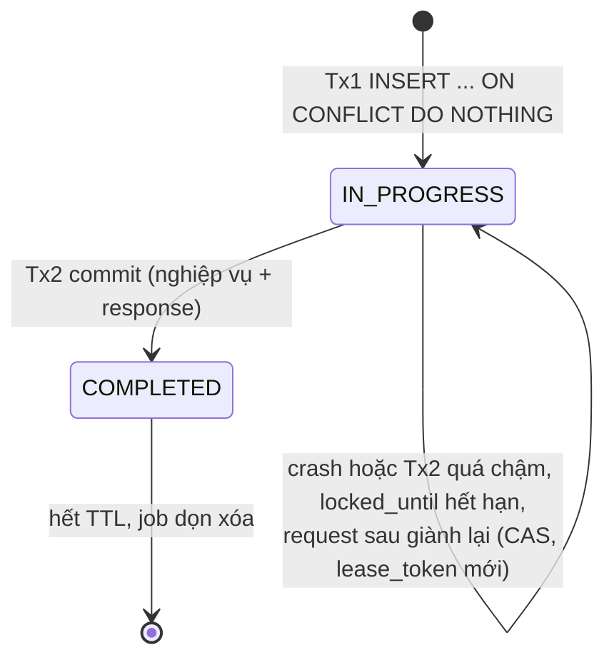

# Tuần 5: Idempotency

| Thời gian | Giai đoạn | Mốc | Ngân sách | Trạng thái |
|---|---|---|---|---|
| 02/11 – 08/11/2026 | 2: Lõi đúng đắn | | 13.5 giờ | ✅ Xong (merge PR #91–#96 ngày 07/10/2026) |

## Mục tiêu

Client retry bao nhiêu lần, đồng thời hay tuần tự, và kể cả khi server crash giữa chừng, thì **một `Idempotency-Key` sinh ra tối đa một giao dịch** và mọi lần gọi đều nhận cùng một kết quả.

## Công việc

| ID | Việc | Giờ | Đầu ra | Trạng thái |
|---|---|:-:|---|---|
| W05-01 | Flyway `V3__idempotency_keys.sql` | 0.5 | `IdempotencyKeyRepository` | ✅ #91 |
| W05-02 | `IdempotencyApi.execute(key, requestHash, action)`: claim (Tx1), rồi action + complete (Tx2) | 3 | `IdempotencyService`, `IdempotencyTransactions` | ✅ #92 |
| W05-03 | Tính `requestHash`: SHA-256 của `method + path + body đã chuẩn hóa` | 1 | `RequestHasher` | ✅ #92 |
| W05-04 | Các nhánh: replay (header `Idempotent-Replayed: true`), 422 khi body khác, 409 + `Retry-After`, giành lại khóa sau khi `locked_until` hết hạn | 2 | `IdempotentRequests` | ✅ #93 |
| W05-05 | Lưu cả lỗi nghiệp vụ có tính xác định (422 thiếu tiền) thành `COMPLETED` | 0.5 | | ✅ #93 |
| W05-06 | Job dọn key hết hạn (`@Scheduled`, xóa theo lô `LIMIT 1000`) | 1 | `IdempotencyCleanupJob` | ✅ #94 |
| W05-07 | `IdempotencyConcurrencyIT`: 50 request đồng thời cùng key | 2 | | ✅ #95 |
| W05-08 | `IdempotencyCrashRecoveryIT`: giả lập crash giữa Tx1 và Tx2 | 2 | | ✅ #95 |
| W05-09 | **ADR-0005**: lưu key trong PostgreSQL (so sánh với Redis), thiết kế hai pha, TTL 24 giờ | 1.5 | [ADR-0005](../adr/0005-idempotency-key-hai-pha-trong-postgresql.md) | ✅ #96 |

## Ghi chú kỹ thuật

### Máy trạng thái của một key

### Vì sao hai pha mà không dùng một transaction?

- **Một transaction**: request thứ hai bị chặn ở unique index cho tới khi request đầu commit. Cách này đơn giản và đúng cho luồng **chỉ có DB**.
- **Hai pha**: cần cho luồng **có gọi mạng ra ngoài** (nạp/rút tiền ở tuần 9), vì không được giữ DB transaction trong lúc chờ ngân hàng. Dùng chung một cơ chế cho mọi endpoint giúp code và test thống nhất.
- Cả hai phương án đều ghi vào ADR-0005, kèm lý do chọn.

### Thiết kế test 50 request đồng thời

Với thiết kế hai pha, request đến khi key đang `IN_PROGRESS` sẽ nhận **409**. Vì vậy test mô phỏng **client đúng chuẩn**:

1. 50 virtual threads gửi cùng key và cùng body tại cùng một thời điểm.
2. Thread nào nhận 409 thì đợi theo `Retry-After` rồi gửi lại.
3. Khẳng định: **đúng 1** dòng `ledger_transactions`, **50/50** response cuối cùng có cùng status và body, và **49** response có header `Idempotent-Replayed: true`.

### Giả lập crash (W05-08)

Trong profile test, đăng ký một `FaultInjector` cho phép ném exception **sau Tx1 và trước Tx2**. Key sẽ kẹt ở `IN_PROGRESS`. Chờ `locked_until` hết hạn (đặt 1 giây trong test), gửi lại request, và khẳng định có đúng một giao dịch được tạo.

Thêm ca **zombie**: làm Tx2 của request đầu chậm hơn `locked_until`, để request thứ hai giành lại key và hoàn tất. Khẳng định request đầu bị rollback (0 dòng khớp `lease_token`) và chỉ có đúng một giao dịch.

## Kiểm thử bắt buộc

| Test | Khẳng định |
|---|---|
| `IdempotencyConcurrencyIT` | Như mô tả ở trên |
| `IdempotencyIT.sameKeyDifferentBody` | 422 `idempotency-key-reused` |
| `IdempotencyIT.missingKey` | 400 |
| `IdempotencyIT.replayInsufficientFunds` | Lần 1 nhận 422, lần 2 nhận lại đúng 422 đó (đã lưu) |
| `IdempotencyCrashRecoveryIT` | Đúng 1 giao dịch sau khi phục hồi |
| `IdempotencyCleanupIT` | Key hết hạn bị xóa, key còn hạn giữ nguyên |

## Definition of Done

- [x] Toàn bộ test xanh (`./gradlew build --rerun-tasks --no-build-cache` 176/176 trên máy dev ngày 07/10/2026, CI của từng PR)
- [x] Metric `ledgerly.idempotency.replays` tăng đúng (`IdempotencyApiIT`, `IdempotencyIT`, và đúng 49 trong `IdempotencyConcurrencyIT`)
- [x] ADR-0005 Accepted (do AI soạn và đặt trạng thái, merge theo yêu cầu của tác giả ngày 07/10/2026)
- [x] README có đoạn ngắn ["Retry an toàn như thế nào"](../../README.md#how-retries-stay-safe) kèm ví dụ `curl`

## Ghi chú khi thực hiện (07/10/2026)

- **Lưu mọi lời từ chối nghiệp vụ**, không chỉ thiếu tiền (W05-05): ví không tồn tại, chuyển cho chính mình, sai tiền tệ cũng được lưu và replay.
- **`JSON` thay cho `JSONB`** ở cột `response_body`, để replay trả lại đúng chuỗi của lần đầu.
- **`locked_until <= now()`** thay cho `<` trong câu giành lại, vì bước thả key đặt `locked_until = now()`.
- **Thời gian lấy từ database**, không tiêm `Clock`: mọi so sánh hạn lease nằm trong SQL.
- **Hook `FaultInjector` có hai điểm**: sau khi claim và trước khi hoàn tất. Điểm đầu nằm ngoài khối có bước thả key, để giống tiến trình chết thật.
- **Thử phá code:** 18 cách sửa hỏng code chính đều làm ít nhất một test đỏ ([bảng](../journal/2026-W45.md#thí-nghiệm-phá-code-để-thử-test)). Thí nghiệm này cũng cho thấy điều kiện `status` trong câu hoàn tất mới là thứ chặn giao dịch thứ hai, còn `lease_token` quyết định bên nào thắng.
- **Ngoài kế hoạch:** `IdempotencyKeyRepositoryIT`, `IdempotencyApiIT`, `RequestHasherTest`, `IdempotencyTransactionsTest`, ca "lỗi sau khi tiền đã ghi nhưng trước khi hoàn tất key", ca 50 request cho một lần chuyển bị từ chối, `Retry-After` cho `ProblemException`.
- **Lý do "hai pha để gọi mạng" trong mục dưới đây chưa được dùng tới:** action chạy trong Tx2. Xem phần Hệ quả của ADR-0005.
- Giới hạn đã biết: xem [nhật ký](../journal/2026-W45.md#giới-hạn-đã-biết).

## Rủi ro và phương án

| Rủi ro | Phương án |
|---|---|
| Chuẩn hóa body khó (thứ tự trường JSON) | Hash trên **DTO đã parse**, serialize lại với thứ tự trường cố định, không hash chuỗi thô |
| `locked_until` quá ngắn gây xử lý trùng | Đặt lớn hơn p99.9 của Tx2 (mặc định 30 giây). Lớp bảo vệ cuối là `lease_token`: Tx2 chỉ được ghi `COMPLETED` khi token còn khớp, không thì rollback ([01-kien-truc §6.1](../01-kien-truc.md#61-chuyển-tiền-idempotent-tuần-35)) |

## Câu hỏi phỏng vấn tự luyện

1. Key lưu ở đâu, TTL bao lâu, vì sao?
2. Hai request cùng key đến cùng lúc thì chuyện gì xảy ra, chính xác đến từng câu SQL?
3. Server crash khi key đang `IN_PROGRESS` thì sao?
4. Vì sao không lưu key trong Redis?
5. Idempotency ở API và idempotency ở consumer Kafka khác nhau thế nào?
