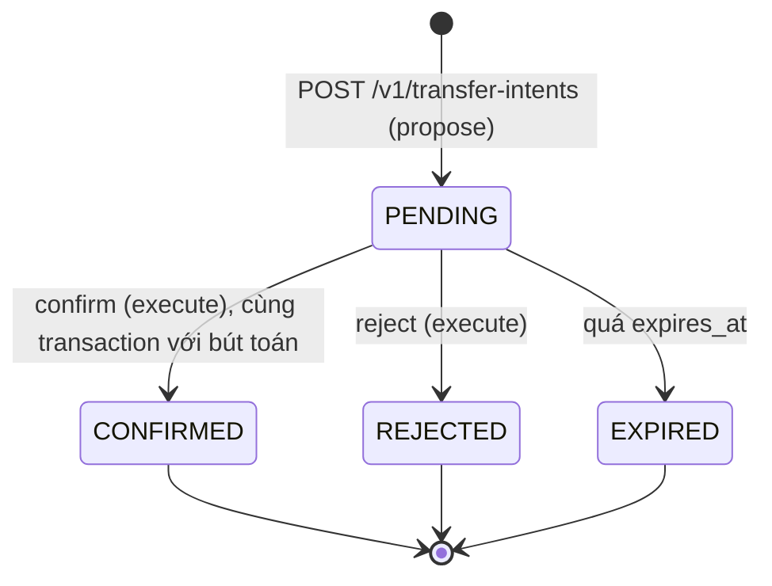

# Tuần A1: Nền cho agent (danh tính, quyền theo scope, lệnh chuyển tiền chờ xác nhận)

| Thời gian | Giai đoạn | Mốc | Ngân sách | Trạng thái |
|---|---|---|---|---|
| 30/11 – 06/12/2026 | 4: Trợ lý AI | | 15 giờ | ⬜ Chưa bắt đầu |

> Tuần đầu của hướng AI Engineer. Lý do, nguồn và các phương án đã loại nằm ở [research/huong-ai-engineer.md](../research/huong-ai-engineer.md). Tuần này **toàn Java**, chưa gọi model nào.

## Mục tiêu

Một agent có thể **đề xuất** chuyển tiền nhưng không bao giờ **tự chuyển** được, và điều đó do server bảo đảm chứ không do prompt. Muốn vậy, API phải biết ai đang gọi, ví nào của ai, và token nào được làm gì.

## Công việc

| ID | Việc | Giờ | Đầu ra |
|---|---|:-:|---|
| A1-01 | Flyway: bảng `principals`, `api_tokens` (chỉ lưu SHA-256 của token, có `scopes`, `expires_at`, `revoked_at`), `wallet_owners` | 1 | |
| A1-02 | Xác thực bằng bearer token cho mọi `/v1/**`. Người gọi nằm trong `RequestContext` (`ScopedValue`). Thiếu hoặc sai token trả 401, thiếu scope trả 403 | 2.5 | Module `identity` |
| A1-03 | Quyền sở hữu: ví gắn với principal, mọi endpoint ví kiểm tra chủ. Ví của người khác trả **404**. `Idempotency-Key` tính theo từng principal | 2 | |
| A1-04 | Lệnh chờ xác nhận: bảng `transfer_intents`, `POST /v1/transfer-intents` (scope `transfers:propose`), `POST .../confirm` và `.../reject` (scope `transfers:execute`), hết hạn sau 5 phút. Xác nhận chạy trong Tx2 của idempotency và gọi `TransferService` | 3 | Module `intent` |
| A1-05 | Hạn mức cho token chỉ có quyền đề xuất: số tiền tối đa mỗi lệnh, tổng đang chờ. Vượt thì 422 | 1 | |
| A1-06 | Sự kiện outbox `TransferIntentCreated`, `TransferIntentConfirmed`, `TransferIntentRejected`, có trường `actor`. Consumer tạo thông báo "có lệnh chờ bạn xác nhận" | 1 | |
| A1-07 | Test (danh sách ở dưới) và `scripts/invariants-agent.sql` cho bất biến I8, I9 | 2 | |
| A1-08 | Khung service Python `assistant/`: `uv`, `ruff`, `pyright`, `pytest`, FastAPI có `/health`, Dockerfile, job CI riêng | 1.5 | `assistant/` |
| A1-09 | **ADR-0011**: agent chỉ được đề xuất (token theo scope và transfer intent), so với xác nhận bằng prompt, với giới hạn số tiền đơn thuần, và với OAuth2 đầy đủ | 1.5 | |

## Ghi chú kỹ thuật

### Hai loại token

| Token | Scope | Ai giữ |
|---|---|---|
| Của người dùng | `wallets:read`, `transfers:propose`, `transfers:execute` | Người dùng |
| Ủy quyền cho agent | `wallets:read`, `transfers:propose` | Service `assistant` |

Token của agent do người dùng tạo ra từ token của mình, và luôn hẹp hơn. Lộ token của agent thì kẻ gian đọc được số dư và tạo được lệnh chờ, nhưng không chuyển được tiền.

### Máy trạng thái của một lệnh

Mọi chuyển trạng thái là `UPDATE ... WHERE id = ? AND status = 'PENDING' AND expires_at > now()`, cùng kiểu compare-and-set đã dùng cho idempotency key. Hai lần xác nhận đồng thời thì một lần thấy 0 dòng.

### Hai bất biến mới

| ID | Phát biểu | Kiểm bằng |
|---|---|---|
| **I8** | Mọi giao dịch chuyển tiền sinh ra từ một lệnh đều có đúng một lệnh `CONFIRMED`, và người xác nhận có scope `transfers:execute` | `scripts/invariants-agent.sql`, `AgentCannotMoveMoneyIT` |
| **I9** | Không response 2xx nào trả dữ liệu của ví mà principal của token không sở hữu | `WalletOwnershipIT` |

### Vì sao 404 chứ không 403

403 xác nhận rằng ví đó tồn tại. Với một agent có thể bị dụ thử hàng loạt id, câu trả lời phải giống hệt trường hợp ví không tồn tại.

### Các test cũ

Mọi integration test hiện có gọi API không kèm token. `WalletApiDriver` sẽ tự tạo một principal và token cho mỗi test. Đây là thay đổi cơ học nhưng chạm gần hết các lớp test, nên làm ngay sau A1-02 và chạy lại toàn bộ.

### Số của migration

Tuần A1 lấy số Flyway kế tiếp sau tuần 8. Các file tuần 9 và 11 đang ghi `V5`, `V6`: khi tới các tuần đó thì dùng số kế tiếp, không dùng số trong file.

## Kiểm thử bắt buộc

| Test | Khẳng định |
|---|---|
| `TokenAuthIT` | Không token: 401. Token hết hạn hoặc đã thu hồi: 401. Thiếu scope: 403. Token không bao giờ xuất hiện trong log |
| `WalletOwnershipIT` | Đọc, xem lịch sử, chuyển từ ví của người khác: 404, và không có gì thay đổi (I9) |
| `IdempotencyScopeIT` | Hai principal dùng cùng một key không thấy response của nhau |
| `TransferIntentIT` | Token agent tạo được lệnh, xác nhận bằng token agent: 403. Xác nhận bằng token người dùng: 201 và có giao dịch. Hết hạn: 422. Xác nhận lại lệnh đã xong: replay, không có giao dịch thứ hai |
| `TransferIntentConcurrencyIT` | 50 lần xác nhận đồng thời cho một lệnh: đúng 1 giao dịch |
| `AgentCannotMoveMoneyIT` | Dùng token agent gọi mọi endpoint làm dịch chuyển tiền: không endpoint nào tạo ra entry. I8 đúng |
| `IntentLimitIT` | Vượt hạn mức mỗi lệnh hoặc tổng đang chờ: 422, không có lệnh mới |

## Definition of Done

- [ ] Toàn bộ test xanh, kể cả các test cũ sau khi thêm xác thực
- [ ] `scripts/invariants-agent.sql` trả 0 dòng trên database compose
- [ ] OpenAPI có mô tả scope cho từng endpoint
- [ ] ADR-0011 Accepted
- [ ] `assistant/` build và chạy `/health` trong CI

## Rủi ro và phương án

| Rủi ro | Phương án |
|---|---|
| Thêm xác thực làm vỡ hàng trăm test | Sửa ở một chỗ (`WalletApiDriver`), chạy lại toàn bộ trước khi làm tiếp |
| Phạm vi phình thành hệ thống tài khoản | Không có đăng ký, mật khẩu hay phiên. Principal và token được tạo bằng endpoint quản trị, đủ cho demo và test |
| k6 của tuần 7 không còn chạy được | Cập nhật `perf/k6/lib` để tạo token, chạy lại baseline và ghi chênh lệch |

## Câu hỏi phỏng vấn tự luyện

1. Vì sao bước xác nhận phải do server ép, không để model tự hỏi "bạn có chắc không"?
2. Token của agent khác token của người dùng ở đâu? Lộ token của agent thì mất gì?
3. Một lệnh được xác nhận hai lần cùng lúc, hoặc đúng lúc hết hạn, thì chuyện gì xảy ra?
4. Vì sao ví của người khác trả 404 chứ không 403?
5. Vì sao không dùng OAuth2/OIDC? Khi nào thì phải dùng?
